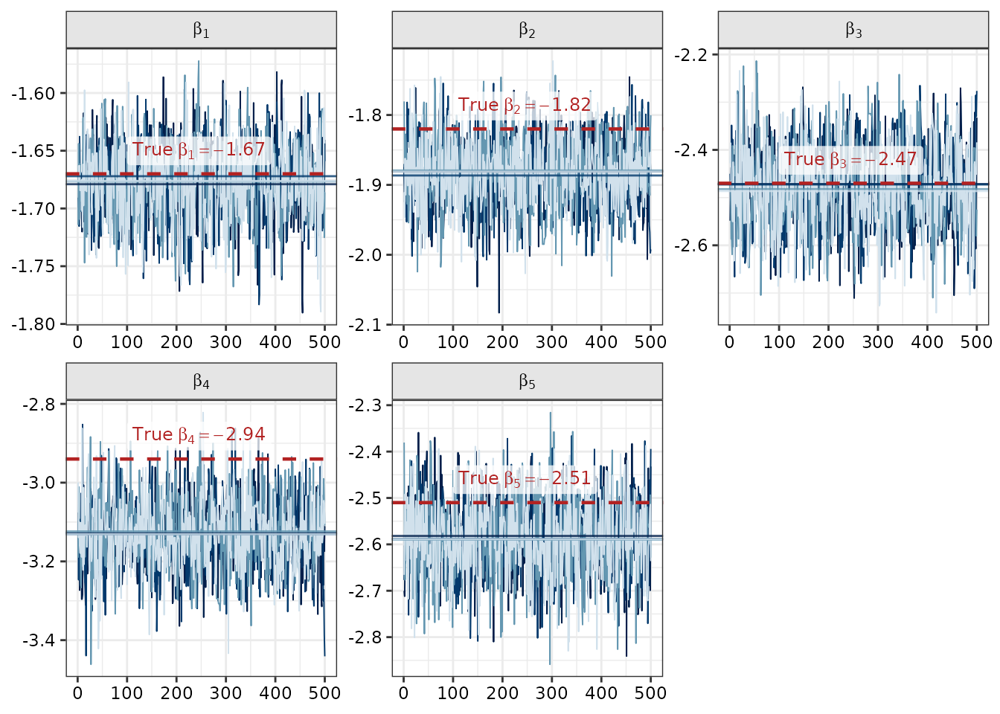
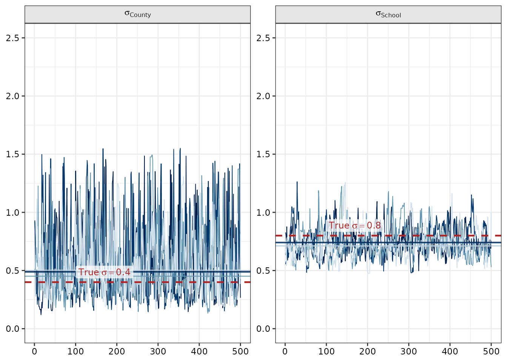
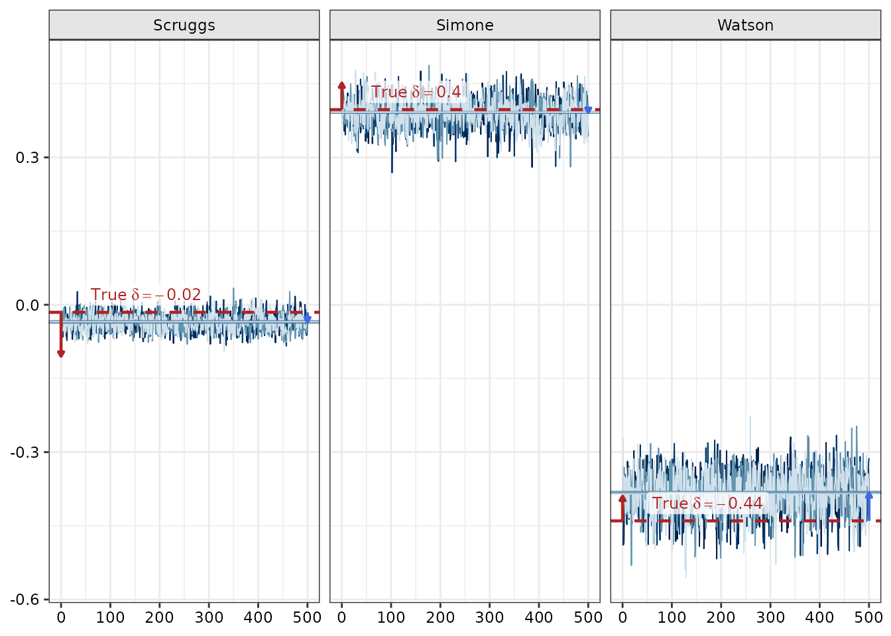
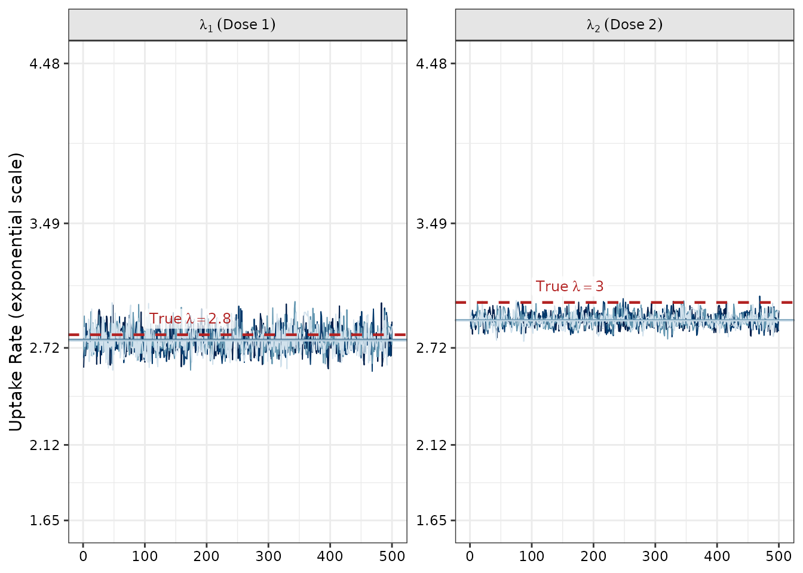

# Fit Inspection and Stan Diagnostics

## Introduction

Because `imuGAP` estimates an underlying process model for vaccination
(including baseline uptake splines $`\beta_{\text{bs}}`$,
force-of-vaccination rates $`\lambda`$, and hierarchical location
offsets $`\delta`$) via Bayesian inference in Stan, evaluating a model
fit entails assessing whether MCMC chains converged without pathologies.
Ideally, you would also synthesize data in a way you think is
representative of your system and attempt to recover the latent process
parameters. The example data in the package demonstrates that workflow.

This vignette demonstrates how to:

1.  Load and extract posterior parameter draws from an `imugap_fit`
    object using
    [`extract_imugap()`](https://accidda.github.io/imuGAP/reference/extract_imugap.md).
2.  Inspect parameter trace plots across multiple chains.
3.  Compare posterior parameter estimates against true data-generating
    simulation values (`latent_params_sim`).
4.  Evaluate spatial variance components ($`\sigma`$) and
    location-specific random offsets ($`\delta`$).

------------------------------------------------------------------------

## 1. Loading the Model Fit and Extracting Parameters

You can load the bundled `fit_sim` object, which wraps the underlying
Stan model fit along with dataset and options metadata:

``` r

data("fit_sim", package = "imuGAP")
data("latent_params_sim", package = "imuGAP")
data("locations_sim", package = "imuGAP")
data("observations_sim", package = "imuGAP")

fit_sim
#> An imuGAP model fit (`imugap_fit`):
#>   Hierarchy:    28 locations across 3 layers (root: 'State')
#>   Observations: 841 total (775 uncensored, 66 right-censored)
#> 
#> Inference for Stan model: impute_school_coverage_process_v6.
#> 4 chains, each with iter=1000; warmup=500; thin=1; 
#> post-warmup draws per chain=500, total post-warmup draws=2000.
#> 
#>                     mean se_mean   sd      2.5%       25%       50%       75%
#> beta_bs[1]         -1.68    0.00 0.03     -1.74     -1.70     -1.68     -1.65
#> beta_bs[2]         -1.88    0.00 0.05     -1.98     -1.91     -1.88     -1.85
#> beta_bs[3]         -2.48    0.00 0.08     -2.65     -2.53     -2.48     -2.42
#> beta_bs[4]         -3.13    0.00 0.09     -3.30     -3.19     -3.13     -3.07
#> beta_bs[5]         -2.59    0.00 0.08     -2.75     -2.64     -2.59     -2.53
#> sigma_layer[1]      0.56    0.01 0.30      0.19      0.33      0.48      0.72
#> sigma_layer[2]      0.74    0.01 0.12      0.55      0.66      0.73      0.81
#> lambda_raw[1]       1.02    0.00 0.03      0.97      1.00      1.02      1.04
#> lambda_raw[2]       1.06    0.00 0.01      1.03      1.05      1.06      1.07
#> lp__           -78864.85    0.28 5.07 -78875.23 -78868.18 -78864.55 -78861.15
#>                    97.5% n_eff Rhat
#> beta_bs[1]         -1.61  1194 1.00
#> beta_bs[2]         -1.79  1095 1.00
#> beta_bs[3]         -2.31   994 1.00
#> beta_bs[4]         -2.96  1010 1.00
#> beta_bs[5]         -2.43  1403 1.00
#> sigma_layer[1]      1.34   656 1.00
#> sigma_layer[2]      1.03   286 1.01
#> lambda_raw[1]       1.07  1198 1.00
#> lambda_raw[2]       1.09   936 1.00
#> lp__           -78856.26   330 1.00
#> 
#> Samples were drawn using NUTS(diag_e) at Wed Sep 23 01:08:11 2026.
#> For each parameter, n_eff is a crude measure of effective sample size,
#> and Rhat is the potential scale reduction factor on split chains (at 
#> convergence, Rhat=1).
```

To extract posterior draws for specific model parameters, use
[`extract_imugap()`](https://accidda.github.io/imuGAP/reference/extract_imugap.md):

``` r

# Extract B-spline basis coefficients
beta_draws <- extract_imugap(fit_sim, pars = "beta_bs")
str(beta_draws)
#> List of 1
#>  $ beta_bs: num [1:2000, 1:5] -1.64 -1.66 -1.67 -1.72 -1.72 ...
#>   ..- attr(*, "dimnames")=List of 2
#>   .. ..$ iterations: NULL
#>   .. ..$           : NULL

# Extract unconstrained force of vaccination rate parameters
lambda_draws <- extract_imugap(fit_sim, pars = "lambda_raw")
str(lambda_draws)
#> List of 1
#>  $ lambda_raw: num [1:2000, 1:2] 1.065 0.999 0.993 1.002 0.969 ...
#>   ..- attr(*, "dimnames")=List of 2
#>   .. ..$ iterations: NULL
#>   .. ..$           : NULL
```

------------------------------------------------------------------------

## 2. Visual Diagnostics with `bayesplot` and Parameter Recovery

#### State-Level Cohort Uptake: Basis Spline Coefficients ($`\beta_{\text{bs}}`$)

The state-level baseline propensity curve is parameterized as a B-spline
over birth cohorts with coefficients $`\beta_{\text{bs}}`$. The
following trace plots show parameter draws across all 4 MCMC chains
alongside within-chain medians and the true simulation parameters
(dashed red lines):

**Show plot code**

``` r

beta_pars <- paste0("beta_bs[", seq_along(latent_params_sim$beta_bs), "]")
beta_arr <- as.array(fit_sim$raw_fit, pars = beta_pars)
beta_chain_meds <- rbindlist(lapply(beta_pars, function(p) {
  data.table(
    parameter = p,
    Chain = factor(seq_len(dim(beta_arr)[2])),
    med_val = apply(beta_arr[, , p, drop = FALSE], 2, median)
  )
}))

beta_ref <- data.frame(
  parameter = beta_pars,
  true_val = latent_params_sim$beta_bs,
  label = sprintf(
    "True~beta[%d] == %.2f",
    seq_along(latent_params_sim$beta_bs),
    latent_params_sim$beta_bs
  )
)

bayesplot::mcmc_trace(
  beta_arr,
  facet_args = list(labeller = ggplot2::as_labeller(function(x) {
    gsub("beta_bs\\[(\\d+)\\]", "beta[\\1]", x)
  }, default = ggplot2::label_parsed))
) +
  geom_hline(
    data = beta_chain_meds,
    aes(yintercept = med_val, color = Chain),
    linetype = "solid", linewidth = 0.5, alpha = 0.8
  ) +
  geom_hline(
    data = beta_ref,
    aes(yintercept = true_val),
    color = "firebrick", linetype = "dashed", linewidth = 0.8
  ) +
  geom_label(
    data = beta_ref,
    aes(x = 100, y = true_val, label = label),
    parse = TRUE, color = "firebrick", fill = ggplot2::alpha("white", 0.75),
    linewidth = NA, vjust = -0.3, hjust = 0, size = 3.2
  ) +
  theme(legend.position = "none")
```



------------------------------------------------------------------------

#### Hierarchy Layer Variances ($`\sigma_{\text{layer}}`$)

In multi-layer models, `sigma_layer` captures the standard deviation of
location random offsets at each level of the tree
(e.g. $`\sigma_{\text{county}}`$ at layer 1 and
$`\sigma_{\text{school}}`$ at layer 2):

**Show plot code**

``` r

sigma_pars <- c("sigma_layer[1]", "sigma_layer[2]")
sigma_arr <- as.array(fit_sim$raw_fit, pars = sigma_pars)
sigma_chain_meds <- rbindlist(lapply(sigma_pars, function(p) {
  data.table(
    parameter = p,
    Chain = factor(seq_len(dim(sigma_arr)[2])),
    med_val = apply(sigma_arr[, , p, drop = FALSE], 2, median)
  )
}))

sigma_ref <- data.frame(
  parameter = sigma_pars,
  true_val = c(latent_params_sim$sigma_cnty, latent_params_sim$sigma_sch),
  label = sprintf(
    "True~sigma == %.2f",
    c(latent_params_sim$sigma_cnty, latent_params_sim$sigma_sch)
  )
)

bayesplot::mcmc_trace(
  sigma_arr,
  facet_args = list(labeller = ggplot2::as_labeller(c(
    "sigma_layer[1]" = "sigma[County]",
    "sigma_layer[2]" = "sigma[School]"
  ), default = ggplot2::label_parsed))
) +
  geom_hline(
    data = sigma_chain_meds,
    aes(yintercept = med_val, color = Chain),
    linetype = "solid", linewidth = 0.5, alpha = 0.8
  ) +
  geom_hline(
    data = sigma_ref,
    aes(yintercept = true_val),
    color = "firebrick", linetype = "dashed", linewidth = 0.8
  ) +
  geom_label(
    data = sigma_ref,
    aes(x = 100, y = true_val, label = label),
    parse = TRUE, color = "firebrick", fill = ggplot2::alpha("white", 0.75),
    linewidth = NA, vjust = -0.3, hjust = 0, size = 3.2
  ) +
  coord_cartesian(ylim = c(0, 2.5)) +
  theme(legend.position = "none")
```



------------------------------------------------------------------------

#### County Location Offsets ($`\delta_{\text{county}}`$)

Location offsets represent deviation in vaccination propensity from the
parent region. The following trace plots show offset trajectories for
Scruggs, Simone, and Watson counties.

Indicator arrows show:

- **Red arrows (left edge, iteration 0)**: Expected error direction
  based on observational sampling noise from finite sample draws
  ($`\Delta_{\delta} = -\overline{\Delta\text{logit}}_{\text{cov}}`$).
- **Blue arrows (right edge, iteration 500)**: Realized difference
  between the posterior median estimate and the true latent offset.

**Show plot code**

``` r

get_weighted_qr_basis <- function(w) {
  n_w <- length(w)
  v1 <- w / sqrt(sum(w^2))
  mat_m <- matrix(0, nrow = n_w, ncol = n_w)
  mat_m[, 1] <- v1
  for (j in seq_len(n_w - 1L)) {
    for (i in seq_len(n_w)) {
      mat_m[i, j + 1L] <- if (i == j) 1.0 else 0.0
    }
  }
  q_star <- qr.Q(qr(mat_m))[, 2:n_w, drop = FALSE]
  for (j in seq_len(ncol(q_star))) {
    nz <- which(abs(q_star[, j]) > 1e-10)[1]
    if (!is.na(nz) && q_star[nz, j] < 0) {
      q_star[, j] <- -q_star[, j]
    }
  }
  q_star
}

loc_info <- canonicalize_locations(locations_sim)
ld <- imuGAP:::assemble_layer_data(loc_info)

bounds_to_range <- function(starts, total) {
  rbind(starts, c(tail(starts, -1L) - 1L, total))
}

layer_bounds <- bounds_to_range(ld$layer_starts, ld$n_locs)
parent_child_bounds <- bounds_to_range(ld$parent_child_starts, ld$n_locs)

loc_layer_idx <- integer(ld$n_locs - 1L)
for (k in seq_len(ld$n_layers - 1L)) {
  st <- layer_bounds[1, k + 1L] - 1L
  en <- layer_bounds[2, k + 1L] - 1L
  loc_layer_idx[st:en] <- k
}

loc_pop_scale <- numeric(ld$n_locs - 1L)
for (k in seq_len(ld$n_layers - 1L)) {
  st <- layer_bounds[1, k + 1L]
  en <- layer_bounds[2, k + 1L]
  layer_pop <- ld$loc_population[st:en]
  mean_layer_pop <- mean(layer_pop)
  loc_pop_scale[(st - 1L):(en - 1L)] <- sqrt(mean_layer_pop / layer_pop)
}

n_unconstrained <- (ld$n_locs - 1L) - ld$n_parent_locs
qr_basis <- matrix(0, nrow = ld$n_locs - 1L, ncol = n_unconstrained)
col_offset <- 0L
for (p in seq_len(ld$n_parent_locs)) {
  st <- parent_child_bounds[1, p]
  en <- parent_child_bounds[2, p]
  n_child <- en - st + 1L
  pop_slice <- ld$loc_population[st:en]
  w <- pop_slice / sum(pop_slice)
  w_prime <- sqrt(w)
  q_star <- get_weighted_qr_basis(w_prime)
  qr_basis[(st - 1L):(en - 1L), (col_offset + 1L):(col_offset + n_child - 1L)] <- q_star
  col_offset <- col_offset + (n_child - 1L)
}

z_arr <- as.array(fit_sim$raw_fit, pars = "z_layer")
sigma_arr <- as.array(fit_sim$raw_fit, pars = "sigma_layer")
n_iter <- dim(z_arr)[1]
n_chains <- dim(z_arr)[2]

off_layer_arr <- array(0, dim = c(n_iter, n_chains, ld$n_locs - 1L))
for (iter in seq_len(n_iter)) {
  for (chain in seq_len(n_chains)) {
    z_vec <- z_arr[iter, chain, ]
    sigma_vec <- sigma_arr[iter, chain, ]
    off_vec <- as.vector(((qr_basis %*% z_vec) * loc_pop_scale) * sigma_vec[loc_layer_idx])
    off_layer_arr[iter, chain, ] <- off_vec
  }
}
dimnames(off_layer_arr) <- list(
  iterations = NULL,
  chains = paste0("chain:", seq_len(n_chains)),
  parameters = paste0("off_layer[", seq_len(ld$n_locs - 1L), "]")
)

county_names <- names(latent_params_sim$off_cnty)
non_root_locs <- loc_info$loc_id[-1]
county_pars <- paste0("off_layer[", match(county_names, non_root_locs), "]")
county_arr <- off_layer_arr[, , county_pars, drop = FALSE]
county_chain_meds <- rbindlist(lapply(county_pars, function(p) {
  data.table(
    parameter = p,
    Chain = factor(seq_len(dim(county_arr)[2])),
    med_val = apply(county_arr[, , p, drop = FALSE], 2, median)
  )
}))

obs <- copy(observations_sim)
phi_st <- latent_params_sim$phi_state
cov <- latent_params_sim$uptake
off_cnty <- latent_params_sim$off_cnty
censor_red <- latent_params_sim$censor_reduction

obs_cnty <- obs[loc_id %in% county_names]
obs_cnty[, mu := {
  c_off <- unname(off_cnty[loc_id])
  phi_c <- plogis(qlogis(phi_st[cohort]) + c_off)
  (1 - phi_c) * cov[11, 2] * censor_red
}, by = loc_id]
obs_cnty[, p_adj := (positive + 0.5) / (sample_n + 1.0)]
obs_cnty[, delta_cov := qlogis(p_adj) - qlogis(mu)]

cnty_errs <- obs_cnty[, .(expected_delta_err = -mean(delta_cov)), by = .(loc_id)]
county_post_meds <- apply(county_arr, 3, median)

county_ref <- data.frame(
  parameter = county_pars,
  loc_id = county_names,
  true_val = unname(latent_params_sim$off_cnty[county_names]),
  post_med = unname(county_post_meds[county_pars]),
  label = sprintf(
    "True~delta == %.2f",
    latent_params_sim$off_cnty[county_names]
  )
)
county_ref <- merge(county_ref, cnty_errs, by = "loc_id")

county_ref$red_arrow_x <- 0
county_ref$red_arrow_yend <- county_ref$true_val + county_ref$expected_delta_err
county_ref$blue_arrow_x <- 500
county_ref$blue_arrow_yend <- county_ref$post_med

bayesplot::mcmc_trace(
  county_arr,
  facet_args = list(
    scales = "fixed",
    labeller = ggplot2::as_labeller(setNames(county_names, county_pars))
  )
) +
  geom_hline(
    data = county_chain_meds,
    aes(yintercept = med_val, color = Chain),
    linetype = "solid", linewidth = 0.5, alpha = 0.8
  ) +
  geom_hline(
    data = county_ref,
    aes(yintercept = true_val),
    color = "firebrick", linetype = "dashed", linewidth = 0.8
  ) +
  geom_segment(
    data = county_ref,
    aes(x = red_arrow_x, xend = red_arrow_x, y = true_val, yend = red_arrow_yend),
    arrow = arrow(length = unit(0.04, "inches"), type = "closed"),
    color = "firebrick", linewidth = 0.8
  ) +
  geom_segment(
    data = county_ref,
    aes(x = blue_arrow_x, xend = blue_arrow_x, y = true_val, yend = blue_arrow_yend),
    arrow = arrow(length = unit(0.04, "inches"), type = "closed"),
    color = "royalblue", linewidth = 0.8
  ) +
  geom_label(
    data = county_ref,
    aes(x = 50, y = true_val, label = label),
    parse = TRUE, color = "firebrick", fill = ggplot2::alpha("white", 0.75),
    linewidth = NA, vjust = -0.3, hjust = 0, size = 3.2
  ) +
  theme(legend.position = "none")
```



------------------------------------------------------------------------

#### Force of Vaccination Rate ($`\lambda`$)

The unconstrained rate parameters $`\lambda_{\text{raw}}`$ govern the
speed at which eligible individuals receive vaccine doses once reaching
age eligibility. The following trace plots show posterior draws on the
exponentiated rate scale:

**Show plot code**

``` r

lambda_pars <- c("lambda_raw[1]", "lambda_raw[2]")
lambda_arr <- as.array(fit_sim$raw_fit, pars = lambda_pars)
lambda_chain_meds <- rbindlist(lapply(lambda_pars, function(p) {
  data.table(
    parameter = p,
    Chain = factor(seq_len(dim(lambda_arr)[2])),
    med_val = apply(lambda_arr[, , p, drop = FALSE], 2, median)
  )
}))

lambda_ref <- data.frame(
  parameter = lambda_pars,
  true_val = log(latent_params_sim$lambda),
  label = sprintf("True~lambda == %.1f", latent_params_sim$lambda)
)

bayesplot::mcmc_trace(
  lambda_arr,
  facet_args = list(labeller = ggplot2::as_labeller(c(
    "lambda_raw[1]" = "lambda[1]~(Dose~1)",
    "lambda_raw[2]" = "lambda[2]~(Dose~2)"
  ), default = ggplot2::label_parsed))
) +
  geom_hline(
    data = lambda_chain_meds,
    aes(yintercept = med_val, color = Chain),
    linetype = "solid", linewidth = 0.5, alpha = 0.8
  ) +
  geom_hline(
    data = lambda_ref,
    aes(yintercept = true_val),
    color = "firebrick", linetype = "dashed", linewidth = 0.8
  ) +
  geom_label(
    data = lambda_ref,
    aes(x = 100, y = true_val, label = label),
    parse = TRUE, color = "firebrick", fill = ggplot2::alpha("white", 0.75),
    linewidth = NA, vjust = -0.3, hjust = 0, size = 3.2
  ) +
  coord_cartesian(ylim = c(0.5, 1.5)) +
  scale_y_continuous(
    transform = "exp",
    labels = function(x) sprintf("%.2f", exp(x))
  ) +
  labs(y = "Uptake Rate (exponential scale)") +
  theme(legend.position = "none")
```



------------------------------------------------------------------------

## Summary and Related Vignettes

- For an overview of estimating the underlying process model and
  predicting coverage, see **[Getting Started with
  imuGAP](https://accidda.github.io/imuGAP/articles/imuGAP.md)**.
- To explore input data preparation and surveillance streams, see
  **[Included Example Datasets and Data
  Validation](https://accidda.github.io/imuGAP/articles/example_data.md)**.
- To learn how `imuGAP` estimates parameters across arbitrary spatial
  hierarchy resolutions, see **[Flexible Location Layers in
  imuGAP](https://accidda.github.io/imuGAP/articles/user_specified_layers.md)**.
