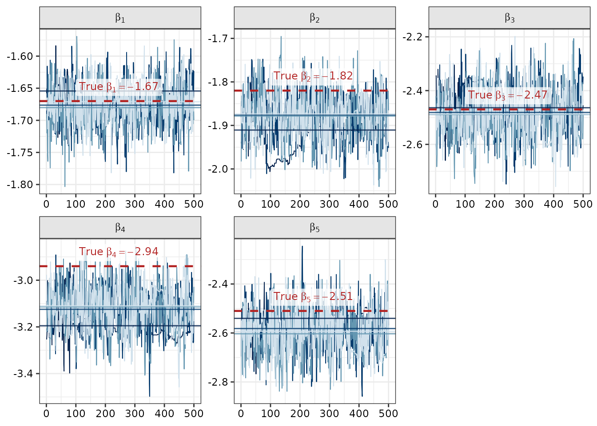
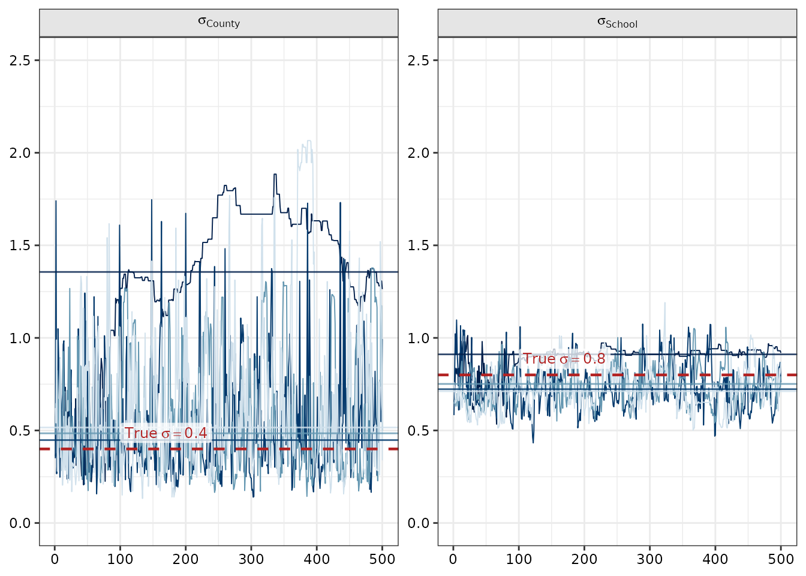
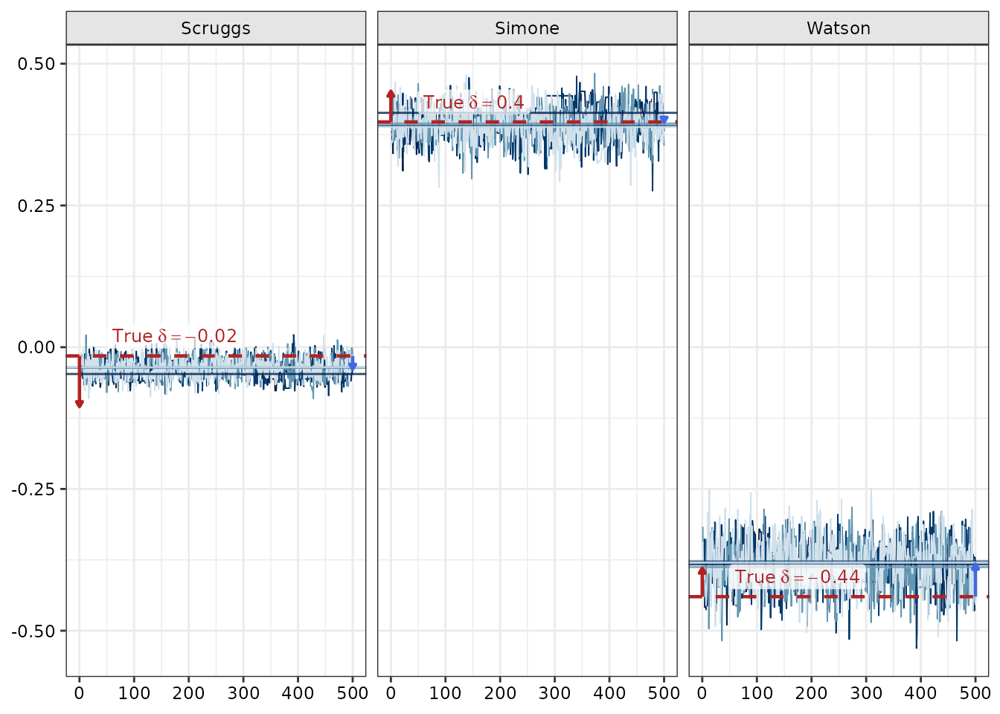
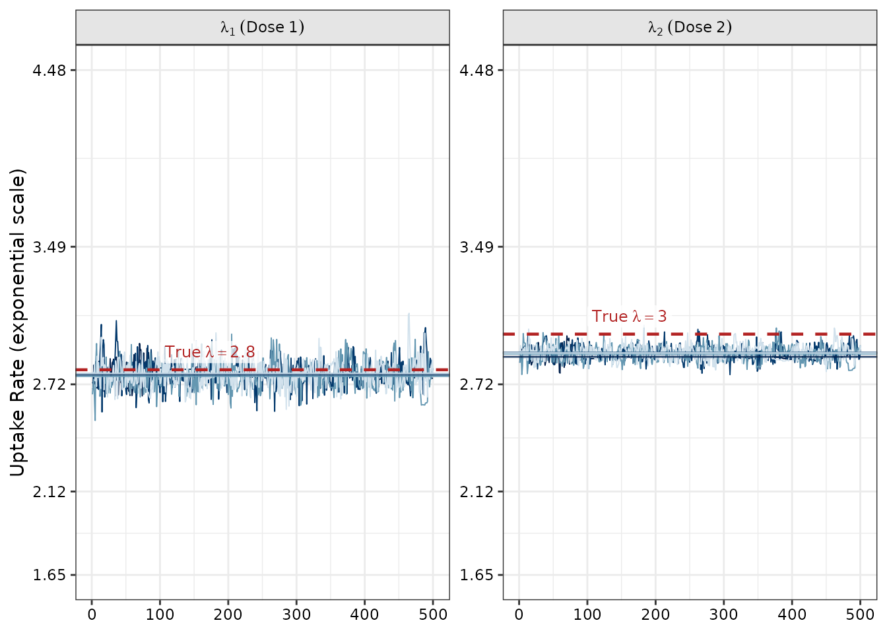

# Fit Inspection and Stan Diagnostics

## Introduction

Because `imuGAP` estimates an underlying process model for vaccination
(including baseline uptake splines $`\beta_{\text{bs}}`$,
force-of-vaccination rates $`\lambda`$, and hierarchical location
offsets $`\delta`$) via Bayesian inference in Stan, evaluating a model
fit entails assessing whether MCMC chains converged without pathologies.
Ideally, you would also synthesize data in a way you think is
representative of your system and attempt to recover the latent process
parameters. The example data in the package demonstrates that workflow.

This vignette demonstrates how to:

1.  Load and extract posterior parameter draws from an `imugap_fit`
    object using
    [`extract_imugap()`](https://accidda.github.io/imuGAP/reference/extract_imugap.md).
2.  Inspect parameter trace plots across multiple chains.
3.  Compare posterior parameter estimates against true data-generating
    simulation values (`latent_params_sim`).
4.  Evaluate spatial variance components ($`\sigma`$) and
    location-specific random offsets ($`\delta`$).

------------------------------------------------------------------------

## 1. Loading the Model Fit and Extracting Parameters

You can load the bundled `fit_sim` object, which wraps the underlying
Stan model fit along with dataset and options metadata:

``` r

data("fit_sim", package = "imuGAP")
data("latent_params_sim", package = "imuGAP")
data("locations_sim", package = "imuGAP")
data("observations_sim", package = "imuGAP")

fit_sim
#> An imuGAP model fit (`imugap_fit`):
#>   Hierarchy:    28 locations across 3 layers (root: 'State')
#>   Observations: 841 total (775 uncensored, 66 right-censored)
#> 
#> Inference for Stan model: bspline_static_zero_halley2_logit.
#> 4 chains, each with iter=125; warmup=0; thin=1; 
#> post-warmup draws per chain=125, total post-warmup draws=500.
#> 
#>                       mean se_mean   sd      2.5%       25%       50%       75%
#> beta_bs[1]           -1.64    0.00 0.03     -1.70     -1.66     -1.64     -1.62
#> beta_bs[2]           -1.84    0.00 0.05     -1.94     -1.88     -1.84     -1.80
#> beta_bs[3]           -2.44    0.00 0.08     -2.60     -2.50     -2.44     -2.38
#> beta_bs[4]           -3.10    0.00 0.09     -3.28     -3.16     -3.10     -3.03
#> beta_bs[5]           -2.56    0.00 0.09     -2.73     -2.62     -2.56     -2.50
#> sigma_layer[1]        0.64    0.02 0.37      0.22      0.39      0.54      0.79
#> sigma_layer[2]        0.82    0.01 0.15      0.59      0.72      0.80      0.91
#> lambda_raw[1]         1.04    0.00 0.03      0.99      1.02      1.04      1.06
#> lambda_raw[2]         1.03    0.00 0.01      1.01      1.02      1.03      1.04
#> raw_phi_root[1]      -1.64    0.00 0.03     -1.70     -1.66     -1.64     -1.62
#> raw_phi_root[2]      -1.68    0.00 0.02     -1.73     -1.70     -1.69     -1.67
#> raw_phi_root[3]      -1.73    0.00 0.02     -1.77     -1.74     -1.73     -1.72
#> raw_phi_root[4]      -1.78    0.00 0.02     -1.82     -1.79     -1.78     -1.76
#> raw_phi_root[5]      -1.83    0.00 0.02     -1.87     -1.84     -1.83     -1.81
#> raw_phi_root[6]      -1.88    0.00 0.02     -1.93     -1.90     -1.88     -1.86
#> raw_phi_root[7]      -1.93    0.00 0.02     -1.98     -1.95     -1.93     -1.92
#> raw_phi_root[8]      -1.99    0.00 0.02     -2.04     -2.01     -1.99     -1.97
#> raw_phi_root[9]      -2.05    0.00 0.02     -2.10     -2.07     -2.05     -2.03
#> raw_phi_root[10]     -2.11    0.00 0.03     -2.16     -2.13     -2.11     -2.09
#> raw_phi_root[11]     -2.17    0.00 0.03     -2.22     -2.19     -2.17     -2.15
#> raw_phi_root[12]     -2.23    0.00 0.03     -2.28     -2.25     -2.23     -2.21
#> raw_phi_root[13]     -2.29    0.00 0.03     -2.35     -2.31     -2.29     -2.27
#> raw_phi_root[14]     -2.36    0.00 0.03     -2.42     -2.38     -2.36     -2.34
#> raw_phi_root[15]     -2.42    0.00 0.03     -2.49     -2.44     -2.42     -2.40
#> raw_phi_root[16]     -2.49    0.00 0.03     -2.55     -2.51     -2.49     -2.46
#> raw_phi_root[17]     -2.55    0.00 0.04     -2.62     -2.58     -2.55     -2.53
#> raw_phi_root[18]     -2.61    0.00 0.04     -2.69     -2.64     -2.61     -2.59
#> raw_phi_root[19]     -2.67    0.00 0.04     -2.75     -2.70     -2.67     -2.65
#> raw_phi_root[20]     -2.72    0.00 0.04     -2.81     -2.75     -2.72     -2.70
#> raw_phi_root[21]     -2.77    0.00 0.04     -2.86     -2.80     -2.77     -2.74
#> raw_phi_root[22]     -2.81    0.00 0.05     -2.90     -2.84     -2.80     -2.77
#> raw_phi_root[23]     -2.83    0.00 0.05     -2.93     -2.86     -2.83     -2.80
#> raw_phi_root[24]     -2.84    0.00 0.05     -2.94     -2.88     -2.84     -2.81
#> raw_phi_root[25]     -2.84    0.00 0.05     -2.94     -2.88     -2.84     -2.81
#> raw_phi_root[26]     -2.82    0.00 0.05     -2.92     -2.86     -2.82     -2.79
#> raw_phi_root[27]     -2.79    0.00 0.05     -2.88     -2.82     -2.79     -2.76
#> raw_phi_root[28]     -2.73    0.00 0.05     -2.84     -2.77     -2.73     -2.70
#> raw_phi_root[29]     -2.66    0.00 0.07     -2.79     -2.70     -2.65     -2.61
#> raw_phi_root[30]     -2.56    0.00 0.09     -2.73     -2.62     -2.56     -2.50
#> mu_offset[1,1]       -0.04    0.00 0.00     -0.04     -0.04     -0.04     -0.03
#> mu_offset[1,2]       -0.11    0.00 0.01     -0.14     -0.12     -0.11     -0.10
#> mu_offset[1,3]       -0.21    0.00 0.03     -0.29     -0.23     -0.21     -0.19
#> mu_offset[1,4]       -0.21    0.00 0.06     -0.37     -0.25     -0.20     -0.17
#> mu_offset[2,1]       -0.04    0.00 0.00     -0.05     -0.04     -0.04     -0.03
#> mu_offset[2,2]       -0.11    0.00 0.01     -0.15     -0.12     -0.11     -0.10
#> mu_offset[2,3]       -0.22    0.00 0.03     -0.30     -0.23     -0.22     -0.20
#> mu_offset[2,4]       -0.21    0.00 0.06     -0.38     -0.25     -0.20     -0.17
#> mu_offset[3,1]       -0.04    0.00 0.00     -0.05     -0.04     -0.04     -0.04
#> mu_offset[3,2]       -0.12    0.00 0.02     -0.15     -0.13     -0.12     -0.11
#> mu_offset[3,3]       -0.23    0.00 0.03     -0.30     -0.24     -0.22     -0.21
#> mu_offset[3,4]       -0.22    0.00 0.06     -0.38     -0.25     -0.21     -0.17
#> mu_offset[4,1]       -0.04    0.00 0.00     -0.05     -0.04     -0.04     -0.04
#> mu_offset[4,2]       -0.12    0.00 0.02     -0.15     -0.13     -0.12     -0.11
#> mu_offset[4,3]       -0.23    0.00 0.03     -0.31     -0.25     -0.23     -0.21
#> mu_offset[4,4]       -0.22    0.00 0.06     -0.38     -0.25     -0.21     -0.17
#> mu_offset[5,1]       -0.04    0.00 0.00     -0.05     -0.04     -0.04     -0.04
#> mu_offset[5,2]       -0.12    0.00 0.02     -0.15     -0.13     -0.12     -0.11
#> mu_offset[5,3]       -0.24    0.00 0.03     -0.32     -0.26     -0.24     -0.22
#> mu_offset[5,4]       -0.22    0.00 0.06     -0.38     -0.25     -0.21     -0.17
#> mu_offset[6,1]       -0.04    0.00 0.00     -0.05     -0.04     -0.04     -0.04
#> mu_offset[6,2]       -0.12    0.00 0.02     -0.16     -0.13     -0.12     -0.11
#> mu_offset[6,3]       -0.25    0.00 0.03     -0.33     -0.26     -0.24     -0.23
#> mu_offset[6,4]       -0.22    0.00 0.06     -0.38     -0.25     -0.21     -0.17
#> mu_offset[7,1]       -0.04    0.00 0.00     -0.05     -0.04     -0.04     -0.04
#> mu_offset[7,2]       -0.12    0.00 0.02     -0.16     -0.13     -0.12     -0.11
#> mu_offset[7,3]       -0.26    0.00 0.03     -0.33     -0.27     -0.25     -0.23
#> mu_offset[7,4]       -0.22    0.00 0.06     -0.38     -0.25     -0.21     -0.18
#> mu_offset[8,1]       -0.04    0.00 0.00     -0.05     -0.04     -0.04     -0.04
#> mu_offset[8,2]       -0.13    0.00 0.02     -0.16     -0.14     -0.12     -0.12
#> mu_offset[8,3]       -0.26    0.00 0.03     -0.34     -0.28     -0.26     -0.24
#> mu_offset[8,4]       -0.22    0.00 0.06     -0.39     -0.26     -0.21     -0.18
#> mu_offset[9,1]       -0.04    0.00 0.00     -0.05     -0.05     -0.04     -0.04
#> mu_offset[9,2]       -0.13    0.00 0.02     -0.16     -0.14     -0.13     -0.12
#> mu_offset[9,3]       -0.27    0.00 0.03     -0.35     -0.29     -0.27     -0.25
#> mu_offset[9,4]       -0.22    0.00 0.06     -0.39     -0.26     -0.21     -0.18
#> mu_offset[10,1]      -0.04    0.00 0.00     -0.05     -0.05     -0.04     -0.04
#> mu_offset[10,2]      -0.13    0.00 0.02     -0.16     -0.14     -0.13     -0.12
#> mu_offset[10,3]      -0.28    0.00 0.03     -0.36     -0.30     -0.27     -0.25
#> mu_offset[10,4]      -0.22    0.00 0.06     -0.39     -0.26     -0.21     -0.18
#> mu_offset[11,1]      -0.04    0.00 0.00     -0.05     -0.05     -0.04     -0.04
#> mu_offset[11,2]      -0.13    0.00 0.02     -0.17     -0.14     -0.13     -0.12
#> mu_offset[11,3]      -0.28    0.00 0.03     -0.36     -0.30     -0.28     -0.26
#> mu_offset[11,4]      -0.23    0.00 0.06     -0.39     -0.26     -0.22     -0.18
#> mu_offset[12,1]      -0.04    0.00 0.00     -0.05     -0.05     -0.04     -0.04
#> mu_offset[12,2]      -0.13    0.00 0.02     -0.17     -0.14     -0.13     -0.12
#> mu_offset[12,3]      -0.29    0.00 0.03     -0.37     -0.31     -0.29     -0.27
#> mu_offset[12,4]      -0.23    0.00 0.06     -0.39     -0.26     -0.22     -0.18
#> mu_offset[13,1]      -0.05    0.00 0.00     -0.05     -0.05     -0.05     -0.04
#> mu_offset[13,2]      -0.13    0.00 0.02     -0.17     -0.15     -0.13     -0.12
#> mu_offset[13,3]      -0.30    0.00 0.03     -0.38     -0.32     -0.29     -0.28
#> mu_offset[13,4]      -0.23    0.00 0.06     -0.39     -0.26     -0.22     -0.18
#> mu_offset[14,1]      -0.05    0.00 0.00     -0.06     -0.05     -0.05     -0.04
#> mu_offset[14,2]      -0.14    0.00 0.02     -0.17     -0.15     -0.14     -0.12
#> mu_offset[14,3]      -0.31    0.00 0.03     -0.39     -0.32     -0.30     -0.28
#> mu_offset[14,4]      -0.23    0.00 0.07     -0.40     -0.26     -0.22     -0.18
#> mu_offset[15,1]      -0.05    0.00 0.00     -0.06     -0.05     -0.05     -0.04
#> mu_offset[15,2]      -0.14    0.00 0.02     -0.17     -0.15     -0.14     -0.13
#> mu_offset[15,3]      -0.31    0.00 0.04     -0.39     -0.33     -0.31     -0.29
#> mu_offset[15,4]      -0.23    0.00 0.07     -0.40     -0.26     -0.22     -0.18
#> mu_offset[16,1]      -0.05    0.00 0.00     -0.06     -0.05     -0.05     -0.04
#> mu_offset[16,2]      -0.14    0.00 0.02     -0.18     -0.15     -0.14     -0.13
#> mu_offset[16,3]      -0.32    0.00 0.04     -0.40     -0.34     -0.31     -0.29
#> mu_offset[16,4]      -0.23    0.00 0.07     -0.40     -0.27     -0.22     -0.19
#> mu_offset[17,1]      -0.05    0.00 0.00     -0.06     -0.05     -0.05     -0.04
#> mu_offset[17,2]      -0.14    0.00 0.02     -0.18     -0.15     -0.14     -0.13
#> mu_offset[17,3]      -0.32    0.00 0.04     -0.41     -0.34     -0.32     -0.30
#> mu_offset[17,4]      -0.23    0.00 0.07     -0.40     -0.27     -0.22     -0.19
#> mu_offset[18,1]      -0.05    0.00 0.00     -0.06     -0.05     -0.05     -0.04
#> mu_offset[18,2]      -0.14    0.00 0.02     -0.18     -0.15     -0.14     -0.13
#> mu_offset[18,3]      -0.33    0.00 0.04     -0.41     -0.35     -0.33     -0.31
#> mu_offset[18,4]      -0.23    0.00 0.07     -0.40     -0.27     -0.22     -0.19
#> mu_offset[19,1]      -0.05    0.00 0.00     -0.06     -0.05     -0.05     -0.05
#> mu_offset[19,2]      -0.14    0.00 0.02     -0.18     -0.15     -0.14     -0.13
#> mu_offset[19,3]      -0.34    0.00 0.04     -0.42     -0.35     -0.33     -0.31
#> mu_offset[19,4]      -0.23    0.00 0.07     -0.40     -0.27     -0.22     -0.19
#> mu_offset[20,1]      -0.05    0.00 0.00     -0.06     -0.05     -0.05     -0.05
#> mu_offset[20,2]      -0.14    0.00 0.02     -0.18     -0.16     -0.14     -0.13
#> mu_offset[20,3]      -0.34    0.00 0.04     -0.42     -0.36     -0.33     -0.32
#> mu_offset[20,4]      -0.23    0.00 0.07     -0.40     -0.27     -0.22     -0.19
#> mu_offset[21,1]      -0.05    0.00 0.00     -0.06     -0.05     -0.05     -0.05
#> mu_offset[21,2]      -0.14    0.00 0.02     -0.18     -0.16     -0.14     -0.13
#> mu_offset[21,3]      -0.34    0.00 0.04     -0.43     -0.36     -0.34     -0.32
#> mu_offset[21,4]      -0.23    0.00 0.07     -0.40     -0.27     -0.22     -0.19
#> mu_offset[22,1]      -0.05    0.00 0.01     -0.06     -0.05     -0.05     -0.05
#> mu_offset[22,2]      -0.15    0.00 0.02     -0.18     -0.16     -0.14     -0.13
#> mu_offset[22,3]      -0.35    0.00 0.04     -0.43     -0.37     -0.34     -0.32
#> mu_offset[22,4]      -0.23    0.00 0.07     -0.40     -0.27     -0.22     -0.19
#> mu_offset[23,1]      -0.05    0.00 0.01     -0.06     -0.05     -0.05     -0.05
#> mu_offset[23,2]      -0.15    0.00 0.02     -0.18     -0.16     -0.14     -0.13
#> mu_offset[23,3]      -0.35    0.00 0.04     -0.43     -0.37     -0.34     -0.32
#> mu_offset[23,4]      -0.23    0.00 0.07     -0.40     -0.27     -0.22     -0.19
#> mu_offset[24,1]      -0.05    0.00 0.01     -0.06     -0.05     -0.05     -0.05
#> mu_offset[24,2]      -0.15    0.00 0.02     -0.18     -0.16     -0.15     -0.13
#> mu_offset[24,3]      -0.35    0.00 0.04     -0.43     -0.37     -0.34     -0.32
#> mu_offset[24,4]      -0.24    0.00 0.07     -0.40     -0.27     -0.22     -0.19
#> mu_offset[25,1]      -0.05    0.00 0.01     -0.06     -0.05     -0.05     -0.05
#> mu_offset[25,2]      -0.15    0.00 0.02     -0.18     -0.16     -0.15     -0.13
#> mu_offset[25,3]      -0.35    0.00 0.04     -0.43     -0.37     -0.34     -0.32
#> mu_offset[25,4]      -0.24    0.00 0.07     -0.40     -0.27     -0.22     -0.19
#> mu_offset[26,1]      -0.05    0.00 0.01     -0.06     -0.05     -0.05     -0.05
#> mu_offset[26,2]      -0.15    0.00 0.02     -0.18     -0.16     -0.14     -0.13
#> mu_offset[26,3]      -0.35    0.00 0.04     -0.43     -0.37     -0.34     -0.32
#> mu_offset[26,4]      -0.23    0.00 0.07     -0.40     -0.27     -0.22     -0.19
#> mu_offset[27,1]      -0.05    0.00 0.01     -0.06     -0.05     -0.05     -0.05
#> mu_offset[27,2]      -0.15    0.00 0.02     -0.18     -0.16     -0.14     -0.13
#> mu_offset[27,3]      -0.34    0.00 0.04     -0.43     -0.36     -0.34     -0.32
#> mu_offset[27,4]      -0.23    0.00 0.07     -0.40     -0.27     -0.22     -0.19
#> mu_offset[28,1]      -0.05    0.00 0.00     -0.06     -0.05     -0.05     -0.05
#> mu_offset[28,2]      -0.14    0.00 0.02     -0.18     -0.16     -0.14     -0.13
#> mu_offset[28,3]      -0.34    0.00 0.04     -0.42     -0.36     -0.34     -0.32
#> mu_offset[28,4]      -0.23    0.00 0.07     -0.40     -0.27     -0.22     -0.19
#> mu_offset[29,1]      -0.05    0.00 0.00     -0.06     -0.05     -0.05     -0.05
#> mu_offset[29,2]      -0.14    0.00 0.02     -0.18     -0.15     -0.14     -0.13
#> mu_offset[29,3]      -0.33    0.00 0.04     -0.42     -0.35     -0.33     -0.31
#> mu_offset[29,4]      -0.23    0.00 0.07     -0.40     -0.27     -0.22     -0.19
#> mu_offset[30,1]      -0.05    0.00 0.00     -0.06     -0.05     -0.05     -0.04
#> mu_offset[30,2]      -0.14    0.00 0.02     -0.18     -0.15     -0.14     -0.13
#> mu_offset[30,3]      -0.33    0.00 0.04     -0.41     -0.35     -0.32     -0.30
#> mu_offset[30,4]      -0.23    0.00 0.07     -0.40     -0.27     -0.22     -0.19
#> lp__             -78913.00    0.28 5.07 -78923.92 -78916.23 -78912.77 -78909.41
#>                      97.5% n_eff Rhat
#> beta_bs[1]           -1.58  1366 1.00
#> beta_bs[2]           -1.75  1257 1.00
#> beta_bs[3]           -2.28  1060 1.00
#> beta_bs[4]           -2.91  1095 1.00
#> beta_bs[5]           -2.40  1217 1.00
#> sigma_layer[1]        1.68   236 1.01
#> sigma_layer[2]        1.18   183 1.03
#> lambda_raw[1]         1.09  1272 1.00
#> lambda_raw[2]         1.06  1046 1.00
#> raw_phi_root[1]      -1.58  1366 1.00
#> raw_phi_root[2]      -1.64  1370 1.00
#> raw_phi_root[3]      -1.69  1313 1.00
#> raw_phi_root[4]      -1.73  1255 1.00
#> raw_phi_root[5]      -1.78  1247 1.00
#> raw_phi_root[6]      -1.83  1262 1.00
#> raw_phi_root[7]      -1.89  1282 1.00
#> raw_phi_root[8]      -1.94  1294 1.00
#> raw_phi_root[9]      -2.00  1276 1.00
#> raw_phi_root[10]     -2.06  1232 1.00
#> raw_phi_root[11]     -2.12  1179 1.00
#> raw_phi_root[12]     -2.18  1133 1.00
#> raw_phi_root[13]     -2.24  1101 1.00
#> raw_phi_root[14]     -2.30  1083 1.00
#> raw_phi_root[15]     -2.36  1080 1.00
#> raw_phi_root[16]     -2.42  1088 1.00
#> raw_phi_root[17]     -2.48  1105 1.00
#> raw_phi_root[18]     -2.54  1123 1.00
#> raw_phi_root[19]     -2.59  1118 1.00
#> raw_phi_root[20]     -2.64  1135 1.00
#> raw_phi_root[21]     -2.68  1120 1.00
#> raw_phi_root[22]     -2.71  1103 1.00
#> raw_phi_root[23]     -2.73  1088 1.00
#> raw_phi_root[24]     -2.75  1077 1.00
#> raw_phi_root[25]     -2.75  1077 1.00
#> raw_phi_root[26]     -2.73  1080 1.00
#> raw_phi_root[27]     -2.70  1102 1.00
#> raw_phi_root[28]     -2.63  1152 1.00
#> raw_phi_root[29]     -2.53  1203 1.00
#> raw_phi_root[30]     -2.40  1217 1.00
#> mu_offset[1,1]       -0.03  1809 1.00
#> mu_offset[1,2]       -0.09  1336 1.00
#> mu_offset[1,3]       -0.17   933 1.00
#> mu_offset[1,4]       -0.12   605 1.01
#> mu_offset[2,1]       -0.03  1814 1.00
#> mu_offset[2,2]       -0.09  1333 1.00
#> mu_offset[2,3]       -0.17   944 1.00
#> mu_offset[2,4]       -0.12   606 1.01
#> mu_offset[3,1]       -0.03  1816 1.00
#> mu_offset[3,2]       -0.09  1330 1.00
#> mu_offset[3,3]       -0.18   952 1.00
#> mu_offset[3,4]       -0.12   607 1.01
#> mu_offset[4,1]       -0.03  1816 1.00
#> mu_offset[4,2]       -0.09  1328 1.00
#> mu_offset[4,3]       -0.18   959 1.00
#> mu_offset[4,4]       -0.12   608 1.01
#> mu_offset[5,1]       -0.03  1817 1.00
#> mu_offset[5,2]       -0.09  1327 1.00
#> mu_offset[5,3]       -0.19   963 1.00
#> mu_offset[5,4]       -0.12   608 1.01
#> mu_offset[6,1]       -0.03  1819 1.00
#> mu_offset[6,2]       -0.09  1326 1.00
#> mu_offset[6,3]       -0.20   965 1.00
#> mu_offset[6,4]       -0.13   609 1.01
#> mu_offset[7,1]       -0.03  1821 1.00
#> mu_offset[7,2]       -0.10  1325 1.00
#> mu_offset[7,3]       -0.20   966 1.00
#> mu_offset[7,4]       -0.13   609 1.01
#> mu_offset[8,1]       -0.03  1823 1.00
#> mu_offset[8,2]       -0.10  1325 1.00
#> mu_offset[8,3]       -0.21   966 1.00
#> mu_offset[8,4]       -0.13   609 1.01
#> mu_offset[9,1]       -0.03  1824 1.00
#> mu_offset[9,2]       -0.10  1300 1.00
#> mu_offset[9,3]       -0.22   966 1.00
#> mu_offset[9,4]       -0.13   609 1.01
#> mu_offset[10,1]      -0.03  1825 1.00
#> mu_offset[10,2]      -0.10  1282 1.00
#> mu_offset[10,3]      -0.23   969 1.00
#> mu_offset[10,4]      -0.13   610 1.01
#> mu_offset[11,1]      -0.04  1825 1.00
#> mu_offset[11,2]      -0.10  1267 1.00
#> mu_offset[11,3]      -0.23   972 1.00
#> mu_offset[11,4]      -0.13   610 1.01
#> mu_offset[12,1]      -0.04  1824 1.00
#> mu_offset[12,2]      -0.10  1253 1.00
#> mu_offset[12,3]      -0.24   975 1.00
#> mu_offset[12,4]      -0.13   610 1.01
#> mu_offset[13,1]      -0.04  1823 1.00
#> mu_offset[13,2]      -0.11  1240 1.00
#> mu_offset[13,3]      -0.24   978 1.00
#> mu_offset[13,4]      -0.13   611 1.01
#> mu_offset[14,1]      -0.04  1822 1.00
#> mu_offset[14,2]      -0.11  1228 1.00
#> mu_offset[14,3]      -0.25   983 1.00
#> mu_offset[14,4]      -0.13   611 1.01
#> mu_offset[15,1]      -0.04  1821 1.00
#> mu_offset[15,2]      -0.11  1219 1.00
#> mu_offset[15,3]      -0.26   987 1.00
#> mu_offset[15,4]      -0.13   611 1.01
#> mu_offset[16,1]      -0.04  1819 1.00
#> mu_offset[16,2]      -0.11  1210 1.00
#> mu_offset[16,3]      -0.26   993 1.00
#> mu_offset[16,4]      -0.13   611 1.01
#> mu_offset[17,1]      -0.04  1817 1.00
#> mu_offset[17,2]      -0.11  1208 1.00
#> mu_offset[17,3]      -0.27   999 1.00
#> mu_offset[17,4]      -0.14   612 1.01
#> mu_offset[18,1]      -0.04  1815 1.00
#> mu_offset[18,2]      -0.11  1210 1.00
#> mu_offset[18,3]      -0.27  1005 1.00
#> mu_offset[18,4]      -0.14   612 1.01
#> mu_offset[19,1]      -0.04  1813 1.00
#> mu_offset[19,2]      -0.11  1213 1.00
#> mu_offset[19,3]      -0.28  1011 1.00
#> mu_offset[19,4]      -0.14   613 1.01
#> mu_offset[20,1]      -0.04  1811 1.00
#> mu_offset[20,2]      -0.11  1216 1.00
#> mu_offset[20,3]      -0.28  1016 1.00
#> mu_offset[20,4]      -0.14   613 1.01
#> mu_offset[21,1]      -0.04  1809 1.00
#> mu_offset[21,2]      -0.11  1215 1.00
#> mu_offset[21,3]      -0.28  1022 1.00
#> mu_offset[21,4]      -0.14   613 1.01
#> mu_offset[22,1]      -0.04  1807 1.00
#> mu_offset[22,2]      -0.11  1214 1.00
#> mu_offset[22,3]      -0.29  1026 1.00
#> mu_offset[22,4]      -0.14   613 1.01
#> mu_offset[23,1]      -0.04  1805 1.00
#> mu_offset[23,2]      -0.12  1213 1.00
#> mu_offset[23,3]      -0.29  1031 1.00
#> mu_offset[23,4]      -0.14   613 1.01
#> mu_offset[24,1]      -0.04  1804 1.00
#> mu_offset[24,2]      -0.12  1212 1.00
#> mu_offset[24,3]      -0.29  1034 1.00
#> mu_offset[24,4]      -0.14   613 1.01
#> mu_offset[25,1]      -0.04  1803 1.00
#> mu_offset[25,2]      -0.12  1212 1.00
#> mu_offset[25,3]      -0.29  1037 1.00
#> mu_offset[25,4]      -0.14   614 1.01
#> mu_offset[26,1]      -0.04  1802 1.00
#> mu_offset[26,2]      -0.12  1210 1.00
#> mu_offset[26,3]      -0.29  1039 1.00
#> mu_offset[26,4]      -0.14   613 1.01
#> mu_offset[27,1]      -0.04  1801 1.00
#> mu_offset[27,2]      -0.11  1212 1.00
#> mu_offset[27,3]      -0.29  1041 1.00
#> mu_offset[27,4]      -0.14   613 1.01
#> mu_offset[28,1]      -0.04  1799 1.00
#> mu_offset[28,2]      -0.11  1209 1.00
#> mu_offset[28,3]      -0.28  1043 1.00
#> mu_offset[28,4]      -0.14   613 1.01
#> mu_offset[29,1]      -0.04  1796 1.00
#> mu_offset[29,2]      -0.11  1205 1.00
#> mu_offset[29,3]      -0.27  1045 1.00
#> mu_offset[29,4]      -0.14   612 1.01
#> mu_offset[30,1]      -0.04  1793 1.00
#> mu_offset[30,2]      -0.11  1199 1.00
#> mu_offset[30,3]      -0.26  1048 1.00
#> mu_offset[30,4]      -0.13   612 1.01
#> lp__             -78904.11   335 1.02
#> 
#> Samples were drawn using NUTS(diag_e) at Fri Oct 30 19:31:58 2026.
#> For each parameter, n_eff is a crude measure of effective sample size,
#> and Rhat is the potential scale reduction factor on split chains (at 
#> convergence, Rhat=1).
```

To extract posterior draws for specific model parameters, use
[`extract_imugap()`](https://accidda.github.io/imuGAP/reference/extract_imugap.md):

``` r

# Extract B-spline basis coefficients
beta_draws <- extract_imugap(fit_sim, pars = "beta_bs")
str(beta_draws)
#> List of 1
#>  $ beta_bs: num [1:500, 1:5] -1.62 -1.67 -1.68 -1.68 -1.7 ...
#>   ..- attr(*, "dimnames")=List of 2
#>   .. ..$ iterations: NULL
#>   .. ..$           : NULL

# Extract unconstrained force of vaccination rate parameters
lambda_draws <- extract_imugap(fit_sim, pars = "lambda_raw")
str(lambda_draws)
#> List of 1
#>  $ lambda_raw: num [1:500, 1:2] 1.058 0.981 0.986 0.988 1.006 ...
#>   ..- attr(*, "dimnames")=List of 2
#>   .. ..$ iterations: NULL
#>   .. ..$           : NULL
```

------------------------------------------------------------------------

## 2. Visual Diagnostics with `bayesplot` and Parameter Recovery

#### State-Level Cohort Uptake: Basis Spline Coefficients ($`\beta_{\text{bs}}`$)

The state-level baseline propensity curve is parameterized as a B-spline
over birth cohorts with coefficients $`\beta_{\text{bs}}`$. The
following trace plots show parameter draws across all 4 MCMC chains
alongside within-chain medians and the true simulation parameters
(dashed red lines):

**Show plot code**

``` r

beta_pars <- paste0("beta_bs[", seq_along(latent_params_sim$beta_bs), "]")
beta_arr <- as.array(fit_sim$raw_fit, pars = beta_pars)
beta_chain_meds <- rbindlist(lapply(beta_pars, function(p) {
  data.table(
    parameter = p,
    Chain = factor(seq_len(dim(beta_arr)[2])),
    med_val = apply(beta_arr[, , p, drop = FALSE], 2, median)
  )
}))

beta_ref <- data.frame(
  parameter = beta_pars,
  true_val = latent_params_sim$beta_bs,
  label = sprintf(
    "True~beta[%d] == %.2f",
    seq_along(latent_params_sim$beta_bs),
    latent_params_sim$beta_bs
  )
)

bayesplot::mcmc_trace(
  beta_arr,
  facet_args = list(labeller = ggplot2::as_labeller(function(x) {
    gsub("beta_bs\\[(\\d+)\\]", "beta[\\1]", x)
  }, default = ggplot2::label_parsed))
) +
  geom_hline(
    data = beta_chain_meds,
    aes(yintercept = med_val, color = Chain),
    linetype = "solid", linewidth = 0.5, alpha = 0.8
  ) +
  geom_hline(
    data = beta_ref,
    aes(yintercept = true_val),
    color = "firebrick", linetype = "dashed", linewidth = 0.8
  ) +
  geom_label(
    data = beta_ref,
    aes(x = 100, y = true_val, label = label),
    parse = TRUE, color = "firebrick", fill = ggplot2::alpha("white", 0.75),
    linewidth = NA, vjust = -0.3, hjust = 0, size = 3.2
  ) +
  theme(legend.position = "none")
```



------------------------------------------------------------------------

#### Hierarchy Layer Variances ($`\sigma_{\text{layer}}`$)

In multi-layer models, `sigma_layer` captures the standard deviation of
location random offsets at each level of the tree
(e.g. $`\sigma_{\text{county}}`$ at layer 1 and
$`\sigma_{\text{school}}`$ at layer 2):

**Show plot code**

``` r

sigma_pars <- c("sigma_layer[1]", "sigma_layer[2]")
sigma_arr <- as.array(fit_sim$raw_fit, pars = sigma_pars)
sigma_chain_meds <- rbindlist(lapply(sigma_pars, function(p) {
  data.table(
    parameter = p,
    Chain = factor(seq_len(dim(sigma_arr)[2])),
    med_val = apply(sigma_arr[, , p, drop = FALSE], 2, median)
  )
}))

sigma_ref <- data.frame(
  parameter = sigma_pars,
  true_val = c(latent_params_sim$sigma_cnty, latent_params_sim$sigma_sch),
  label = sprintf(
    "True~sigma == %.2f",
    c(latent_params_sim$sigma_cnty, latent_params_sim$sigma_sch)
  )
)

bayesplot::mcmc_trace(
  sigma_arr,
  facet_args = list(labeller = ggplot2::as_labeller(c(
    "sigma_layer[1]" = "sigma[County]",
    "sigma_layer[2]" = "sigma[School]"
  ), default = ggplot2::label_parsed))
) +
  geom_hline(
    data = sigma_chain_meds,
    aes(yintercept = med_val, color = Chain),
    linetype = "solid", linewidth = 0.5, alpha = 0.8
  ) +
  geom_hline(
    data = sigma_ref,
    aes(yintercept = true_val),
    color = "firebrick", linetype = "dashed", linewidth = 0.8
  ) +
  geom_label(
    data = sigma_ref,
    aes(x = 100, y = true_val, label = label),
    parse = TRUE, color = "firebrick", fill = ggplot2::alpha("white", 0.75),
    linewidth = NA, vjust = -0.3, hjust = 0, size = 3.2
  ) +
  coord_cartesian(ylim = c(0, 2.5)) +
  theme(legend.position = "none")
```



------------------------------------------------------------------------

#### County Location Offsets ($`\delta_{\text{county}}`$)

Location offsets represent deviation in vaccination propensity from the
parent region. The following trace plots show offset trajectories for
Scruggs, Simone, and Watson counties.

Indicator arrows show:

- **Red arrows (left edge, iteration 0)**: Expected error direction
  based on observational sampling noise from finite sample draws
  ($`\Delta_{\delta} = -\overline{\Delta\text{logit}}_{\text{cov}}`$).
- **Blue arrows (right edge, iteration 500)**: Realized difference
  between the posterior median estimate and the true latent offset.

**Show plot code**

``` r

loc_info <- canonicalize_locations(locations_sim)
off_layer_arr <- as.array(fit_sim$raw_fit, pars = "off_layer")

county_names <- names(latent_params_sim$off_cnty)
non_root_locs <- loc_info$loc_id[-1]
county_pars <- paste0("off_layer[", match(county_names, non_root_locs), "]")
county_arr <- off_layer_arr[, , county_pars, drop = FALSE]
county_chain_meds <- rbindlist(lapply(county_pars, function(p) {
  data.table(
    parameter = p,
    Chain = factor(seq_len(dim(county_arr)[2])),
    med_val = apply(county_arr[, , p, drop = FALSE], 2, median)
  )
}))

obs <- copy(observations_sim)
phi_st <- latent_params_sim$phi_state
cov <- latent_params_sim$uptake
off_cnty <- latent_params_sim$off_cnty
censor_red <- latent_params_sim$censor_reduction

obs_cnty <- obs[loc_id %in% county_names]
obs_cnty[, mu := {
  c_off <- unname(off_cnty[loc_id])
  phi_c <- plogis(qlogis(phi_st[cohort]) + c_off)
  (1 - phi_c) * cov[11, 2] * censor_red
}, by = loc_id]
obs_cnty[, p_adj := (positive + 0.5) / (sample_n + 1.0)]
obs_cnty[, delta_cov := qlogis(p_adj) - qlogis(mu)]

cnty_errs <- obs_cnty[, .(expected_delta_err = -mean(delta_cov)), by = .(loc_id)]
county_post_meds <- apply(county_arr, 3, median)

county_ref <- data.frame(
  parameter = county_pars,
  loc_id = county_names,
  true_val = unname(latent_params_sim$off_cnty[county_names]),
  post_med = unname(county_post_meds[county_pars]),
  label = sprintf(
    "True~delta == %.2f",
    latent_params_sim$off_cnty[county_names]
  )
)
county_ref <- merge(county_ref, cnty_errs, by = "loc_id")

county_ref$red_arrow_x <- 0
county_ref$red_arrow_yend <- county_ref$true_val + county_ref$expected_delta_err
county_ref$blue_arrow_x <- 500
county_ref$blue_arrow_yend <- county_ref$post_med

bayesplot::mcmc_trace(
  county_arr,
  facet_args = list(
    scales = "fixed",
    labeller = ggplot2::as_labeller(setNames(county_names, county_pars))
  )
) +
  geom_hline(
    data = county_chain_meds,
    aes(yintercept = med_val, color = Chain),
    linetype = "solid", linewidth = 0.5, alpha = 0.8
  ) +
  geom_hline(
    data = county_ref,
    aes(yintercept = true_val),
    color = "firebrick", linetype = "dashed", linewidth = 0.8
  ) +
  geom_segment(
    data = county_ref,
    aes(x = red_arrow_x, xend = red_arrow_x, y = true_val, yend = red_arrow_yend),
    arrow = arrow(length = unit(0.04, "inches"), type = "closed"),
    color = "firebrick", linewidth = 0.8
  ) +
  geom_segment(
    data = county_ref,
    aes(x = blue_arrow_x, xend = blue_arrow_x, y = true_val, yend = blue_arrow_yend),
    arrow = arrow(length = unit(0.04, "inches"), type = "closed"),
    color = "royalblue", linewidth = 0.8
  ) +
  geom_label(
    data = county_ref,
    aes(x = 50, y = true_val, label = label),
    parse = TRUE, color = "firebrick", fill = ggplot2::alpha("white", 0.75),
    linewidth = NA, vjust = -0.3, hjust = 0, size = 3.2
  ) +
  theme(legend.position = "none")
```



------------------------------------------------------------------------

#### Force of Vaccination Rate ($`\lambda`$)

The unconstrained rate parameters $`\lambda_{\text{raw}}`$ govern the
speed at which eligible individuals receive vaccine doses once reaching
age eligibility. The following trace plots show posterior draws on the
exponentiated rate scale:

**Show plot code**

``` r

lambda_pars <- c("lambda_raw[1]", "lambda_raw[2]")
lambda_arr <- as.array(fit_sim$raw_fit, pars = lambda_pars)
lambda_chain_meds <- rbindlist(lapply(lambda_pars, function(p) {
  data.table(
    parameter = p,
    Chain = factor(seq_len(dim(lambda_arr)[2])),
    med_val = apply(lambda_arr[, , p, drop = FALSE], 2, median)
  )
}))

lambda_ref <- data.frame(
  parameter = lambda_pars,
  true_val = log(latent_params_sim$lambda),
  label = sprintf("True~lambda == %.1f", latent_params_sim$lambda)
)

bayesplot::mcmc_trace(
  lambda_arr,
  facet_args = list(labeller = ggplot2::as_labeller(c(
    "lambda_raw[1]" = "lambda[1]~(Dose~1)",
    "lambda_raw[2]" = "lambda[2]~(Dose~2)"
  ), default = ggplot2::label_parsed))
) +
  geom_hline(
    data = lambda_chain_meds,
    aes(yintercept = med_val, color = Chain),
    linetype = "solid", linewidth = 0.5, alpha = 0.8
  ) +
  geom_hline(
    data = lambda_ref,
    aes(yintercept = true_val),
    color = "firebrick", linetype = "dashed", linewidth = 0.8
  ) +
  geom_label(
    data = lambda_ref,
    aes(x = 100, y = true_val, label = label),
    parse = TRUE, color = "firebrick", fill = ggplot2::alpha("white", 0.75),
    linewidth = NA, vjust = -0.3, hjust = 0, size = 3.2
  ) +
  coord_cartesian(ylim = c(0.5, 1.5)) +
  scale_y_continuous(
    transform = "exp",
    labels = function(x) sprintf("%.2f", exp(x))
  ) +
  labs(y = "Uptake Rate (exponential scale)") +
  theme(legend.position = "none")
```



------------------------------------------------------------------------

## Summary and Related Vignettes

- For an overview of estimating the underlying process model and
  predicting coverage, see **[Getting Started with
  imuGAP](https://accidda.github.io/imuGAP/articles/imuGAP.md)**.
- To explore input data preparation and surveillance streams, see
  **[Included Example Datasets and Data
  Validation](https://accidda.github.io/imuGAP/articles/example_data.md)**.
- To learn how `imuGAP` estimates parameters across arbitrary spatial
  hierarchy resolutions, see **[Flexible Location Layers in
  imuGAP](https://accidda.github.io/imuGAP/articles/user_specified_layers.md)**.
