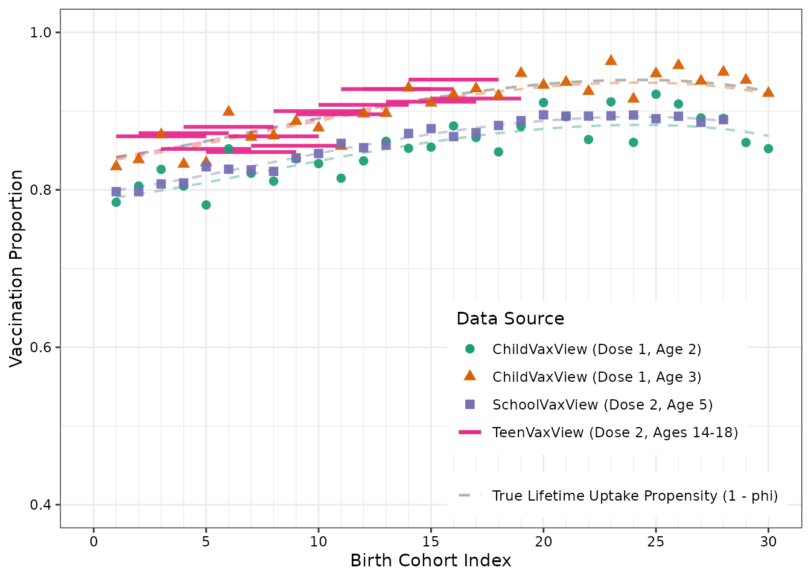
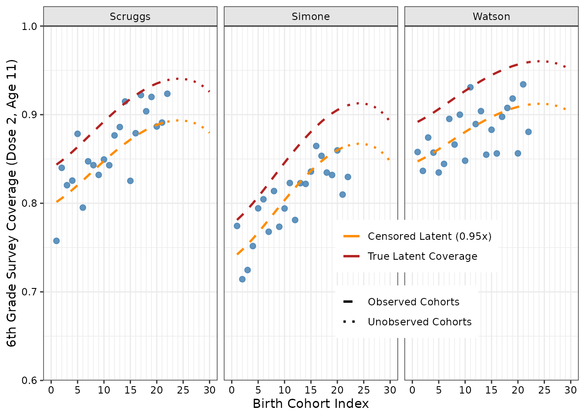
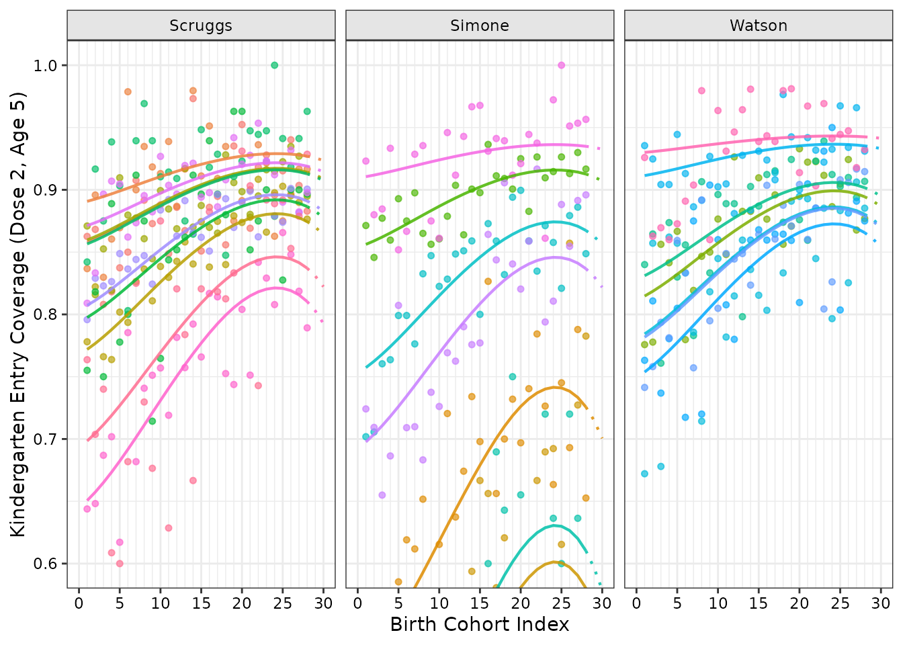

# Included Example Datasets and Data Validation

## Overview of the Synthetic Simulation Universe

`imuGAP` provides four bundled datasets (`locations_sim`,
`observations_sim`, `populations_sim`, and `target_sim`) alongside
latent parameter fixtures (`latent_params_sim`, `fit_sim`,
`predict_sim`) that reflect an underlying vaccination process model and
surveillance streams across a multi-resolution hierarchical population
structure.

In this scenario:

- A single **State** is partitioned into 3 **Counties** (Scruggs,
  Simone, Watson), which contain a total of 24 elementary **Schools**
  (10 in Scruggs, 7 in Simone, 7 in Watson).
- The vaccine requires a 2-dose sequential regimen (e.g. MMR, with dose
  1 recommended at age 1 and dose 2 eligible at age 4).
- Observations are gathered from diverse empirical surveillance streams:
  - **ChildVaxView / NIS-Child**: State-level single-cohort point
    estimates at ages 2 and 3 for dose 1.
  - **SchoolVaxView**: State-level kindergarten entry surveys (dose 2 at
    age 5).
  - **TeenVaxView**: State-level multi-cohort cross-sectional survey
    snapshots spanning ages 14 to 18 (dose 2).
  - **County Sixth-Grade Surveys**: Right-censored dose 2 coverage at
    age 11 across all 3 counties.
  - **School Kindergarten Entry Records**: Annual kindergarten entry
    surveys for dose 2 at age 5 across all 24 individual schools.

------------------------------------------------------------------------

## 1. Inspecting the Bundled Datasets

#### Location Hierarchy (`locations_sim`)

The `locations_sim` dataset defines the spatial tree structure. Every
location node must have either 0 offspring (a leaf node, such as a
school) or strictly greater than 1 offspring ($`\ge 2`$ children).

``` r

data("locations_sim", package = "imuGAP")
head(locations_sim)
#>                  loc_id population parent_id
#>                  <char>      <num>    <char>
#> 1:                State  2895.1333      <NA>
#> 2:              Scruggs  1527.7000     State
#> 3:               Simone   746.6333     State
#> 4:               Watson   620.8000     State
#> 5: Chickadee Elementary   147.8333   Scruggs
#> 6:     Nuthatch Academy   368.5333   Scruggs
nrow(locations_sim)
#> [1] 28
```

You can validate and canonicalize the location tree using
[`canonicalize_locations()`](https://accidda.github.io/imuGAP/reference/canonicalize.md):

``` r

canonical_locations <- canonicalize_locations(locations_sim)
head(canonical_locations)
#> Key: <layer, parent_id, loc_id>
#>                      loc_id population parent_id layer loc_c_id loc_cp_id
#>                      <char>      <num>    <char> <int>    <int>     <int>
#> 1:                    State 2895.13333      <NA>     1        1        NA
#> 2:                  Scruggs 1527.70000     State     2        2         1
#> 3:                   Simone  746.63333     State     2        3         1
#> 4:                   Watson  620.80000     State     2        4         1
#> 5:        Blue Heron School  115.43333   Scruggs     3        5         2
#> 6: Bluebird Learning Center   49.63333   Scruggs     3        6         2
#>    layer_bound
#>          <int>
#> 1:           1
#> 2:           1
#> 3:           1
#> 4:           1
#> 5:           1
#> 6:           1
```

[`canonicalize_locations()`](https://accidda.github.io/imuGAP/reference/canonicalize.md)
introduces:

- `loc_c_id` and `loc_cp_id`: 1-based integer continuous indices for the
  location and its parent.
- `layer`: 1-based integer tree depth (1 for State, 2 for County, 3 for
  School).
- `layer_bound`: Index slicing offsets used internally by Stan to
  partition the spatial random effect arrays.

------------------------------------------------------------------------

#### Coverage Observations (`observations_sim`)

The `observations_sim` dataset contains the binomial survey outcomes:

- `obs_id`: Unique identifier for each observation.
- `loc_id`: Location identifier matching a node in `locations_sim`.
- `positive`: Count of vaccinated individuals.
- `sample_n`: Total sample size ($`N`$).
- `censored`: `1` for right-censored observations, `NA` for uncensored
  observations.

``` r

data("observations_sim", package = "imuGAP")
head(observations_sim[, .(obs_id, loc_id, positive, sample_n, censored)])
#>    obs_id               loc_id positive sample_n censored
#>     <int>               <char>    <num>    <int>    <num>
#> 1:      1 Chickadee Elementary      135      155       NA
#> 2:      2 Chickadee Elementary      124      152       NA
#> 3:      3 Chickadee Elementary      133      156       NA
#> 4:      4 Chickadee Elementary      127      155       NA
#> 5:      5 Chickadee Elementary      141      155       NA
#> 6:      6 Chickadee Elementary      139      158       NA
```

Canonicalizing observations with
[`canonicalize_observations()`](https://accidda.github.io/imuGAP/reference/canonicalize.md)
assigns continuous 1-based indices `obs_c_id`, sorting uncensored
records before censored records for efficient block execution in Stan:

``` r

canonical_observations <- canonicalize_observations(observations_sim)
head(canonical_observations)
#> Key: <censored, obs_id>
#>    obs_c_id positive sample_n censored obs_id
#>       <int>    <int>    <int>    <num>  <int>
#> 1:        1      135      155       NA      1
#> 2:        2      124      152       NA      2
#> 3:        3      133      156       NA      3
#> 4:        4      127      155       NA      4
#> 5:        5      141      155       NA      5
#> 6:        6      139      158       NA      6
```

------------------------------------------------------------------------

#### Observation Metadata & Populations (`populations_sim`)

The `populations` table provides essential metadata for all
observations—defining the discrete location, age, cohort, and dose
associated with each survey outcome. Every record in `observations`
receives one or more entries in `populations`:

- **Direct (1:1) observations**: A single row with `weight = 1.0` maps
  the observation directly to a discrete population slice (such as a
  single-cohort kindergarten survey at age 5).
- **Mixed observations**: When a survey mixes multiple underlying
  populations (such as cross-sectional surveys spanning multiple age
  groups or cohorts), `populations` captures this mixture using multiple
  rows sharing the same `obs_id`, each assigned a fractional weight
  (e.g. equal weights or demographic population shares summing to 1.0).

``` r

data("populations_sim", package = "imuGAP")
head(populations_sim)
#>    obs_id               loc_id cohort   age  dose weight
#>     <int>               <char>  <int> <int> <int>  <num>
#> 1:      1 Chickadee Elementary      1     5     2      1
#> 2:      2 Chickadee Elementary      2     5     2      1
#> 3:      3 Chickadee Elementary      3     5     2      1
#> 4:      4 Chickadee Elementary      4     5     2      1
#> 5:      5 Chickadee Elementary      5     5     2      1
#> 6:      6 Chickadee Elementary      6     5     2      1
```

For single-cohort kindergarten surveys, `obs_id` has a 1:1 mapping with
`weight = 1.0`. For multi-age surveys (such as TeenVaxView at
`obs_id == 761`), multiple rows describe the mixture across ages:

``` r

# TeenVaxView-style observation spanning ages 14 to 18
observations_sim[
  obs_id == 761,
  .(obs_id, loc_id, positive, sample_n, age_min, age_max, dose)
]
#>    obs_id loc_id positive sample_n age_min age_max  dose
#>     <int> <char>    <num>    <int>   <int>   <int> <int>
#> 1:    761  State      217      250      14      19     2

# Corresponding population metadata with distributed weights summing to 1.0
populations_sim[obs_id == 761]
#>    obs_id loc_id cohort   age  dose weight
#>     <int> <char>  <int> <int> <int>  <num>
#> 1:    761  State      5    14     2    0.2
#> 2:    761  State      4    15     2    0.2
#> 3:    761  State      3    16     2    0.2
#> 4:    761  State      2    17     2    0.2
#> 5:    761  State      1    18     2    0.2
```

You can validate and canonicalize populations using
[`canonicalize_populations()`](https://accidda.github.io/imuGAP/reference/canonicalize.md):

``` r

canonical_populations <- canonicalize_populations(
  populations_sim, observations_sim, locations_sim
)
head(canonical_populations)
#> Key: <obs_c_id, loc_c_id, cohort, age, dose>
#>    obs_id               loc_id cohort   age  dose weight obs_c_id loc_c_id
#>     <int>               <char>  <int> <int> <int>  <num>    <int>    <int>
#> 1:      1 Chickadee Elementary      1     5     2      1        1        8
#> 2:      2 Chickadee Elementary      2     5     2      1        2        8
#> 3:      3 Chickadee Elementary      3     5     2      1        3        8
#> 4:      4 Chickadee Elementary      4     5     2      1        4        8
#> 5:      5 Chickadee Elementary      5     5     2      1        5        8
#> 6:      6 Chickadee Elementary      6     5     2      1        6        8
#>    range_start
#>          <int>
#> 1:           1
#> 2:           2
#> 3:           3
#> 4:           4
#> 5:           5
#> 6:           6
```

------------------------------------------------------------------------

## 2. Canonicalization Rules and Validation Diagnostics

`imuGAP` enforces strict structural assertions to safeguard model
fitting against corrupted or incompatible inputs:

#### Observation Binomial Count Consistency

If an observation has `positive > sample_n`,
[`canonicalize_observations()`](https://accidda.github.io/imuGAP/reference/canonicalize.md)
raises an informative error:

``` r

invalid_obs <- copy(observations_sim[, .(obs_id, loc_id, positive, sample_n, censored)])
invalid_obs[1, positive := sample_n + 10]

tryCatch(
  canonicalize_observations(invalid_obs),
  error = function(e) message("Caught expected error: ", e$message)
)
#> Caught expected error: `observations` column 'positive' must be <= 'sample_n'; found 1 invalid row(s) with obs_id: 1; use `subset(observations, positive > sample_n)` to resolve invalid entries
```

#### Hierarchy Invariant Enforcement

If duplicate location IDs exist, or single-child chains are introduced,
[`canonicalize_locations()`](https://accidda.github.io/imuGAP/reference/canonicalize.md)
rejects the tree:

``` r

invalid_locs <- rbind(
  locations_sim,
  data.frame(loc_id = "Scruggs", parent_id = "State"),
  fill = TRUE
)

tryCatch(
  canonicalize_locations(invalid_locs),
  error = function(e) message("Caught expected error: ", e$message)
)
#> Caught expected error: `locations` column 'loc_id' must contain unique values; found 1 duplicate(s): Scruggs; use `subset(locations, duplicated(loc_id) | duplicated(loc_id, fromLast = TRUE))` to resolve invalid entries
```

------------------------------------------------------------------------

## 3. Visualizing the Synthetic Observation Streams

The following figures illustrate empirical coverage rates across each
observation stream compared against underlying true data-generating
parameters (`latent_params_sim`).

#### State-Level Observation Streams

**Show plot code**

``` r

data("latent_params_sim", package = "imuGAP")

state_obs <- copy(observations_sim[loc_id == "State"])
state_obs[, source := factor(
  fcase(
    dose == 1 & age_min == 2, "ChildVaxView (Dose 1, Age 2)",
    dose == 1 & age_min == 3, "ChildVaxView (Dose 1, Age 3)",
    age_min == 5, "SchoolVaxView (Dose 2, Age 5)",
    default = "TeenVaxView (Dose 2, Ages 14-18)"
  ),
  levels = c(
    "ChildVaxView (Dose 1, Age 2)",
    "ChildVaxView (Dose 1, Age 3)",
    "SchoolVaxView (Dose 2, Age 5)",
    "TeenVaxView (Dose 2, Ages 14-18)"
  )
)]
state_obs[, obs_prop := positive / sample_n]

single_cohort_obs <- state_obs[is.na(age_max) | age_max == age_min + 1L]
multi_cohort_obs <- copy(state_obs[!is.na(age_max) & age_max > age_min + 1L])
multi_cohort_obs[, cohort_max := cohort_min + (age_max - 1L) - age_min]

latent_state <- data.table(
  cohort_min = seq_along(latent_params_sim$phi_state),
  propensity = 1 - latent_params_sim$phi_state
)

n_c <- length(latent_params_sim$phi_state)
skv_max_cohort <- max(state_obs[age_min == 5, cohort_min])
tvv_max_cohort <- max(multi_cohort_obs$cohort_min)

latent_curves <- rbindlist(list(
  data.table(
    cohort_min = seq_len(n_c),
    latent_cov = (1 - latent_params_sim$phi_state) *
      latent_params_sim$uptake[2, 1],
    source = "ChildVaxView (Dose 1, Age 2)"
  ),
  data.table(
    cohort_min = seq_len(n_c),
    latent_cov = (1 - latent_params_sim$phi_state) *
      latent_params_sim$uptake[3, 1],
    source = "ChildVaxView (Dose 1, Age 3)"
  ),
  data.table(
    cohort_min = seq_len(skv_max_cohort),
    latent_cov = (1 - latent_params_sim$phi_state[seq_len(skv_max_cohort)]) *
      latent_params_sim$uptake[5, 2],
    source = "SchoolVaxView (Dose 2, Age 5)"
  ),
  data.table(
    cohort_min = seq_len(tvv_max_cohort),
    latent_cov = (1 - latent_params_sim$phi_state[seq_len(tvv_max_cohort)]) *
      mean(latent_params_sim$uptake[14:18, 2]),
    source = "TeenVaxView (Dose 2, Ages 14-18)"
  )
))
latent_curves[, source := factor(source, levels = levels(state_obs$source))]

ggplot() +
  geom_line(
    data = latent_state,
    aes(x = cohort_min, y = propensity, linetype = "True Lifetime Uptake Propensity (1 - phi)"),
    color = "gray40", linewidth = 0.8, alpha = 0.5
  ) +
  geom_line(
    data = latent_curves,
    aes(x = cohort_min, y = latent_cov, color = source),
    linetype = "dashed", linewidth = 0.7, alpha = 0.4
  ) +
  geom_segment(
    data = multi_cohort_obs,
    aes(x = cohort_min, xend = cohort_max, y = obs_prop, yend = obs_prop, color = source),
    linewidth = 1.1, alpha = 0.95
  ) +
  geom_point(
    data = single_cohort_obs,
    aes(x = cohort_min, y = obs_prop, color = source, shape = source),
    size = 2.4, alpha = 0.95
  ) +
  scale_x_continuous(breaks = seq(0, 30, by = 5), minor_breaks = seq(1, 30, by = 1)) +
  coord_cartesian(xlim = c(0, 30), ylim = c(0.4, 1.0)) +
  scale_linetype_manual(
    name = NULL,
    values = c("True Lifetime Uptake Propensity (1 - phi)" = "dashed")
  ) +
  scale_color_brewer(name = "Data Source", palette = "Dark2") +
  scale_shape_manual(
    name = "Data Source",
    values = c(
      "ChildVaxView (Dose 1, Age 2)" = 16,
      "ChildVaxView (Dose 1, Age 3)" = 17,
      "SchoolVaxView (Dose 2, Age 5)" = 15,
      "TeenVaxView (Dose 2, Ages 14-18)" = 18
    )
  ) +
  guides(
    color = guide_legend(
      override.aes = list(
        shape = c(16, 17, 15, NA),
        linetype = c("blank", "blank", "blank", "solid"),
        linewidth = c(0, 0, 0, 1.1),
        alpha = 1
      )
    ),
    shape = "none"
  ) +
  theme(
    legend.position = "inside",
    legend.position.inside = c(0.98, 0.02),
    legend.justification.inside = c(1, 0)
  ) +
  labs(x = "Birth Cohort Index", y = "Vaccination Proportion")
```



------------------------------------------------------------------------

#### County-Level Right-Censored Surveillance

`imuGAP` supports observations at intermediate spatial resolutions as
well as right-censored surveillance streams.

In public health surveillance, records often report composite vaccine
series completion (for example, whether a student has received all
required middle school entry immunizations) rather than tracking a
specific vaccine in isolation. Because an individual who completed the
full multi-vaccine series has necessarily received the target vaccine,
the observed series completion rate acts as a lower bound on the target
vaccine’s true coverage (true coverage $`\ge`$ observed proportion).

`imuGAP` natively models right-censored observations:

- In `observations`, you mark right-censored survey records with
  `censored = 1` (and uncensored records with `NA`).
- During Bayesian model fitting, the likelihood accounts for the
  right-censoring mechanism, ensuring that lower-bound surveillance
  records accurately inform the latent process without biasing coverage
  trajectories downward.

In this simulation universe, routine county-wide middle school entry
tallies (dose 2 at age 11) across all three counties represent
right-censored surveillance streams:

**Show plot code**

``` r

county_names <- names(latent_params_sim$off_cnty)
county_obs <- copy(observations_sim[loc_id %in% county_names])
county_obs[, obs_prop := positive / sample_n]

max_obs_cohort <- max(county_obs$cohort_min)
n_cohorts <- length(latent_params_sim$phi_state)

county_latent <- rbindlist(lapply(names(latent_params_sim$off_cnty), function(cnty) {
  cohorts <- seq_len(n_cohorts)
  c_idx <- match(cnty, names(latent_params_sim$off_cnty))
  offset <- latent_params_sim$off_cnty[c_idx]
  phi_shifted <- plogis(qlogis(latent_params_sim$phi_state[cohorts]) + offset)
  cov_true <- (1 - phi_shifted) * latent_params_sim$uptake[11, 2]
  cov_censored <- cov_true * latent_params_sim$censor_reduction
  data.table(
    loc_id = cnty,
    cohort_min = cohorts,
    latent_cov = cov_true,
    latent_cov_censored = cov_censored
  )
}))

county_latent_obs <- county_latent[cohort_min <= max_obs_cohort]
county_latent_unobs <- county_latent[cohort_min >= max_obs_cohort]

ggplot() +
  geom_point(
    data = county_obs,
    aes(x = cohort_min, y = obs_prop),
    color = "steelblue", size = 2, alpha = 0.85
  ) +
  geom_line(
    data = county_latent_obs,
    aes(
      x = cohort_min,
      y = latent_cov,
      color = "True Latent Coverage",
      linetype = "Observed Cohorts"
    ),
    linewidth = 0.9
  ) +
  geom_line(
    data = county_latent_obs,
    aes(
      x = cohort_min,
      y = latent_cov_censored,
      color = "Censored Latent (0.95x)",
      linetype = "Observed Cohorts"
    ),
    linewidth = 0.9
  ) +
  geom_line(
    data = county_latent_unobs,
    aes(
      x = cohort_min,
      y = latent_cov,
      color = "True Latent Coverage",
      linetype = "Unobserved Cohorts"
    ),
    linewidth = 0.9
  ) +
  geom_line(
    data = county_latent_unobs,
    aes(
      x = cohort_min,
      y = latent_cov_censored,
      color = "Censored Latent (0.95x)",
      linetype = "Unobserved Cohorts"
    ),
    linewidth = 0.9
  ) +
  facet_wrap(~loc_id) +
  scale_x_continuous(breaks = seq(0, 30, by = 5), minor_breaks = seq(1, 30, by = 1)) +
  scale_y_continuous(expand = c(0, 0)) +
  coord_cartesian(xlim = c(0, 30), ylim = c(0.6, 1.0)) +
  scale_color_manual(
    name = NULL,
    values = c("True Latent Coverage" = "firebrick", "Censored Latent (0.95x)" = "darkorange")
  ) +
  scale_linetype_manual(
    name = NULL,
    values = c("Observed Cohorts" = "dashed", "Unobserved Cohorts" = "dotted")
  ) +
  guides(
    color = guide_legend(order = 1, override.aes = list(linewidth = 0.9, linetype = "solid")),
    linetype = guide_legend(order = 2, override.aes = list(linewidth = 0.9, color = "black"))
  ) +
  theme(
    legend.position = "inside",
    legend.position.inside = c(0.85, 0.12),
    legend.justification.inside = c(1, 0)
  ) +
  labs(x = "Birth Cohort Index", y = "6th Grade Survey Coverage (Dose 2, Age 11)")
```



------------------------------------------------------------------------

#### School Kindergarten Enrollment Records

The following plot illustrates school-level kindergarten entry records
(dose 2 at age 5) across all elementary schools grouped by county,
comparing empirical survey counts against the underlying school-specific
latent coverage curves:

**Show plot code**

``` r

canonical_locations <- canonicalize_locations(locations_sim)
sch_locs <- canonical_locations[layer == 3]

n_cohorts <- length(latent_params_sim$phi_state)
off_c <- latent_params_sim$off_cnty
off_s <- latent_params_sim$off_sch
uptake_val <- latent_params_sim$uptake[5, 2]

school_latent <- rbindlist(lapply(seq_len(nrow(sch_locs)), function(i) {
  sch <- sch_locs$loc_id[i]
  cnty <- sch_locs$parent_id[i]
  tot_off <- unname(off_c[cnty]) + unname(off_s[sch])
  cohorts <- seq_len(n_cohorts)
  phi_shifted <- plogis(qlogis(latent_params_sim$phi_state[cohorts]) + tot_off)
  cov_true <- (1 - phi_shifted) * uptake_val
  data.table(loc_id = sch, county_id = cnty, cohort_min = cohorts, latent_cov = cov_true)
}))

sch_obs <- copy(observations_sim[loc_id %in% sch_locs$loc_id])
sch_obs[, obs_prop := positive / sample_n]
sch_obs <- merge(sch_obs, sch_locs[, .(loc_id, county_id = parent_id)], by = "loc_id")

max_obs_cohort <- max(sch_obs$cohort_min)
school_latent_obs <- school_latent[cohort_min <= max_obs_cohort]
school_latent_unobs <- school_latent[cohort_min >= max_obs_cohort]

ggplot() +
  geom_point(
    data = sch_obs,
    aes(x = cohort_min, y = obs_prop, color = loc_id),
    size = 1.3, alpha = 0.65
  ) +
  geom_line(
    data = school_latent_obs,
    aes(
      x = cohort_min,
      y = latent_cov,
      group = loc_id,
      color = loc_id,
      linetype = "Observed Cohorts"
    ),
    linewidth = 0.75, alpha = 0.85
  ) +
  geom_line(
    data = school_latent_unobs,
    aes(
      x = cohort_min,
      y = latent_cov,
      group = loc_id,
      color = loc_id,
      linetype = "Unobserved Cohorts"
    ),
    linewidth = 0.75, alpha = 0.85
  ) +
  facet_wrap(~county_id) +
  scale_x_continuous(breaks = seq(0, 30, by = 5), minor_breaks = seq(1, 30, by = 1)) +
  coord_cartesian(xlim = c(0, 30), ylim = c(0.6, 1.0)) +
  scale_linetype_manual(
    name = NULL,
    values = c("Observed Cohorts" = "solid", "Unobserved Cohorts" = "dotted")
  ) +
  theme(legend.position = "none") +
  labs(
    x = "Birth Cohort Index",
    y = "Kindergarten Entry Coverage (Dose 2, Age 5)"
  )
```



------------------------------------------------------------------------

## Summary and Related Vignettes

- For an overview of estimating the underlying process model and
  predicting coverage, see **[Getting Started with
  imuGAP](https://accidda.github.io/imuGAP/articles/imuGAP.md)**.
- To learn how `imuGAP` configures and estimates parameters across
  arbitrary spatial depths, see **[Flexible Location Layers in
  imuGAP](https://accidda.github.io/imuGAP/articles/user_specified_layers.md)**.
- For detailed MCMC convergence checks, trace plots, and parameter
  inference, see **[Fit Inspection and Stan
  Diagnostics](https://accidda.github.io/imuGAP/articles/examining_fits.md)**.
