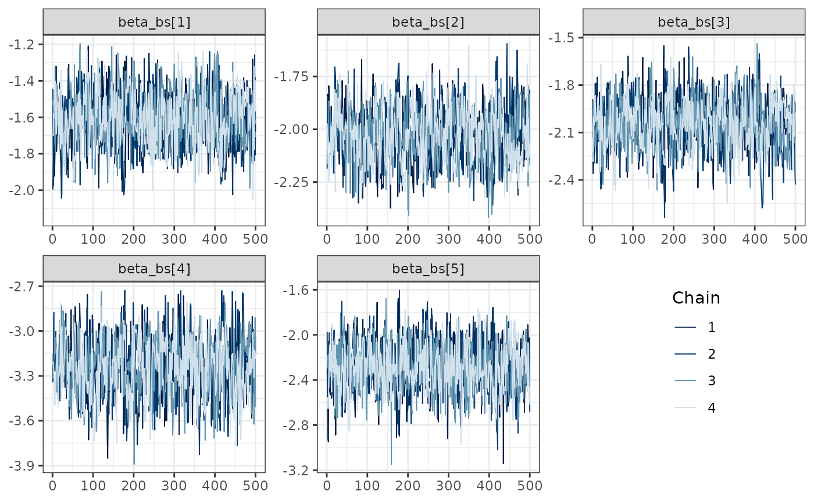
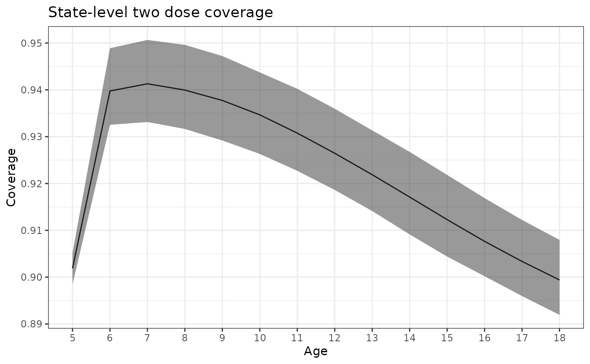
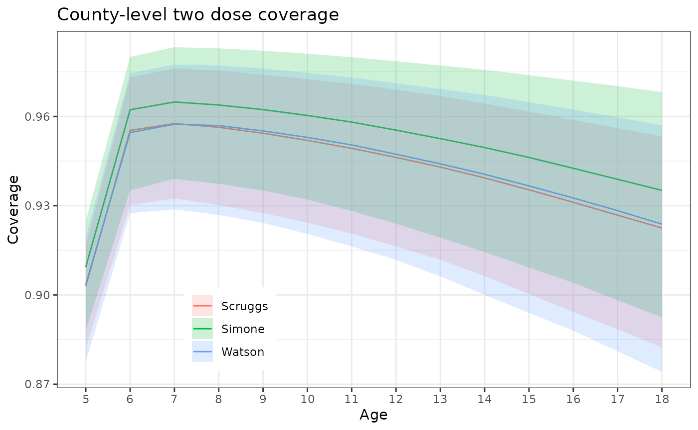
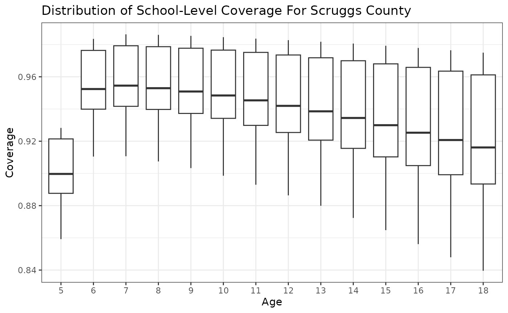
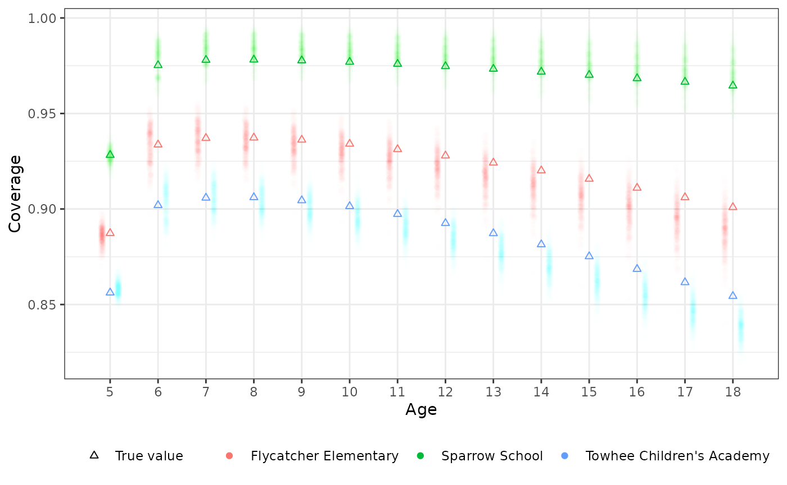

# imuGAP, Immunity: Geographic & Age-based Projection

## Introduction

The name `imuGAP` stands for “Immunity: Geographic & Age-based
Projection”. This package allows the user to synthesize across multiple
data sources to make predictions of vaccination coverage for
user-defined populations of interest. For example, one could use the
package to:

1.  Estimate current vaccination coverage by location across different
    age groups
2.  Estimate coverage (or uptake) for a given birth cohort (e.g. people
    born in 1990) across their life course (i.e. at each age from birth
    to current age)
3.  Fill in gaps in observed coverage data (e.g. a school that doesn’t
    report vaccination coverage in a certain year)

More specifically, the package provides a
[stan](https://mc-stan.org/)-based model for estimating vaccination
coverage by location, cohort, and age for childhood infectious diseases,
such as measles. The core model represents a target population as having
a life-long propensity for vaccination; some proportion, $`\phi`$, of
that population is unlikely to vaccinate and the complementary
proportion, $`1 - \phi`$, is likely to vaccinate. That population then
experiences a vaccination rate, $`\lambda`$, over the model time eras,
according to the vaccination eligibility schedule, $`\nu`$. These core
parameters can vary over time and location, in a user-specifiable way.

Focusing just on the core model element, imagine a particular population
location $`i`$ and cohort $`a`$ (where $`a`$ denotes the start of the
time period when that group was born). If that cohort is now age $`t`$,
and the vaccine schedule for the first dose is $`\nu(t)`$, the expected
fraction of that group to have at least one dose is then:

``` math
P(\ge\textrm{1 dose}) = \left(1 - \phi_{i, a}\right) \left(1 - \exp\left\{-\int_a^{t} \lambda_{i, a}(s)\nu(s) d\textrm{s}\right\}\right)
```

Which is to say, we are representing vaccination coverage via a
survival-like model. The model generalizes this approach to the first
dose out to arbitrary sequential dose coverage, with each subsequent
dose conditional on previous dose receipt.

## Walkthrough of Basic Usage

This walkthrough demonstrates the workflow of fitting the model and
predicting coverage on simulated data. The package includes several
bundled datasets for demonstration, representing a nested geographic
hierarchy (State -\> Counties -\> Schools) for population uptake of a
two dose vaccine, like MMR for measles.

### 1. Preparing and Validating the Input Data

First, let’s explore the three required inputs that define the location
hierarchy, observation metadata, and the actual coverage observations.
The package provides a family of `canonicalize_*` functions to validate,
clean, and convert these raw structures into the canonical forms
required by the sampler. You can use those directly to help troubleshoot
your inputs, as we do in the following examples. However, as shown in
the next section, the
[`sampling()`](https://accidda.github.io/imuGAP/reference/sampling.md)
method also automatically canonicalizes the inputs.

#### Location Hierarchy (`locations_sim`)

The locations dataset defines the nesting relationship of the locations
in the model. In this simulation, we have a State, which contains three
Counties, which in turn contain various Schools. We validate and
canonicalize it using
[`canonicalize_locations()`](https://accidda.github.io/imuGAP/reference/canonicalize.md).

``` r

data("locations_sim", package = "imuGAP")
head(locations_sim)
#>                  loc_id parent_id
#>                  <char>    <char>
#> 1:                State      <NA>
#> 2:              Scruggs     State
#> 3:               Simone     State
#> 4:               Watson     State
#> 5: Chickadee Elementary   Scruggs
#> 6:     Nuthatch Academy   Scruggs

# Canonicalize and validate
canonical_locations <- canonicalize_locations(locations_sim)
head(canonical_locations)
#> Key: <layer, parent_id, loc_id>
#>                      loc_id parent_id layer loc_c_id loc_cp_id layer_bound
#>                      <char>    <char> <int>    <int>     <int>       <int>
#> 1:                    State      <NA>     1        1        NA           1
#> 2:                  Scruggs     State     2        2         1           1
#> 3:                   Simone     State     2        3         1           1
#> 4:                   Watson     State     2        4         1           1
#> 5:        Blue Heron School   Scruggs     3        5         2           1
#> 6: Bluebird Learning Center   Scruggs     3        6         2           1
```

#### Coverage Observations (`observations_sim`)

The observations dataset contains the counts of individuals who were
vaccinated (`positive`) out of the total sampled (`sample_n`) for each
observation. It also includes a `censored` column, which is `1` if the
observation is right-censored and `NA` otherwise. We validate and
canonicalize it using
[`canonicalize_observations()`](https://accidda.github.io/imuGAP/reference/canonicalize.md).

``` r

data("observations_sim", package = "imuGAP")
head(observations_sim[, .(obs_id, loc_id, positive, sample_n, censored)])
#>    obs_id               loc_id positive sample_n censored
#>     <int>               <char>    <num>    <num>    <num>
#> 1:      1 Chickadee Elementary       16       19       NA
#> 2:      2 Chickadee Elementary       14       20       NA
#> 3:      3 Chickadee Elementary       14       16       NA
#> 4:      4 Chickadee Elementary       10       13       NA
#> 5:      5 Chickadee Elementary        8       13       NA
#> 6:      6 Chickadee Elementary        7        8       NA

# Canonicalize and validate
canonical_observations <- canonicalize_observations(observations_sim)
head(canonical_observations)
#> Key: <censored, obs_id>
#>    obs_c_id positive sample_n censored obs_id
#>       <int>    <int>    <int>    <num>  <int>
#> 1:        1       16       19       NA      1
#> 2:        2       14       20       NA      2
#> 3:        3       14       16       NA      3
#> 4:        4       10       13       NA      4
#> 5:        5        8       13       NA      5
#> 6:        6        7        8       NA      6
```

#### Observation Metadata (`populations_sim`)

The populations dataset acts as observation metadata, mapping each
observation ID (`obs_id`) to the corresponding location, birth cohort,
age at observation, vaccine dose, and observation weight. We validate
and canonicalize it using
[`canonicalize_populations()`](https://accidda.github.io/imuGAP/reference/canonicalize.md).

``` r

data("populations_sim", package = "imuGAP")
head(populations_sim)
#>    obs_id               loc_id cohort   age  dose weight
#>     <num>               <char>  <num> <num> <num>  <num>
#> 1:      1 Chickadee Elementary      4     5     2      1
#> 2:      2 Chickadee Elementary      5     5     2      1
#> 3:      3 Chickadee Elementary      6     5     2      1
#> 4:      4 Chickadee Elementary      7     5     2      1
#> 5:      5 Chickadee Elementary      8     5     2      1
#> 6:      6 Chickadee Elementary      9     5     2      1

# Canonicalize and validate
canonical_populations <- canonicalize_populations(
  populations_sim, observations_sim, locations_sim
)
head(canonical_populations)
#> Key: <obs_c_id, loc_c_id, cohort, age, dose>
#>    obs_id               loc_id cohort   age  dose weight obs_c_id loc_c_id
#>     <num>               <char>  <int> <int> <num>  <num>    <int>    <int>
#> 1:      1 Chickadee Elementary      4     5     2      1        1        8
#> 2:      2 Chickadee Elementary      5     5     2      1        2        8
#> 3:      3 Chickadee Elementary      6     5     2      1        3        8
#> 4:      4 Chickadee Elementary      7     5     2      1        4        8
#> 5:      5 Chickadee Elementary      8     5     2      1        5        8
#> 6:      6 Chickadee Elementary      9     5     2      1        6        8
#>    range_start
#>          <int>
#> 1:           1
#> 2:           2
#> 3:           3
#> 4:           4
#> 5:           5
#> 6:           6
```

#### Validation Failure Examples

To ensure data integrity, the `canonicalize_*` functions enforce strict
rules on the input data format and constraints. For example, if we
modify the observations data so that the number of `positive` cases
exceeds the total sample size `sample_n`, the validation function will
raise a clear error:

``` r

# Create a copy with an invalid observation (positive > sample_n)
invalid_obs <- copy(observations_sim[, .(obs_id, loc_id, positive, sample_n, censored)])
invalid_obs[1, positive := sample_n + 10]

# This will fail validation and throw an error:
tryCatch(
  canonicalize_observations(invalid_obs),
  error = function(e) message("Caught expected error: ", e$message)
)
#> Caught expected error: positive must be <= sample_n; found 1 invalid observations with offending ids: 1
```

Similarly, if the locations data contains duplicate location IDs,
[`canonicalize_locations()`](https://accidda.github.io/imuGAP/reference/canonicalize.md)
will detect the duplication and throw an error:

``` r

# Create a copy with a duplicate location ID
invalid_locs <- rbind(
  locations_sim,
  data.frame(loc_id = "Scruggs", parent_id = "State")
)

# This will fail validation:
tryCatch(
  canonicalize_locations(invalid_locs),
  error = function(e) message("Caught expected error: ", e$message)
)
#> Caught expected error: locations$loc_id must be unique; found 1 duplicates: 29
```

See the `canonicalize_*` function documentation for more complete
validation requirements.

------------------------------------------------------------------------

### 2. Fitting the Model

Using the prepared input datasets, we can fit the Bayesian model using
[`sampling()`](https://accidda.github.io/imuGAP/reference/sampling.md).
The options for the sampler can be configured using
[`stan_options()`](https://accidda.github.io/imuGAP/reference/stan_options.md).

Because compiling the Stan model and running the MCMC chain can take
some time, we show the code below without executing it.

``` r

fit_sim <- sampling(
  observations_sim, populations_sim, locations_sim,
  stan_opts = stan_options(
    iter = 2000, chains = 4, refresh = 0, seed = 1L
  )
)
```

For this walkthrough, we load the pre-computed fit object `fit_sim`
bundled with the package:

``` r

data("fit_sim", package = "imuGAP")
```

Once the model is fit, we can extract posterior draws of the model
parameters using
[`extract_imugap()`](https://accidda.github.io/imuGAP/reference/extract_imugap.md).
For example, let’s extract the B-spline coefficients representing the
state-level vaccine uptake baseline:

``` r

beta_draws <- extract_imugap(fit_sim, pars = "beta_bs")
str(beta_draws)
#> List of 1
#>  $ beta_bs: num [1:2000, 1:5] -1.86 -2.01 -1.8 -1.91 -1.92 ...
#>   ..- attr(*, "dimnames")=List of 2
#>   .. ..$ iterations: NULL
#>   .. ..$           : NULL
```

We can also look at trace plots for selected parameters to ensure
convergence has been reached.

``` r

bayesplot::mcmc_trace(fit_sim$stanfit,
  pars = c(
    "beta_bs[1]", "beta_bs[2]", "beta_bs[3]",
    "beta_bs[4]", "beta_bs[5]"
  )
) + theme_bw() +
  theme(legend.position = c(.9, .1), legend.justification = c(1, 0))
```



------------------------------------------------------------------------

### 3. Defining a Target for Predictions

To predict vaccine coverage for a target population (which can include
locations or cohorts without direct observations, as long as they exist
in the locations hierarchy), we first define a target grid using
[`create_target()`](https://accidda.github.io/imuGAP/reference/create_target.md).
Note that predictions can only be made for birth cohorts and locations
that have at least some observations included in the estimation run. In
other words, the model cannot predict coverage for future birth cohorts
or unobserved locations.

For example, we can generate a “snapshot” prediction target for all
locations, including the State and County levels, across ages 1 to 18:

``` r

target_sim <- create_target(
  location = unique(locations_sim$loc_id), age = 1:18,
  cohort = max(populations_sim$cohort) - 18, dose = c(1, 2), mode = "snapshot"
)
head(target_sim)
#>    obs_c_id               loc_id   age cohort  dose weight
#>       <int>               <char> <int>  <num> <num>  <num>
#> 1:        1                State     1     30     1      1
#> 2:        2              Scruggs     1     30     1      1
#> 3:        3               Simone     1     30     1      1
#> 4:        4               Watson     1     30     1      1
#> 5:        5 Chickadee Elementary     1     30     1      1
#> 6:        6     Nuthatch Academy     1     30     1      1
```

------------------------------------------------------------------------

### 4. Predicting Coverage

Finally, we run [`predict()`](https://rdrr.io/r/stats/predict.html) to
generate predicted coverage probabilities for each target population
combination. By default it uses every posterior draw; here we pass
`posterior_size` to predict over a smaller sub-sample taken from the end
of each chain.

Generating predictions also runs the Stan model (in generated quantities
mode) and can be time-consuming, so we show the code below without
executing it:

``` r

predict_sim <- predict(object = fit_sim, target = target_sim, posterior_size = 100)
```

Instead, we load the pre-computed prediction results `predict_sim`
bundled with the package. This is an object of class `imugap_predict`
which contains a 3D draws array (`predict_sim$draws`) with the MCMC
draws for each prediction target as well as the target information
(`predict_sim$target`).

``` r

data("predict_sim", package = "imuGAP")
```

We can summarize these predictions to get the posterior mean and
credible intervals across the target location, age, and doses requested:

``` r

# Calculate the posterior mean coverage probability for each location and dose at age 5
summary_predict <- summary(predict_sim)
head(summary_predict)
#>    obs_c_id               loc_id   age cohort  dose weight loc_c_id obs_id
#>       <int>               <char> <int>  <num> <num>  <num>    <int>  <int>
#> 1:        1                State     1     30     1      1        1      1
#> 2:        2              Scruggs     1     30     1      1        2      2
#> 3:        3               Simone     1     30     1      1        3      3
#> 4:        4               Watson     1     30     1      1        4      4
#> 5:        5 Chickadee Elementary     1     30     1      1        8      5
#> 6:        6     Nuthatch Academy     1     30     1      1       11      6
#>     mean  q2_5   q50 q97_5
#>    <num> <num> <num> <num>
#> 1:     0     0     0     0
#> 2:     0     0     0     0
#> 3:     0     0     0     0
#> 4:     0     0     0     0
#> 5:     0     0     0     0
#> 6:     0     0     0     0
```

Now let’s visualize the results. First we will take a look at overall
state coverage by cohort. Note that the lower coverage among 5 year olds
is due to them only having been eligible for their second dose for one
year.

``` r

summary_predict |>
  subset(loc_id == "State" & dose == 2 & age > 4) |>
  ggplot() +
  aes(x = age) +
  geom_line(aes(y = q50)) +
  geom_ribbon(aes(ymin = q2_5, ymax = q97_5), alpha = 0.5) +
  theme_bw() +
  scale_x_continuous(breaks = 5:18, minor_breaks = NULL) +
  labs(x = "Age", y = "Coverage", title = "State-level two dose coverage")
```



We can also look at the trend in coverage by age at the county level.
Note that they follow the same trend as the state but with differing
magnitude.

``` r

summary_predict |>
  subset(loc_id %in% c("Scruggs", "Simone", "Watson") & dose == 2 & age > 4) |>
  ggplot() +
  aes(x = age) +
  geom_line(aes(y = q50, color = loc_id)) +
  geom_ribbon(aes(ymin = q2_5, ymax = q97_5, fill = loc_id), alpha = 0.2) +
  theme_bw() +
  theme(
    legend.position = "inside", legend.position.inside = c(.2, 0.05),
    legend.justification.inside = c(0, 0)
  ) +
  scale_x_continuous(breaks = 5:18, minor_breaks = NULL) +
  scale_color_discrete(NULL, aesthetics = c("color", "fill")) +
  labs(
    x = "Age", y = "Coverage", title = "County-level two dose coverage"
  )
```



Next, we can look at the distribution of school-level coverage estimates
by age group. Let’s focus on Scruggs County as an example.

``` r

scruggs_schools <- locations_sim[parent_id == "Scruggs", loc_id]
summary_predict |>
  subset(
    loc_id %in% scruggs_schools & dose == 2 & age > 4
  ) |>
  ggplot() +
  geom_boxplot(aes(x = factor(age), y = q50)) +
  theme_bw() +
  labs(
    x = "Age", y = "Coverage",
    title = "Distribution of School-Level Coverage For Scruggs County"
  )
```



Finally let’s look at some selected schools and see how their predicted
coverage compared to true underlying coverage from the data simulation
process.

``` r

schools <- c(
  "Towhee Children's Academy", # ~380 per grade
  "Flycatcher Elementary", # ~110 per grade
  "Sparrow School" # ~60 per grade
)

# Subset to targets of interest (all retained posterior draws)
predict_sub <- predict_sim |>
  subset(loc_id %in% schools & dose == 2 & age > 4)

# Get the pre-computed background coverage matching the subsetted target
latent_ref <- copy(predict_sub$target)
latent_ref$coverage <- latent_params_sim$coverage[predict_sub$target$obs_id]


# Convert predictions to a long-format data.frame
draws_df <- as.data.frame(predict_sub)

# Now plot it all
ggplot() +
  aes(age, coverage, color = loc_id) +
  geom_point(
    data = draws_df,
    alpha = 1 / 256, shape = 16,
    position = position_jitterdodge(
      dodge.width = 0.5,
      jitter.width = 0.15
    )
  ) +
  geom_point(
    data = latent_ref,
    mapping = aes(shape = "True value"),
    fill = NA
  ) +
  theme_bw() +
  scale_shape_manual(
    name = "",
    values = c("True value" = 24)
  ) +
  scale_color_discrete(NULL, aesthetics = c("color", "fill")) +
  scale_x_continuous(breaks = 5:18, minor_breaks = NULL) +
  theme(legend.position = "bottom") +
  labs(color = "School", x = "Age", y = "Coverage")
```


