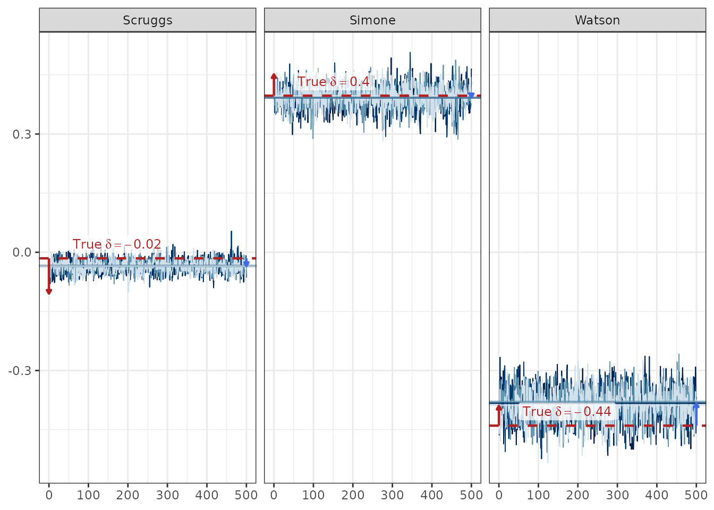
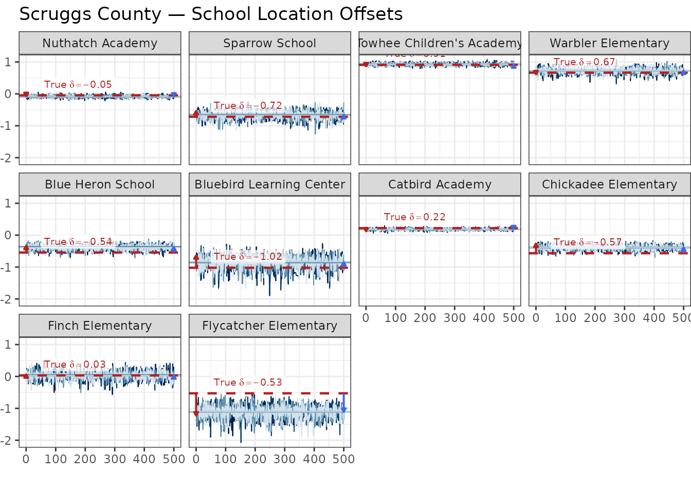
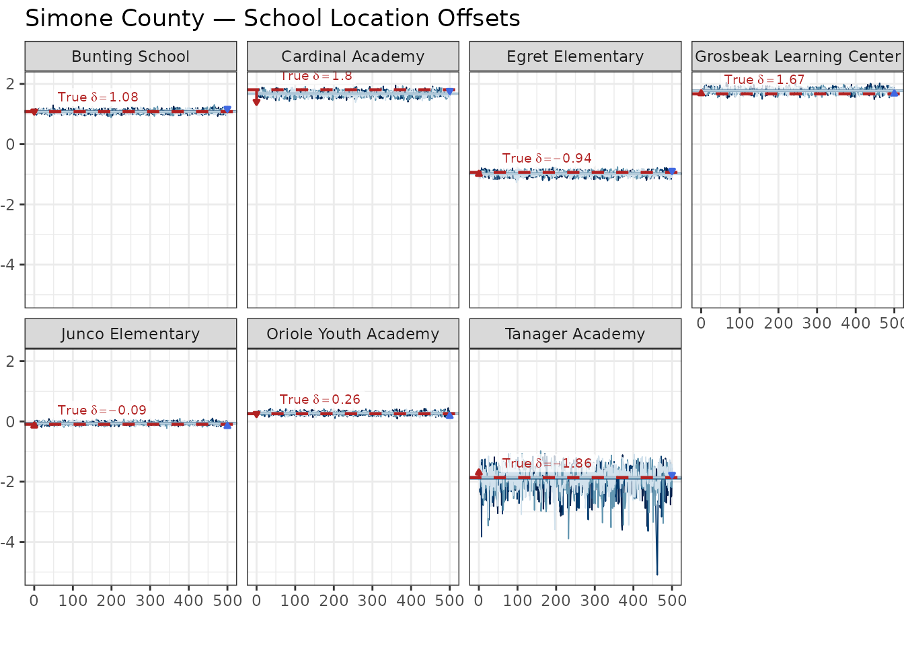
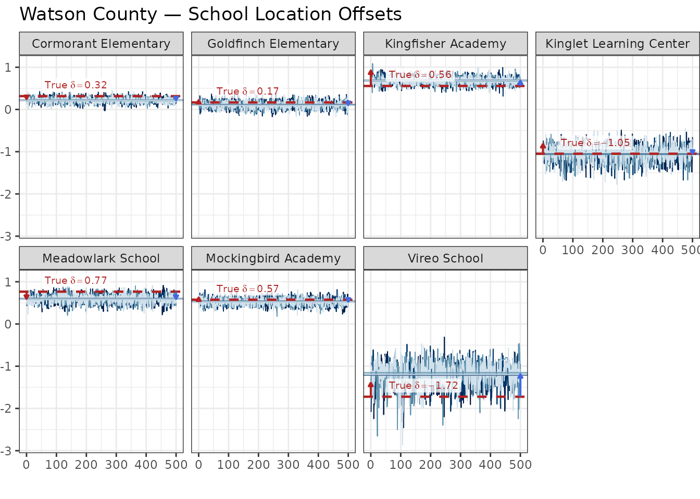
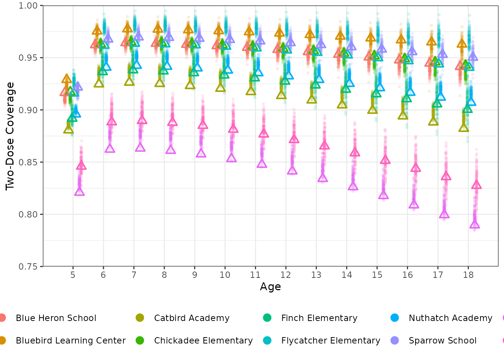

# imuGAP, Immunity: Geographic & Age-based Projection

## Introduction

The name `imuGAP` stands for “Immunity: Geographic & Age-based
Projection”. This package allows the user to synthesize across multiple
data sources to make predictions of vaccination coverage for
user-defined populations of interest. For example, one could use the
package to:

1.  Estimate current vaccination coverage by location across different
    age groups
2.  Estimate coverage (or uptake) for a given birth cohort (e.g. people
    born in 1990) across their life course (i.e. at each age from birth
    to current age)
3.  Fill in gaps in observed coverage data (e.g. a school that doesn’t
    report vaccination coverage in a certain year)

More specifically, the package provides a
[stan](https://mc-stan.org/)-based model for estimating vaccination
coverage by location, cohort, and age for childhood infectious diseases,
such as measles. The core model represents a target population as having
a life-long propensity for vaccination; some proportion, $`\phi`$, of
that population is unlikely to vaccinate and the complementary
proportion, $`1 - \phi`$, is likely to vaccinate. That population then
experiences a vaccination rate, $`\lambda`$, over the model time eras,
according to the vaccination eligibility schedule, $`\nu`$. These core
parameters can vary over time and location, in a user-specifiable way.

Focusing just on the core model element, imagine a particular population
location $`i`$ and cohort $`a`$ (where $`a`$ denotes the start of the
time period when that group was born). If that cohort is now age $`t`$,
and the vaccine schedule for the first dose is $`\nu(t)`$, the expected
fraction of that group to have at least one dose is then:

``` math
P(\ge\textrm{1 dose}) = \left(1 - \phi_{i, a}\right) \left(1 - \exp\left\{-\int_a^{t} \lambda_{i, a}(s)\nu(s) d\textrm{s}\right\}\right)
```

Which is to say, we are representing vaccination coverage via a
survival-like model. The model generalizes this approach to the first
dose out to arbitrary sequential dose coverage, with each subsequent
dose conditional on previous dose receipt.

## Walkthrough of Basic Usage

This walkthrough demonstrates the workflow of fitting the model and
predicting coverage on simulated data. The package includes several
bundled datasets for demonstration, representing a nested geographic
hierarchy (State -\> Counties -\> Schools) for population uptake of a
two dose vaccine, like MMR for measles.

### 1. Preparing and Validating the Input Data

First, let’s explore the three required inputs that define the location
hierarchy, observation metadata, and the actual coverage observations.
The package provides a family of `canonicalize_*` functions to validate,
clean, and convert these raw structures into the canonical forms
required by the sampler. You can use those directly to help troubleshoot
your inputs, as we do in the following examples. However, as shown in
the next section, the
[`sampling()`](https://accidda.github.io/imuGAP/reference/sampling.md)
method also automatically canonicalizes the inputs.

#### Location Hierarchy (`locations_sim`)

The locations dataset defines the nesting relationship of the locations
in the model. In this simulation, we have a State, which contains three
Counties, which in turn contain various Schools. We validate and
canonicalize it using
[`canonicalize_locations()`](https://accidda.github.io/imuGAP/reference/canonicalize.md).

``` r

data("locations_sim", package = "imuGAP")
head(locations_sim)
#>                  loc_id population parent_id
#>                  <char>      <num>    <char>
#> 1:                State  2895.1333      <NA>
#> 2:              Scruggs  1527.7000     State
#> 3:               Simone   746.6333     State
#> 4:               Watson   620.8000     State
#> 5: Chickadee Elementary   147.8333   Scruggs
#> 6:     Nuthatch Academy   368.5333   Scruggs

# Canonicalize and validate
canonical_locations <- canonicalize_locations(locations_sim)
head(canonical_locations)
#> Key: <layer, parent_id, loc_id>
#>                      loc_id population parent_id layer loc_c_id loc_cp_id
#>                      <char>      <num>    <char> <int>    <int>     <int>
#> 1:                    State 2895.13333      <NA>     1        1        NA
#> 2:                  Scruggs 1527.70000     State     2        2         1
#> 3:                   Simone  746.63333     State     2        3         1
#> 4:                   Watson  620.80000     State     2        4         1
#> 5:        Blue Heron School  115.43333   Scruggs     3        5         2
#> 6: Bluebird Learning Center   49.63333   Scruggs     3        6         2
#>    layer_bound
#>          <int>
#> 1:           1
#> 2:           1
#> 3:           1
#> 4:           1
#> 5:           1
#> 6:           1
```

#### Coverage Observations (`observations_sim`)

The observations dataset contains the counts of individuals who were
vaccinated (`positive`) out of the total sampled (`sample_n`) for each
observation. It also includes a `censored` column, which is `1` if the
observation is right-censored and `NA` otherwise. We validate and
canonicalize it using
[`canonicalize_observations()`](https://accidda.github.io/imuGAP/reference/canonicalize.md).

``` r

data("observations_sim", package = "imuGAP")
head(observations_sim[, .(obs_id, loc_id, positive, sample_n, censored)])
#>    obs_id               loc_id positive sample_n censored
#>     <int>               <char>    <num>    <int>    <num>
#> 1:      1 Chickadee Elementary      135      155       NA
#> 2:      2 Chickadee Elementary      124      152       NA
#> 3:      3 Chickadee Elementary      133      156       NA
#> 4:      4 Chickadee Elementary      127      155       NA
#> 5:      5 Chickadee Elementary      141      155       NA
#> 6:      6 Chickadee Elementary      139      158       NA

# Canonicalize and validate
canonical_observations <- canonicalize_observations(observations_sim)
head(canonical_observations)
#> Key: <censored, obs_id>
#>    obs_c_id positive sample_n censored obs_id
#>       <int>    <int>    <int>    <num>  <int>
#> 1:        1      135      155       NA      1
#> 2:        2      124      152       NA      2
#> 3:        3      133      156       NA      3
#> 4:        4      127      155       NA      4
#> 5:        5      141      155       NA      5
#> 6:        6      139      158       NA      6
```

#### Observation Metadata (`populations_sim`)

The populations dataset acts as observation metadata, mapping each
observation ID (`obs_id`) to the corresponding location, birth cohort,
age at observation, vaccine dose, and observation weight (`weight`). We
validate and canonicalize it using
[`canonicalize_populations()`](https://accidda.github.io/imuGAP/reference/canonicalize.md).

For observations that record coverage for a single cohort and age (such
as kindergarten entry surveys), there is a 1:1 mapping where each
`obs_id` has a single row with `weight = 1.0`:

``` r

data("populations_sim", package = "imuGAP")
head(populations_sim)
#>    obs_id               loc_id cohort   age  dose weight
#>     <int>               <char>  <int> <int> <int>  <num>
#> 1:      1 Chickadee Elementary      1     5     2      1
#> 2:      2 Chickadee Elementary      2     5     2      1
#> 3:      3 Chickadee Elementary      3     5     2      1
#> 4:      4 Chickadee Elementary      4     5     2      1
#> 5:      5 Chickadee Elementary      5     5     2      1
#> 6:      6 Chickadee Elementary      6     5     2      1
```

However, composite observations (such as TeenVaxView surveys spanning
multiple age groups) aggregate individuals across multiple cohorts and
ages into a single observation. In such cases, `populations_sim`
contains multiple rows for the same `obs_id`, with fractional weights
summing to `1.0`:

``` r

# TeenVaxView-style observation spanning ages 14 to 18
observations_sim[
  obs_id == 761,
  .(obs_id, loc_id, positive, sample_n, age_min, age_max, dose)
]
#>    obs_id loc_id positive sample_n age_min age_max  dose
#>     <int> <char>    <num>    <int>   <int>   <int> <int>
#> 1:    761  State      217      250      14      19     2

# Corresponding population metadata with distributed weights summing to 1
populations_sim[obs_id == 761]
#>    obs_id loc_id cohort   age  dose weight
#>     <int> <char>  <int> <int> <int>  <num>
#> 1:    761  State      5    14     2    0.2
#> 2:    761  State      4    15     2    0.2
#> 3:    761  State      3    16     2    0.2
#> 4:    761  State      2    17     2    0.2
#> 5:    761  State      1    18     2    0.2
```

We can then validate and canonicalize the dataset:

``` r

# Canonicalize and validate
canonical_populations <- canonicalize_populations(
  populations_sim, observations_sim, locations_sim
)
head(canonical_populations)
#> Key: <obs_c_id, loc_c_id, cohort, age, dose>
#>    obs_id               loc_id cohort   age  dose weight obs_c_id loc_c_id
#>     <int>               <char>  <int> <int> <int>  <num>    <int>    <int>
#> 1:      1 Chickadee Elementary      1     5     2      1        1        8
#> 2:      2 Chickadee Elementary      2     5     2      1        2        8
#> 3:      3 Chickadee Elementary      3     5     2      1        3        8
#> 4:      4 Chickadee Elementary      4     5     2      1        4        8
#> 5:      5 Chickadee Elementary      5     5     2      1        5        8
#> 6:      6 Chickadee Elementary      6     5     2      1        6        8
#>    range_start
#>          <int>
#> 1:           1
#> 2:           2
#> 3:           3
#> 4:           4
#> 5:           5
#> 6:           6
```

#### Validation Failure Examples

To ensure data integrity, the `canonicalize_*` functions enforce strict
rules on the input data format and constraints. For example, if we
modify the observations data so that the number of `positive` cases
exceeds the total sample size `sample_n`, the validation function will
raise a clear error:

``` r

# Create a copy with an invalid observation (positive > sample_n)
invalid_obs <- copy(observations_sim[, .(obs_id, loc_id, positive, sample_n, censored)])
invalid_obs[1, positive := sample_n + 10]

# This will fail validation and throw an error:
tryCatch(
  canonicalize_observations(invalid_obs),
  error = function(e) message("Caught expected error: ", e$message)
)
#> Caught expected error: `observations` column 'positive' must be <= 'sample_n'; found 1 invalid row(s) with obs_id: 1
```

Similarly, if the locations data contains duplicate location IDs,
[`canonicalize_locations()`](https://accidda.github.io/imuGAP/reference/canonicalize.md)
will detect the duplication and throw an error:

``` r

# Create a copy with a duplicate location ID
invalid_locs <- rbind(
  locations_sim,
  data.frame(loc_id = "Scruggs", parent_id = "State"),
  fill = TRUE
)

# This will fail validation:
tryCatch(
  canonicalize_locations(invalid_locs),
  error = function(e) message("Caught expected error: ", e$message)
)
#> Caught expected error: `locations` column 'loc_id' must contain unique values; found 1 duplicate(s): 29
```

See the `canonicalize_*` function documentation for more complete
validation requirements.

------------------------------------------------------------------------

### 2. Exploring the Synthetic Dataset and Latent Features

Before fitting the model, we can explore how the synthetic observations
relate to the underlying latent parameters across all geographic levels
in the simulation:

1.  **State Level (ChildVaxView, SchoolVaxView, TeenVaxView)**:
    Observations across cohorts spanning doses 1 and 2, plotted against
    the underlying lifetime uptake propensity $`1 - \phi_{st}`$.
2.  **County Level (6th Grade Surveys)**: Right-censored dose 2 coverage
    at age 11 across Scruggs, Simone, and Watson counties, reflecting
    county-specific random offsets.
3.  **School Level (Kindergarten Entry)**: Annual kindergarten entry
    coverage (dose 2 at age 5) across all 24 individual schools, showing
    school-level variation around county baselines.

#### State-Level Observations & Latent Propensity

**Show plot code**

``` r

data("latent_params_sim", package = "imuGAP")

# Categorize state-level observation sources
state_obs <- copy(observations_sim[loc_id == "State"])
state_obs[, source := factor(
  fcase(
    dose == 1 & age_min == 2, "ChildVaxView (Dose 1, Age 2)",
    dose == 1 & age_min == 3, "ChildVaxView (Dose 1, Age 3)",
    age_min == 5, "SchoolVaxView (Dose 2, Age 5)",
    default = "TeenVaxView (Dose 2, Ages 14-18)"
  ),
  levels = c(
    "ChildVaxView (Dose 1, Age 2)",
    "ChildVaxView (Dose 1, Age 3)",
    "SchoolVaxView (Dose 2, Age 5)",
    "TeenVaxView (Dose 2, Ages 14-18)"
  )
)]
state_obs[, obs_prop := positive / sample_n]

# Split single-cohort point observations vs multi-cohort cross-sectional survey snapshots
single_cohort_obs <- state_obs[is.na(age_max) | age_max == age_min + 1L]
multi_cohort_obs <- copy(state_obs[!is.na(age_max) & age_max > age_min + 1L])
multi_cohort_obs[, cohort_max := cohort_min + (age_max - 1L) - age_min]

# True state lifetime uptake propensity across cohorts (1 - phi)
# Note: phi represents the non-uptake rate, so (1 - phi) represents the vaccinating population
latent_state <- data.table(
  cohort_min = seq_along(latent_params_sim$phi_state),
  propensity = 1 - latent_params_sim$phi_state
)

# Latent milestone coverage curves corresponding to each observation source
n_c <- length(latent_params_sim$phi_state)
latent_curves <- rbindlist(list(
  data.table(
    cohort_min = seq_len(n_c),
    latent_cov = (1 - latent_params_sim$phi_state) *
      latent_params_sim$uptake[2, 1],
    source = "ChildVaxView (Dose 1, Age 2)"
  ),
  data.table(
    cohort_min = seq_len(n_c),
    latent_cov = (1 - latent_params_sim$phi_state) *
      latent_params_sim$uptake[3, 1],
    source = "ChildVaxView (Dose 1, Age 3)"
  ),
  data.table(
    cohort_min = seq_len(28),
    latent_cov = (1 - latent_params_sim$phi_state[1:28]) *
      latent_params_sim$uptake[5, 2],
    source = "SchoolVaxView (Dose 2, Age 5)"
  ),
  data.table(
    cohort_min = seq_len(15),
    latent_cov = (1 - latent_params_sim$phi_state[1:15]) *
      mean(latent_params_sim$uptake[14:18, 2]),
    source = "TeenVaxView (Dose 2, Ages 14-18)"
  )
))
latent_curves[, source := factor(source, levels = levels(state_obs$source))]

ggplot() +
  geom_line(
    data = latent_state,
    aes(
      x = cohort_min,
      y = propensity,
      linetype = "True Lifetime Uptake Propensity (1 - phi)"
    ),
    color = "gray40",
    linewidth = 0.8,
    alpha = 0.5
  ) +
  geom_line(
    data = latent_curves,
    aes(x = cohort_min, y = latent_cov, color = source),
    linetype = "dashed",
    linewidth = 0.7,
    alpha = 0.4
  ) +
  geom_segment(
    data = multi_cohort_obs,
    aes(
      x = cohort_min,
      xend = cohort_max,
      y = obs_prop,
      yend = obs_prop,
      color = source
    ),
    linewidth = 1.1,
    alpha = 0.95
  ) +
  geom_point(
    data = single_cohort_obs,
    aes(x = cohort_min, y = obs_prop, color = source, shape = source),
    size = 2.4,
    alpha = 0.95
  ) +
  theme_bw() +
  scale_x_continuous(
    breaks = seq(0, 30, by = 5),
    minor_breaks = seq(1, 30, by = 1)
  ) +
  coord_cartesian(xlim = c(0, 30), ylim = c(0.4, 1.0)) +
  scale_linetype_manual(
    name = NULL,
    values = c("True Lifetime Uptake Propensity (1 - phi)" = "dashed")
  ) +
  scale_color_brewer(name = "Data Source", palette = "Dark2") +
  scale_shape_manual(
    name = "Data Source",
    values = c(
      "ChildVaxView (Dose 1, Age 2)" = 16,
      "ChildVaxView (Dose 1, Age 3)" = 17,
      "SchoolVaxView (Dose 2, Age 5)" = 15,
      "TeenVaxView (Dose 2, Ages 14-18)" = 18
    )
  ) +
  guides(
    color = guide_legend(
      override.aes = list(
        shape = c(16, 17, 15, NA),
        linetype = c("blank", "blank", "blank", "solid"),
        linewidth = c(0, 0, 0, 1.1),
        alpha = 1
      )
    ),
    shape = "none"
  ) +
  theme(
    legend.position = "inside",
    legend.position.inside = c(0.98, 0.02),
    legend.justification.inside = c(1, 0)
  ) +
  labs(
    x = "Birth Cohort Index",
    y = "Vaccination Proportion"
  )
```


#### County-Level Observations & Offsets

**Show plot code**

``` r

county_obs <- copy(observations_sim[loc_id %in% c("Scruggs", "Simone", "Watson")])
county_obs[, obs_prop := positive / sample_n]

max_obs_cohort <- max(county_obs$cohort_min)
n_cohorts <- length(latent_params_sim$phi_state)

# Analytical county-level latent curves for 6th grade survey (age 11, dose 2, censored)
# Note: phi represents non-uptake, so (1 - phi_shifted) represents the vaccinating population
county_latent <- rbindlist(lapply(names(latent_params_sim$off_cnty), function(cnty) {
  cohorts <- seq_len(n_cohorts)
  c_idx <- match(cnty, names(latent_params_sim$off_cnty))
  offset <- latent_params_sim$off_cnty[c_idx]
  phi_shifted <- plogis(qlogis(latent_params_sim$phi_state[cohorts]) + offset)
  cov_true <- (1 - phi_shifted) * latent_params_sim$uptake[11, 2]
  cov_censored <- cov_true * latent_params_sim$censor_reduction
  data.table(
    loc_id = cnty,
    cohort_min = cohorts,
    latent_cov = cov_true,
    latent_cov_censored = cov_censored
  )
}))

county_latent_obs <- county_latent[cohort_min <= max_obs_cohort]
county_latent_unobs <- county_latent[cohort_min >= max_obs_cohort]

ggplot() +
  geom_point(
    data = county_obs,
    aes(x = cohort_min, y = obs_prop),
    color = "steelblue", size = 2, alpha = 0.85
  ) +
  geom_line(
    data = county_latent_obs,
    aes(
      x = cohort_min,
      y = latent_cov,
      color = "True Latent Coverage",
      linetype = "Observed Cohorts"
    ),
    linewidth = 0.9
  ) +
  geom_line(
    data = county_latent_obs,
    aes(
      x = cohort_min,
      y = latent_cov_censored,
      color = "Censored Latent (0.95x)",
      linetype = "Observed Cohorts"
    ),
    linewidth = 0.9
  ) +
  geom_line(
    data = county_latent_unobs,
    aes(
      x = cohort_min,
      y = latent_cov,
      color = "True Latent Coverage",
      linetype = "Unobserved Cohorts"
    ),
    linewidth = 0.9
  ) +
  geom_line(
    data = county_latent_unobs,
    aes(
      x = cohort_min,
      y = latent_cov_censored,
      color = "Censored Latent (0.95x)",
      linetype = "Unobserved Cohorts"
    ),
    linewidth = 0.9
  ) +
  facet_wrap(~loc_id) +
  theme_bw() +
  scale_x_continuous(
    breaks = seq(0, 30, by = 5),
    minor_breaks = seq(1, 30, by = 1)
  ) +
  scale_y_continuous(expand = c(0, 0)) +
  coord_cartesian(xlim = c(0, 30), ylim = c(0.6, 1.0)) +
  scale_color_manual(
    name = NULL,
    values = c(
      "True Latent Coverage" = "firebrick",
      "Censored Latent (0.95x)" = "darkorange"
    )
  ) +
  scale_linetype_manual(
    name = NULL,
    values = c(
      "Observed Cohorts" = "dashed",
      "Unobserved Cohorts" = "dotted"
    )
  ) +
  guides(
    color = guide_legend(
      order = 1,
      override.aes = list(linewidth = 0.9, linetype = "solid")
    ),
    linetype = guide_legend(
      order = 2,
      override.aes = list(linewidth = 0.9, color = "black")
    )
  ) +
  theme(
    legend.position = "inside",
    legend.position.inside = c(0.85, 0.12),
    legend.justification.inside = c(1, 0)
  ) +
  labs(
    x = "Birth Cohort Index",
    y = "6th Grade Survey Coverage (Dose 2, Age 11)"
  )
```


#### School-Level Observations Across Counties

**Show plot code**

``` r

# Select representative schools at the 0, 0.25, 0.5, 0.75, and 1 quantiles of coverage propensity
sch_info <- locations_sim[!loc_id %in% c("State", "Scruggs", "Simone", "Watson")]
# Non-uptake offset off: positive off indicates lower coverage; negate to rank by coverage
sch_info[, off := latent_params_sim$off_sch[loc_id]]
sch_info[, cov_offset := -off]

probs <- c(0, 0.25, 0.5, 0.75, 1)
labels <- c("0% (Min)", "25% (Q1)", "50% (Median)", "75% (Q3)", "100% (Max)")

sel_schools <- sch_info[, {
  q_vals <- quantile(cov_offset, probs = probs, type = 7)
  chosen_idx <- sapply(q_vals, function(qv) which.min(abs(cov_offset - qv)))
  .(
    quantile_label = factor(labels, levels = labels),
    loc_id = loc_id[chosen_idx],
    off = off[chosen_idx]
  )
}, by = parent_id]

# Filter school observations to the selected quantile schools
school_obs <- merge(
  observations_sim,
  sel_schools[, .(parent_id, loc_id, quantile_label)],
  by = c("parent_id", "loc_id")
)
school_obs[, obs_prop := positive / sample_n]

sch_cohorts <- 1:28

# 1. State-level lifetime uptake propensity reference (1 - phi)
state_sch_propensity <- rbindlist(lapply(
  c("Scruggs", "Simone", "Watson"),
  function(cnty) {
    data.table(
      parent_id = cnty,
      cohort_min = sch_cohorts,
      propensity = 1 - latent_params_sim$phi_state[sch_cohorts]
    )
  }
))

# 2. County-level latent milestone trajectory (age 5, dose 2)
county_sch_latent <- rbindlist(lapply(
  names(latent_params_sim$off_cnty),
  function(cnty) {
    c_idx <- match(cnty, names(latent_params_sim$off_cnty))
    offset <- latent_params_sim$off_cnty[c_idx]
    phi_shifted <- plogis(
      qlogis(latent_params_sim$phi_state[sch_cohorts]) + offset
    )
    cov_true <- (1 - phi_shifted) * latent_params_sim$uptake[5, 2]
    data.table(parent_id = cnty, cohort_min = sch_cohorts, latent_cov = cov_true)
  }
))

# 3. School-level latent milestone trajectories for selected quantile schools
school_sch_latent <- rbindlist(lapply(
  seq_len(nrow(sel_schools)),
  function(i) {
    row <- sel_schools[i]
    cnty <- row$parent_id
    s_name <- row$loc_id
    q_lab <- row$quantile_label
    c_offset <- latent_params_sim$off_cnty[cnty]
    s_offset <- latent_params_sim$off_sch[s_name]
    phi_sch <- plogis(
      qlogis(latent_params_sim$phi_state[sch_cohorts]) + c_offset + s_offset
    )
    cov_sch <- (1 - phi_sch) * latent_params_sim$uptake[5, 2]
    data.table(
      parent_id = cnty,
      loc_id = s_name,
      quantile_label = q_lab,
      cohort_min = sch_cohorts,
      latent_cov = cov_sch
    )
  }
))

ggplot() +
  # State lifetime uptake propensity reference
  geom_line(
    data = state_sch_propensity,
    aes(
      x = cohort_min,
      y = propensity,
      linetype = "True State Lifetime Uptake Propensity (1 - phi)"
    ),
    color = "gray40",
    linewidth = 0.8,
    alpha = 0.5
  ) +
  # County latent curve
  geom_line(
    data = county_sch_latent,
    aes(x = cohort_min, y = latent_cov, linetype = "True County Latent Coverage"),
    color = "firebrick",
    linewidth = 0.9
  ) +
  # School latent curves
  geom_line(
    data = school_sch_latent,
    aes(x = cohort_min, y = latent_cov, color = quantile_label, group = loc_id),
    linetype = "dashed",
    linewidth = 0.7,
    alpha = 0.8
  ) +
  # School observation points (faded)
  geom_point(
    data = school_obs,
    aes(x = cohort_min, y = obs_prop, color = quantile_label),
    size = 1.8,
    alpha = 0.6
  ) +
  facet_wrap(~parent_id) +
  theme_bw() +
  scale_x_continuous(
    breaks = seq(0, 30, by = 5),
    minor_breaks = seq(1, 30, by = 1)
  ) +
  coord_cartesian(xlim = c(0, 30), ylim = c(0.4, 1.0)) +
  scale_color_viridis_d(name = "School Quantile", option = "plasma", end = 0.9) +
  scale_linetype_manual(
    name = "Reference Curves",
    values = c(
      "True State Lifetime Uptake Propensity (1 - phi)" = "dotted",
      "True County Latent Coverage" = "solid"
    )
  ) +
  guides(
    color = guide_legend(reverse = TRUE, order = 1),
    linetype = guide_legend(order = 2)
  ) +
  theme(
    legend.position = "inside",
    legend.position.inside = c(0.02, 0.05),
    legend.justification.inside = c(0, 0),
    legend.background = element_rect(fill = alpha("white", 0.8), color = NA),
    legend.box = "horizontal",
    legend.spacing.x = unit(0.3, "cm")
  ) +
  labs(
    x = "Birth Cohort Index",
    y = "Kindergarten Entry Coverage (Dose 2, Age 5)"
  )
```


------------------------------------------------------------------------

### 3. Fitting the Model

Using the prepared input datasets, we can fit the Bayesian model using
[`sampling()`](https://accidda.github.io/imuGAP/reference/sampling.md).
The options for the sampler can be configured using
[`stan_options()`](https://accidda.github.io/flexstanr/reference/stan_options.html).

Because compiling the Stan model and running the MCMC chain can take
some time, we show the code below without executing it.

``` r

fit_sim <- sampling(
  observations_sim, populations_sim, locations_sim,
  stan_opts = stan_options(
    iter = 2000, chains = 4, refresh = 0, seed = 1L
  )
)
```

For this walkthrough, we load the pre-computed fit object `fit_sim`
bundled with the package:

``` r

data("fit_sim", package = "imuGAP")
```

Once the model is fit, we can extract posterior draws of the model
parameters using
[`extract_imugap()`](https://accidda.github.io/imuGAP/reference/extract_imugap.md).
For example, let’s extract the B-spline coefficients representing the
state-level vaccine uptake baseline:

``` r

beta_draws <- extract_imugap(fit_sim, pars = "beta_bs")
str(beta_draws)
#> List of 1
#>  $ beta_bs: num [1:2000, 1:5] -1.63 -1.72 -1.67 -1.67 -1.68 ...
#>   ..- attr(*, "dimnames")=List of 2
#>   .. ..$ iterations: NULL
#>   .. ..$           : NULL
```

We can also examine trace plots for key parameters to check MCMC
convergence and evaluate parameter recovery against the true
data-generating simulation parameters (`latent_params_sim`). In each
trace plot, the distinct trace colors and corresponding horizontal solid
lines represent individual MCMC sampling chains (chains 1–4) and their
within-chain medians, while the dashed red lines and annotated values
indicate the true simulation parameters.

##### Basis Spline Coefficients ($`\beta_{\text{bs}}`$)

Trace plots for the B-spline basis coefficients $`\beta_{\text{bs}}`$
(`beta_bs[1]` through `beta_bs[5]`) showing individual chain medians and
true simulation parameters (dashed red lines and annotated values):

**Show plot code**

``` r

beta_pars <- paste0("beta_bs[", seq_along(latent_params_sim$beta_bs), "]")
beta_arr <- as.array(fit_sim$stanfit, pars = beta_pars)
beta_chain_meds <- rbindlist(lapply(beta_pars, function(p) {
  data.table(
    parameter = p,
    Chain = factor(seq_len(dim(beta_arr)[2])),
    med_val = apply(beta_arr[, , p, drop = FALSE], 2, median)
  )
}))

beta_ref <- data.frame(
  parameter = beta_pars,
  true_val = latent_params_sim$beta_bs,
  label = sprintf(
    "True~beta[%d] == %.2f",
    seq_along(latent_params_sim$beta_bs),
    latent_params_sim$beta_bs
  )
)

bayesplot::mcmc_trace(
  beta_arr,
  facet_args = list(labeller = ggplot2::as_labeller(function(x) {
    gsub("beta_bs\\[(\\d+)\\]", "beta[\\1]", x)
  }, default = ggplot2::label_parsed))
) +
  geom_hline(
    data = beta_chain_meds,
    aes(yintercept = med_val, color = Chain),
    linetype = "solid",
    linewidth = 0.5,
    alpha = 0.8
  ) +
  geom_hline(
    data = beta_ref,
    aes(yintercept = true_val),
    color = "firebrick",
    linetype = "dashed",
    linewidth = 0.8
  ) +
  geom_label(
    data = beta_ref,
    aes(x = 100, y = true_val, label = label),
    parse = TRUE,
    color = "firebrick",
    fill = ggplot2::alpha("white", 0.75),
    linewidth = NA,
    vjust = -0.3,
    hjust = 0,
    size = 3.2
  ) +
  theme_bw() +
  theme(legend.position = "none")
```


##### Hierarchy Layer Variances ($`\sigma`$)

Trace plots for the hierarchy layer standard deviations
$`\sigma_{\text{county}}`$ (`sigma_layer[1]`) and
$`\sigma_{\text{school}}`$ (`sigma_layer[2]`) zoomed to the shared range
$`[0, 2.5]`$ via coordinate clipping (preserving full chains), showing
individual chain medians and true simulation standard deviations (dashed
red lines and annotated values):

**Show plot code**

``` r

sigma_pars <- c("sigma_layer[1]", "sigma_layer[2]")
sigma_arr <- as.array(fit_sim$stanfit, pars = sigma_pars)
sigma_chain_meds <- rbindlist(lapply(sigma_pars, function(p) {
  data.table(
    parameter = p,
    Chain = factor(seq_len(dim(sigma_arr)[2])),
    med_val = apply(sigma_arr[, , p, drop = FALSE], 2, median)
  )
}))

sigma_ref <- data.frame(
  parameter = sigma_pars,
  true_val = c(latent_params_sim$sigma_cnty, latent_params_sim$sigma_sch),
  label = sprintf(
    "True~sigma == %.2f",
    c(latent_params_sim$sigma_cnty, latent_params_sim$sigma_sch)
  )
)

bayesplot::mcmc_trace(
  sigma_arr,
  facet_args = list(labeller = ggplot2::as_labeller(c(
    "sigma_layer[1]" = "sigma[County]",
    "sigma_layer[2]" = "sigma[School]"
  ), default = ggplot2::label_parsed))
) +
  geom_hline(
    data = sigma_chain_meds,
    aes(yintercept = med_val, color = Chain),
    linetype = "solid",
    linewidth = 0.5,
    alpha = 0.8
  ) +
  geom_hline(
    data = sigma_ref,
    aes(yintercept = true_val),
    color = "firebrick",
    linetype = "dashed",
    linewidth = 0.8
  ) +
  geom_label(
    data = sigma_ref,
    aes(x = 100, y = true_val, label = label),
    parse = TRUE,
    color = "firebrick",
    fill = ggplot2::alpha("white", 0.75),
    linewidth = NA,
    vjust = -0.3,
    hjust = 0,
    size = 3.2
  ) +
  coord_cartesian(ylim = c(0, 2.5)) +
  theme_bw() +
  theme(legend.position = "none")
```


##### County Location Offsets ($`\delta_{\text{county}}`$)

Trace plots for the county-level location offsets
$`\delta_{\text{county}}`$ (`off_layer[1]` through `off_layer[3]`)
showing individual chain medians and true simulation offsets (dashed red
lines and annotated values). Indicator arrows perpendicular to the true
latent line show:

- **Red arrows (left edge, iteration 0)**: Expected error direction and
  relative magnitude based on observational noise
  ($`\Delta_{\delta} = -\overline{\Delta\text{logit}}_{\text{cov}}`$)
  from finite observation sample draws.
- **Blue arrows (right edge, iteration 500)**: Realized difference
  between the posterior median estimate and the true latent offset.

**Show plot code**

``` r

# Reconstruct location offsets from standard normal deviations z_layer,
# layer standard deviations sigma_layer, and the hierarchical basis/scaling.
get_weighted_qr_basis <- function(w) {
  n_w <- length(w)
  v1 <- w / sqrt(sum(w^2))
  mat_m <- matrix(0, nrow = n_w, ncol = n_w)
  mat_m[, 1] <- v1
  for (j in seq_len(n_w - 1L)) {
    for (i in seq_len(n_w)) {
      mat_m[i, j + 1L] <- if (i == j) 1.0 else 0.0
    }
  }
  q_star <- qr.Q(qr(mat_m))[, 2:n_w, drop = FALSE]
  for (j in seq_len(ncol(q_star))) {
    nz <- which(abs(q_star[, j]) > 1e-10)[1]
    if (!is.na(nz) && q_star[nz, j] < 0) {
      q_star[, j] <- -q_star[, j]
    }
  }
  q_star
}

loc_info <- canonicalize_locations(locations_sim)
ld <- imuGAP:::assemble_layer_data(loc_info)

bounds_to_range <- function(starts, total) {
  rbind(starts, c(tail(starts, -1L) - 1L, total))
}

layer_bounds <- bounds_to_range(ld$layer_starts, ld$n_locs)
parent_child_bounds <- bounds_to_range(ld$parent_child_starts, ld$n_locs)

loc_layer_idx <- integer(ld$n_locs - 1L)
for (k in seq_len(ld$n_layers - 1L)) {
  st <- layer_bounds[1, k + 1L] - 1L
  en <- layer_bounds[2, k + 1L] - 1L
  loc_layer_idx[st:en] <- k
}

loc_pop_scale <- numeric(ld$n_locs - 1L)
for (k in seq_len(ld$n_layers - 1L)) {
  st <- layer_bounds[1, k + 1L]
  en <- layer_bounds[2, k + 1L]
  layer_pop <- ld$loc_population[st:en]
  mean_layer_pop <- mean(layer_pop)
  loc_pop_scale[(st - 1L):(en - 1L)] <- sqrt(mean_layer_pop / layer_pop)
}

n_unconstrained <- (ld$n_locs - 1L) - ld$n_parent_locs
qr_basis <- matrix(0, nrow = ld$n_locs - 1L, ncol = n_unconstrained)
col_offset <- 0L
for (p in seq_len(ld$n_parent_locs)) {
  st <- parent_child_bounds[1, p]
  en <- parent_child_bounds[2, p]
  n_child <- en - st + 1L
  pop_slice <- ld$loc_population[st:en]
  w <- pop_slice / sum(pop_slice)
  w_prime <- sqrt(w)
  q_star <- get_weighted_qr_basis(w_prime)
  qr_basis[(st - 1L):(en - 1L), (col_offset + 1L):(col_offset + n_child - 1L)] <- q_star
  col_offset <- col_offset + (n_child - 1L)
}

z_arr <- as.array(fit_sim$stanfit, pars = "z_layer")
sigma_arr <- as.array(fit_sim$stanfit, pars = "sigma_layer")
n_iter <- dim(z_arr)[1]
n_chains <- dim(z_arr)[2]

off_layer_arr <- array(0, dim = c(n_iter, n_chains, ld$n_locs - 1L))
for (iter in seq_len(n_iter)) {
  for (chain in seq_len(n_chains)) {
    z_vec <- z_arr[iter, chain, ]
    sigma_vec <- sigma_arr[iter, chain, ]
    off_vec <- as.vector(((qr_basis %*% z_vec) * loc_pop_scale) * sigma_vec[loc_layer_idx])
    off_layer_arr[iter, chain, ] <- off_vec
  }
}
dimnames(off_layer_arr) <- list(
  iterations = NULL,
  chains = paste0("chain:", seq_len(n_chains)),
  parameters = paste0("off_layer[", seq_len(ld$n_locs - 1L), "]")
)

county_names <- names(latent_params_sim$off_cnty)
non_root_locs <- loc_info$loc_id[-1]
county_pars <- paste0("off_layer[", match(county_names, non_root_locs), "]")
county_arr <- off_layer_arr[, , county_pars, drop = FALSE]
county_chain_meds <- rbindlist(lapply(county_pars, function(p) {
  data.table(
    parameter = p,
    Chain = factor(seq_len(dim(county_arr)[2])),
    med_val = apply(county_arr[, , p, drop = FALSE], 2, median)
  )
}))

# Compute expected empirical error for county offsets based on observation sample draws
obs <- copy(observations_sim)
phi_st <- latent_params_sim$phi_state
cov <- latent_params_sim$uptake
off_cnty <- latent_params_sim$off_cnty
off_sch <- latent_params_sim$off_sch
censor_red <- latent_params_sim$censor_reduction

obs_cnty <- obs[loc_id %in% county_names]
obs_cnty[, mu := {
  c_off <- unname(off_cnty[loc_id])
  phi_c <- plogis(qlogis(phi_st[cohort]) + c_off)
  (1 - phi_c) * cov[11, 2] * censor_red
}, by = loc_id]
obs_cnty[, p_adj := (positive + 0.5) / (sample_n + 1.0)]
obs_cnty[, delta_cov := qlogis(p_adj) - qlogis(mu)]

cnty_errs <- obs_cnty[, .(expected_delta_err = -mean(delta_cov)), by = .(loc_id)]
county_post_meds <- apply(county_arr, 3, median)

county_ref <- data.frame(
  parameter = county_pars,
  loc_id = county_names,
  true_val = unname(latent_params_sim$off_cnty[county_names]),
  post_med = unname(county_post_meds[county_pars]),
  label = sprintf(
    "True~delta == %.2f",
    latent_params_sim$off_cnty[county_names]
  )
)
county_ref <- merge(county_ref, cnty_errs, by = "loc_id")

err_scale <- 1.0
county_ref$red_arrow_x <- 0
county_ref$red_arrow_yend <- county_ref$true_val + err_scale * county_ref$expected_delta_err
county_ref$blue_arrow_x <- 500
county_ref$blue_arrow_yend <- county_ref$post_med

bayesplot::mcmc_trace(
  county_arr,
  facet_args = list(
    scales = "fixed",
    labeller = ggplot2::as_labeller(setNames(county_names, county_pars))
  )
) +
  geom_hline(
    data = county_chain_meds,
    aes(yintercept = med_val, color = Chain),
    linetype = "solid",
    linewidth = 0.5,
    alpha = 0.8
  ) +
  geom_hline(
    data = county_ref,
    aes(yintercept = true_val),
    color = "firebrick",
    linetype = "dashed",
    linewidth = 0.8
  ) +
  geom_segment(
    data = county_ref,
    aes(x = red_arrow_x, xend = red_arrow_x, y = true_val, yend = red_arrow_yend),
    arrow = arrow(length = unit(0.04, "inches"), type = "closed"),
    color = "firebrick",
    linewidth = 0.8
  ) +
  geom_segment(
    data = county_ref,
    aes(x = blue_arrow_x, xend = blue_arrow_x, y = true_val, yend = blue_arrow_yend),
    arrow = arrow(length = unit(0.04, "inches"), type = "closed"),
    color = "royalblue",
    linewidth = 0.8
  ) +
  geom_label(
    data = county_ref,
    aes(x = 50, y = true_val, label = label),
    parse = TRUE,
    color = "firebrick",
    fill = ggplot2::alpha("white", 0.75),
    linewidth = NA,
    vjust = -0.3,
    hjust = 0,
    size = 3.2
  ) +
  theme_bw() +
  theme(legend.position = "none")
```



##### School Location Offsets ($`\delta_{\text{school}}`$)

Trace plots for school-level location offsets $`\delta_{\text{school}}`$
divided by county, showing individual chain medians and true simulation
offsets (dashed red lines and annotated values) across schools in
Scruggs, Simone, and Watson counties. Indicator arrows perpendicular to
the true latent line show:

- **Red arrows (left edge, iteration 0)**: Expected error direction and
  relative magnitude based on observational noise
  ($`\Delta_{\delta} = -\overline{\Delta\text{logit}}_{\text{cov}}`$)
  from each school’s kindergarten entry observation sample, with length
  exaggerated (2.5×) to highlight the expected error scale across
  schools.
- **Blue arrows (right edge, iteration 500)**: Realized difference
  between the school posterior median estimate and the true latent
  offset.

**Show plot code**

``` r

for (cnty in county_names) {
  sch_in_c <- locations_sim[parent_id == cnty, loc_id]
  sch_pars <- paste0("off_layer[", match(sch_in_c, non_root_locs), "]")
  sch_arr <- off_layer_arr[, , sch_pars, drop = FALSE]

  sch_chain_meds <- rbindlist(lapply(sch_pars, function(p) {
    data.table(
      parameter = p,
      Chain = factor(seq_len(dim(sch_arr)[2])),
      med_val = apply(sch_arr[, , p, drop = FALSE], 2, median)
    )
  }))

  obs_sch <- obs[loc_id %in% sch_in_c]
  obs_sch[, mu := {
    c_off <- unname(off_cnty[parent_id])
    s_off <- unname(off_sch[loc_id])
    phi_s <- plogis(qlogis(phi_st[cohort]) + c_off + s_off)
    (1 - phi_s) * cov[5, 2]
  }, by = .(loc_id, parent_id)]
  obs_sch[, p_adj := (positive + 0.5) / (sample_n + 1.0)]
  obs_sch[, delta_cov := qlogis(p_adj) - qlogis(mu)]

  sch_errs <- obs_sch[, .(expected_delta_err = -mean(delta_cov)), by = .(loc_id)]
  sch_post_meds <- apply(sch_arr, 3, median)

  sch_ref <- data.frame(
    parameter = sch_pars,
    loc_id = sch_in_c,
    true_val = unname(latent_params_sim$off_sch[sch_in_c]),
    post_med = unname(sch_post_meds[sch_pars]),
    label = sprintf(
      "True~delta == %.2f",
      latent_params_sim$off_sch[sch_in_c]
    )
  )
  sch_ref <- merge(sch_ref, sch_errs, by = "loc_id")

  err_scale <- 2.5
  sch_ref$red_arrow_x <- 0
  sch_ref$red_arrow_yend <- sch_ref$true_val + err_scale * sch_ref$expected_delta_err
  sch_ref$blue_arrow_x <- 500
  sch_ref$blue_arrow_yend <- sch_ref$post_med

  p <- bayesplot::mcmc_trace(
    sch_arr,
    facet_args = list(
      ncol = 4,
      scales = "fixed",
      labeller = ggplot2::as_labeller(setNames(sch_in_c, sch_pars))
    )
  ) +
    geom_hline(
      data = sch_chain_meds,
      aes(yintercept = med_val, color = Chain),
      linetype = "solid",
      linewidth = 0.5,
      alpha = 0.8
    ) +
    geom_hline(
      data = sch_ref,
      aes(yintercept = true_val),
      color = "firebrick",
      linetype = "dashed",
      linewidth = 0.8
    ) +
    geom_segment(
      data = sch_ref,
      aes(x = red_arrow_x, xend = red_arrow_x, y = true_val, yend = red_arrow_yend),
      arrow = arrow(length = unit(0.04, "inches"), type = "closed"),
      color = "firebrick",
      linewidth = 0.7
    ) +
    geom_segment(
      data = sch_ref,
      aes(x = blue_arrow_x, xend = blue_arrow_x, y = true_val, yend = blue_arrow_yend),
      arrow = arrow(length = unit(0.04, "inches"), type = "closed"),
      color = "royalblue",
      linewidth = 0.7
    ) +
    geom_label(
      data = sch_ref,
      aes(x = 50, y = true_val, label = label),
      parse = TRUE,
      color = "firebrick",
      fill = ggplot2::alpha("white", 0.75),
      linewidth = NA,
      vjust = -0.3,
      hjust = 0,
      size = 2.6
    ) +
    labs(title = paste0(cnty, " County — School Location Offsets")) +
    theme_bw() +
    theme(
      legend.position = "none",
      plot.margin = margin(t = 5, b = 20, unit = "pt")
    )

  print(p)
  cat("\n\n<br>\n\n")
}
```



  



  



  

##### Vaccination Uptake Rates ($`\lambda_{\text{raw}}`$)

Trace plots for the unconstrained dose uptake rates
$`\lambda_{\text{raw}}`$ (`lambda_raw[1]` and `lambda_raw[2]`) zoomed to
the shared range $`[\exp(0.5), \exp(1.5)]`$ via coordinate clipping
(preserving full chains), showing individual chain medians and
log-transformed true simulation parameters $`\log(\lambda)`$ (dashed red
lines and annotated values) with an exponentiated y-axis scale and tick
labels:

**Show plot code**

``` r

lambda_pars <- c("lambda_raw[1]", "lambda_raw[2]")
lambda_arr <- as.array(fit_sim$stanfit, pars = lambda_pars)
lambda_chain_meds <- rbindlist(lapply(lambda_pars, function(p) {
  data.table(
    parameter = p,
    Chain = factor(seq_len(dim(lambda_arr)[2])),
    med_val = apply(lambda_arr[, , p, drop = FALSE], 2, median)
  )
}))

lambda_ref <- data.frame(
  parameter = lambda_pars,
  true_val = log(latent_params_sim$lambda),
  label = sprintf("True~lambda == %.1f", latent_params_sim$lambda)
)

bayesplot::mcmc_trace(
  lambda_arr,
  facet_args = list(labeller = ggplot2::as_labeller(c(
    "lambda_raw[1]" = "lambda[1]~(Dose~1)",
    "lambda_raw[2]" = "lambda[2]~(Dose~2)"
  ), default = ggplot2::label_parsed))
) +
  geom_hline(
    data = lambda_chain_meds,
    aes(yintercept = med_val, color = Chain),
    linetype = "solid",
    linewidth = 0.5,
    alpha = 0.8
  ) +
  geom_hline(
    data = lambda_ref,
    aes(yintercept = true_val),
    color = "firebrick",
    linetype = "dashed",
    linewidth = 0.8
  ) +
  geom_label(
    data = lambda_ref,
    aes(x = 100, y = true_val, label = label),
    parse = TRUE,
    color = "firebrick",
    fill = ggplot2::alpha("white", 0.75),
    linewidth = NA,
    vjust = -0.3,
    hjust = 0,
    size = 3.2
  ) +
  coord_cartesian(ylim = c(0.5, 1.5)) +
  scale_y_continuous(
    transform = "exp",
    labels = function(x) sprintf("%.2f", exp(x))
  ) +
  labs(y = "Uptake Rate (exponential scale)") +
  theme_bw() +
  theme(legend.position = "none")
```


------------------------------------------------------------------------

### 4. Defining a Target for Predictions

To predict vaccine coverage for a target population (which can include
locations or cohorts without direct observations, as long as they exist
in the locations hierarchy), we first define a target grid using
[`create_target()`](https://accidda.github.io/imuGAP/reference/create_target.md).
Note that predictions can only be made for birth cohorts and locations
that have at least some observations included in the estimation run. In
other words, the model cannot predict coverage for future birth cohorts
or unobserved locations.

For example, we can generate a “snapshot” prediction target for all
locations, including the State and County levels, across ages 1 to 18:

``` r

target_sim <- create_target(
  location = unique(locations_sim$loc_id), age = 1:18,
  cohort = max(populations_sim$cohort) - 18, dose = c(1, 2), mode = "snapshot"
)
head(target_sim)
#>    obs_c_id               loc_id   age cohort  dose weight
#>       <int>               <char> <int>  <num> <num>  <num>
#> 1:        1                State     1     29     1      1
#> 2:        2              Scruggs     1     29     1      1
#> 3:        3               Simone     1     29     1      1
#> 4:        4               Watson     1     29     1      1
#> 5:        5 Chickadee Elementary     1     29     1      1
#> 6:        6     Nuthatch Academy     1     29     1      1
```

------------------------------------------------------------------------

### 5. Predicting Coverage

Finally, we run [`predict()`](https://rdrr.io/r/stats/predict.html) to
generate predicted coverage probabilities for each target population
combination. By default it uses every posterior draw; here we pass
`posterior_size` to predict over a smaller sub-sample taken from the end
of each chain.

Generating predictions also runs the Stan model (in generated quantities
mode) and can be time-consuming, so we show the code below without
executing it:

``` r

predict_sim <- predict(object = fit_sim, target = target_sim, posterior_size = 100)
```

Instead, we load the pre-computed prediction results `predict_sim`
bundled with the package. This is an object of class `imugap_predict`
which contains a 3D draws array (`predict_sim$draws`) with the MCMC
draws for each prediction target as well as the target information
(`predict_sim$target`).

``` r

data("predict_sim", package = "imuGAP")
```

We can summarize these predictions to get the posterior mean and
credible intervals across the target location, age, and doses requested:

``` r

# Calculate the posterior mean coverage probability for each location and dose at age 5
summary_predict <- summary(predict_sim)
head(summary_predict)
#>    obs_c_id               loc_id   age cohort  dose weight loc_c_id  mean  q2_5
#>       <int>               <char> <int>  <num> <num>  <num>    <int> <num> <num>
#> 1:        1                State     1     29     1      1        1     0     0
#> 2:        2              Scruggs     1     29     1      1        2     0     0
#> 3:        3               Simone     1     29     1      1        3     0     0
#> 4:        4               Watson     1     29     1      1        4     0     0
#> 5:        5 Chickadee Elementary     1     29     1      1        8     0     0
#> 6:        6     Nuthatch Academy     1     29     1      1       11     0     0
#>      q50 q97_5
#>    <num> <num>
#> 1:     0     0
#> 2:     0     0
#> 3:     0     0
#> 4:     0     0
#> 5:     0     0
#> 6:     0     0
```

Now let’s visualize the results. First we will take a look at overall
state coverage by cohort. Note that the lower coverage among 5 year olds
is due to them only having been eligible for their second dose for one
year.

**Show plot code**

``` r

data("latent_params_sim", package = "imuGAP")

# Filter predictions for the State level, dose 2, and ages > 4
state_predict <- summary_predict[loc_id == "State" & dose == 2 & age > 4]

# Create the lookup index for the matching target populations to attach true latent values
state_idx <- predict_sim$target[loc_id == "State" & dose == 2 & age > 4, which = TRUE]
state_predict[, latent := latent_params_sim$coverage[state_idx]]

ggplot(state_predict) +
  aes(x = age) +
  geom_ribbon(aes(ymin = q2_5, ymax = q97_5, fill = "95% Credible Interval"), alpha = 0.25) +
  geom_line(aes(y = q50, color = "Posterior Median"), linewidth = 0.8) +
  geom_line(aes(y = latent, color = "True Latent"), linetype = "dashed", linewidth = 0.8) +
  theme_bw() +
  scale_x_continuous(breaks = 5:18, minor_breaks = NULL) +
  coord_cartesian(ylim = c(0.8, 1.0)) +
  scale_color_manual(
    name = NULL,
    values = c("Posterior Median" = "black", "True Latent" = "firebrick")
  ) +
  scale_fill_manual(name = NULL, values = c("95% Credible Interval" = "grey50")) +
  theme(
    legend.position = "inside",
    legend.position.inside = c(0.05, 0.05),
    legend.justification.inside = c(0, 0)
  ) +
  labs(x = "Age", y = "State-Level Two-Dose Coverage")
```


We can also look at the trend in coverage by age at the county level.
Note that they follow the same trend as the state but with differing
magnitude.

**Show plot code**

``` r

summary_predict |>
  subset(loc_id %in% c("Scruggs", "Simone", "Watson") & dose == 2 & age > 4) |>
  transform(loc_id = factor(loc_id, levels = c("Simone", "Watson", "Scruggs"))) |>
  ggplot() +
  aes(x = age) +
  geom_line(aes(y = q50, color = loc_id)) +
  geom_ribbon(aes(ymin = q2_5, ymax = q97_5, fill = loc_id), alpha = 0.2) +
  theme_bw() +
  theme(
    legend.position = "inside",
    legend.position.inside = c(0.12, 0.05),
    legend.justification.inside = c(0, 0)
  ) +
  scale_x_continuous(breaks = 5:18, minor_breaks = NULL) +
  coord_cartesian(ylim = c(0.8, 1.0)) +
  scale_color_discrete(NULL, aesthetics = c("color", "fill")) +
  labs(
    x = "Age", y = "County-Level Two-Dose Coverage"
  )
```


Finally, we can zoom into school-level coverage estimates across an
entire county. Below, we compare the predicted coverage distributions
across all schools within Scruggs County against the true underlying
latent coverage from the simulation process:

**Show plot code**

``` r

scruggs_schools <- locations_sim[parent_id == "Scruggs", loc_id]

# Subset to targets of interest (all retained posterior draws)
predict_sub <- predict_sim |>
  subset(loc_id %in% scruggs_schools & dose == 2 & age > 4)

# Get the pre-computed background coverage matching the subsetted target
target_idx <- predict_sim$target[
  loc_id %in% scruggs_schools & dose == 2 & age > 4,
  which = TRUE
]
latent_ref <- copy(predict_sub$target)
latent_ref$coverage <- latent_params_sim$coverage[target_idx]

# Convert predictions to a long-format data.frame
draws_df <- as.data.frame(predict_sub)

# Now plot it all
ggplot() +
  aes(age, coverage, color = loc_id) +
  geom_point(
    data = draws_df,
    alpha = 0.15,
    shape = 16,
    size = 1.2,
    position = position_jitterdodge(
      dodge.width = 0.6,
      jitter.width = 0.15
    )
  ) +
  geom_point(
    data = latent_ref,
    mapping = aes(shape = "True value"),
    size = 2.5,
    stroke = 1.1,
    position = position_dodge(width = 0.6)
  ) +
  theme_bw() +
  scale_shape_manual(
    name = "",
    values = c("True value" = 24)
  ) +
  scale_color_discrete(NULL, aesthetics = c("color", "fill")) +
  scale_x_continuous(breaks = 5:18, minor_breaks = NULL) +
  scale_y_continuous(expand = c(0, 0)) +
  coord_cartesian(ylim = c(0.75, 1.0)) +
  theme(legend.position = "bottom") +
  labs(color = "School", x = "Age", y = "Two-Dose Coverage")
```


