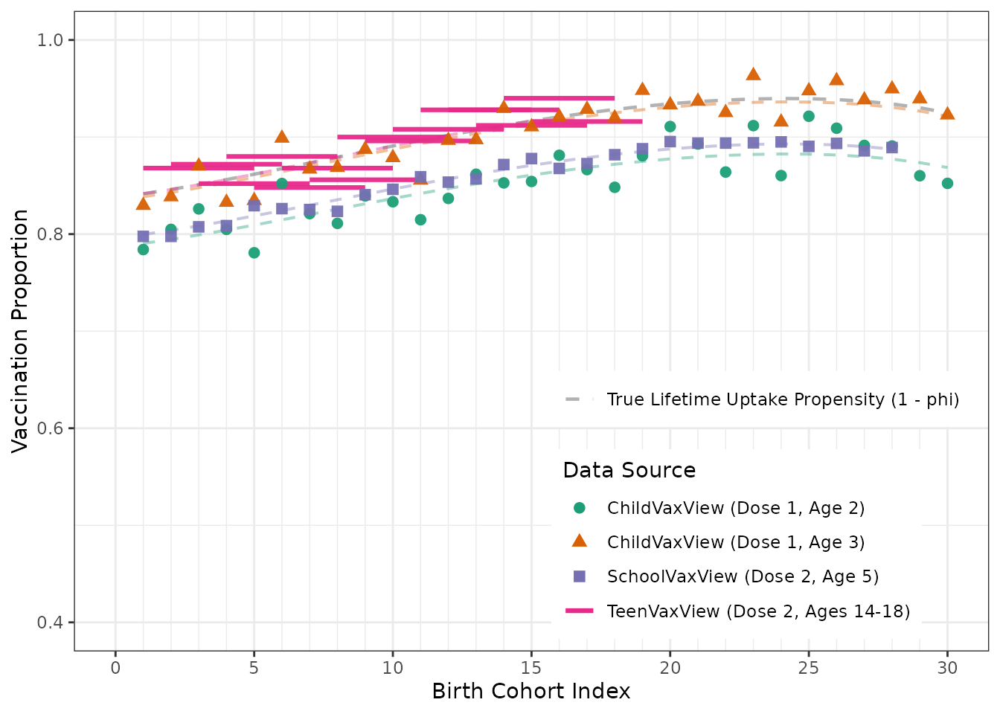
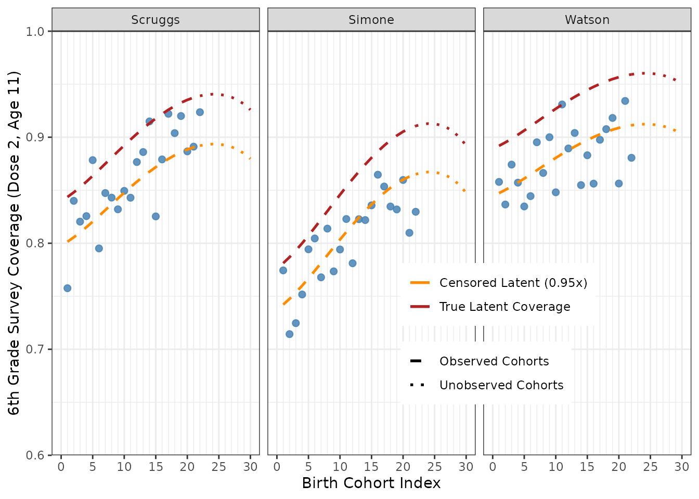
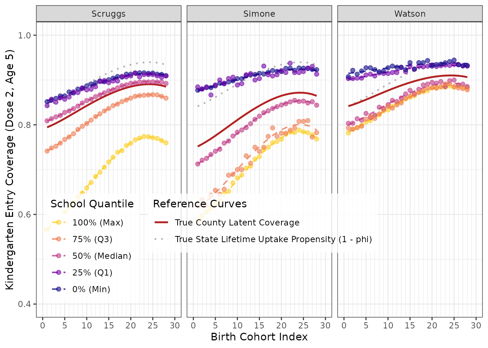
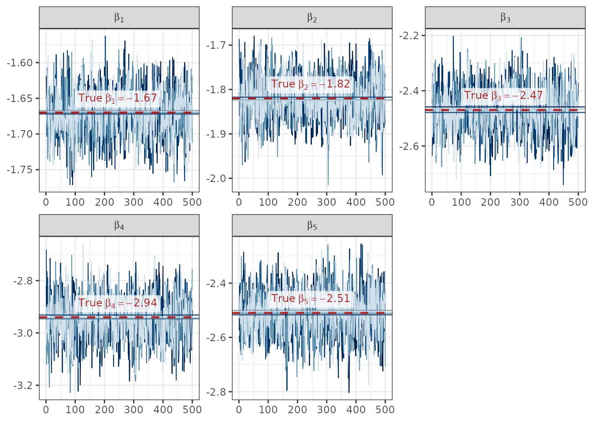
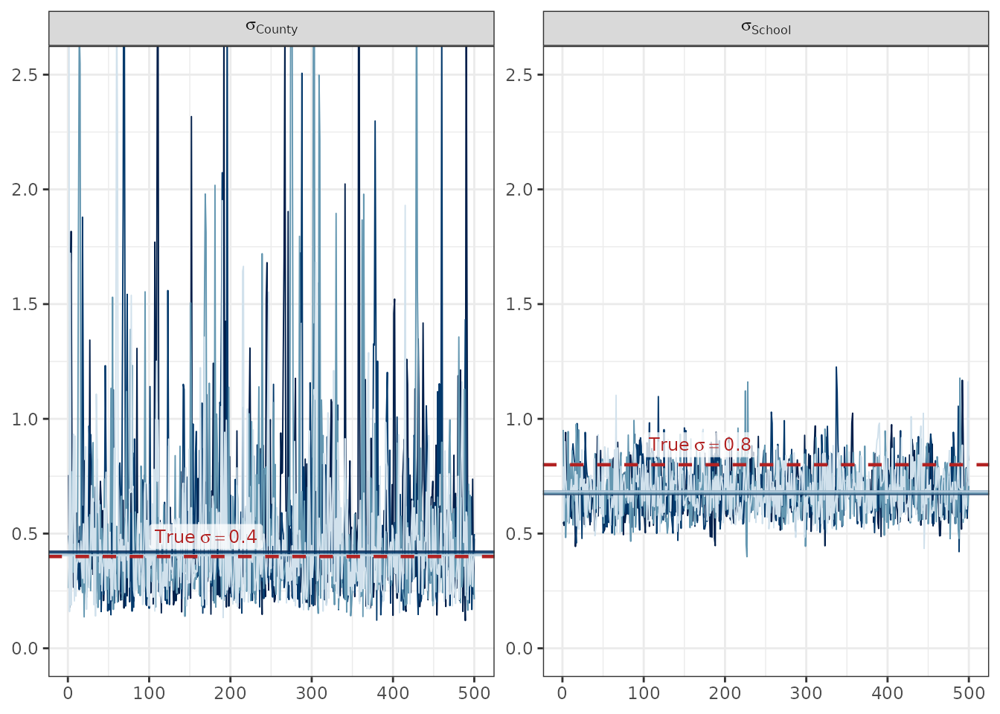
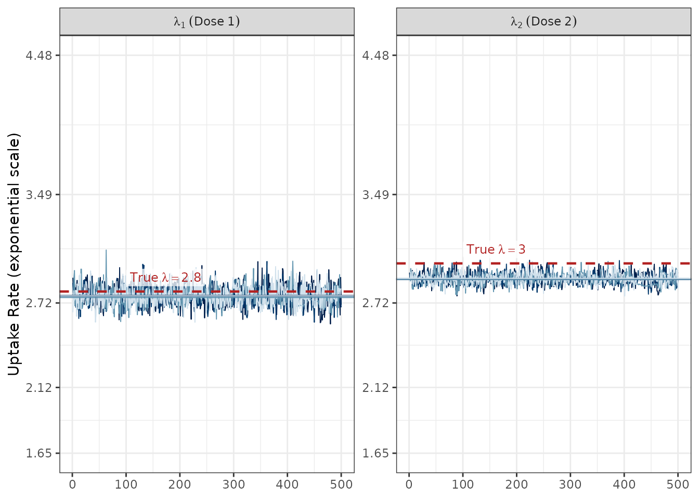
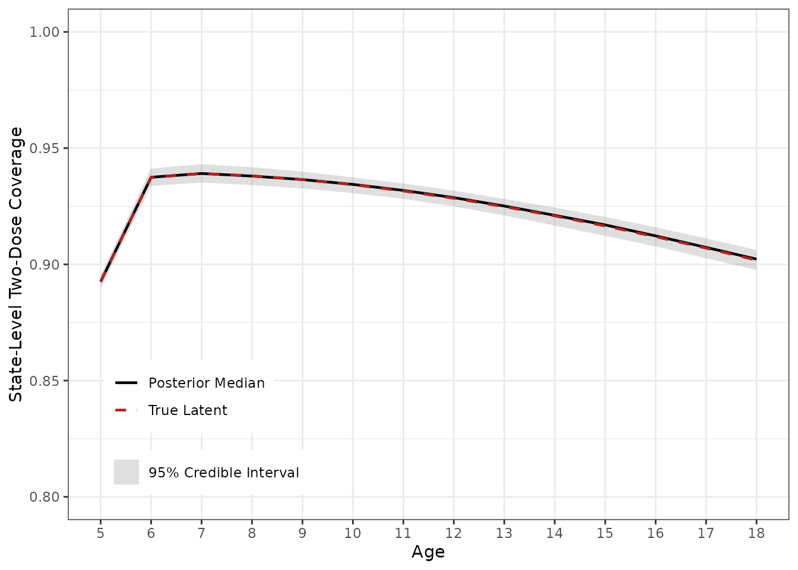
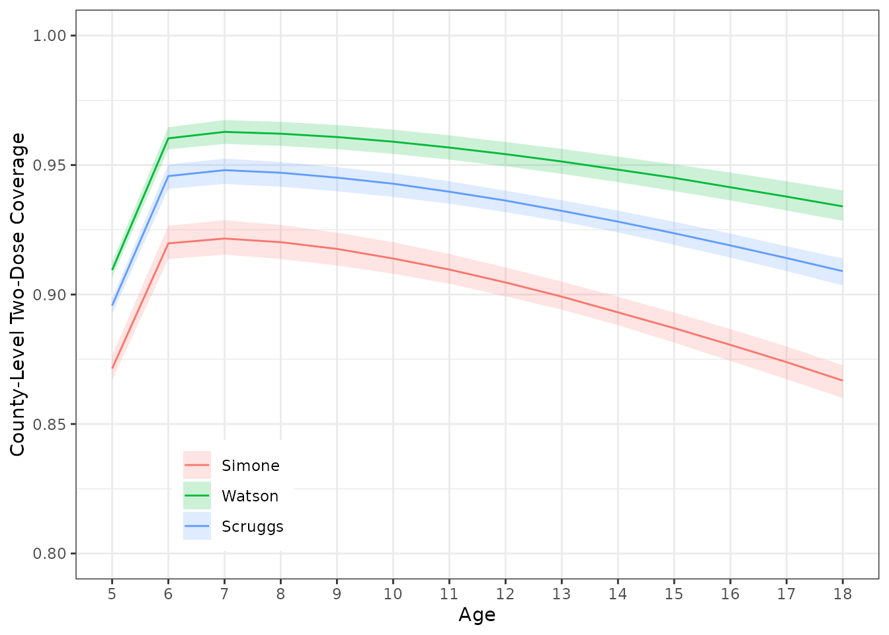
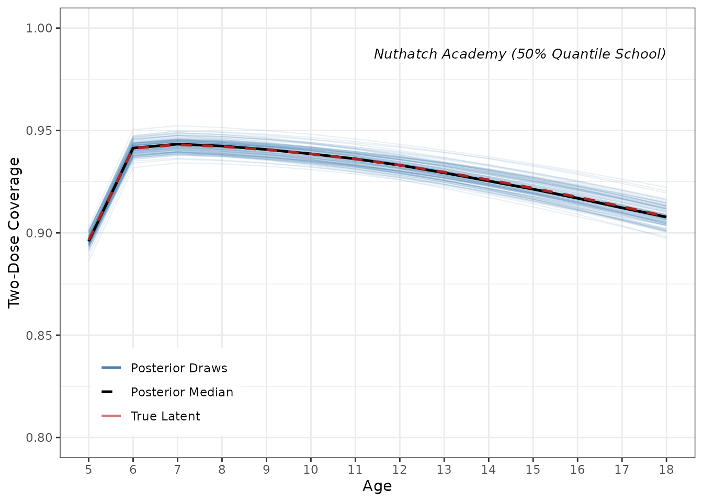
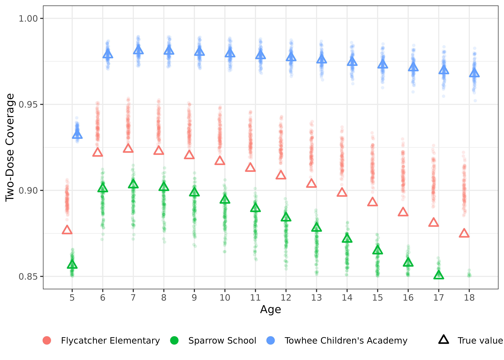

# imuGAP, Immunity: Geographic & Age-based Projection

## Introduction

The name `imuGAP` stands for “Immunity: Geographic & Age-based
Projection”. This package allows the user to synthesize across multiple
data sources to make predictions of vaccination coverage for
user-defined populations of interest. For example, one could use the
package to:

1.  Estimate current vaccination coverage by location across different
    age groups
2.  Estimate coverage (or uptake) for a given birth cohort (e.g. people
    born in 1990) across their life course (i.e. at each age from birth
    to current age)
3.  Fill in gaps in observed coverage data (e.g. a school that doesn’t
    report vaccination coverage in a certain year)

More specifically, the package provides a
[stan](https://mc-stan.org/)-based model for estimating vaccination
coverage by location, cohort, and age for childhood infectious diseases,
such as measles. The core model represents a target population as having
a life-long propensity for vaccination; some proportion, $`\phi`$, of
that population is unlikely to vaccinate and the complementary
proportion, $`1 - \phi`$, is likely to vaccinate. That population then
experiences a vaccination rate, $`\lambda`$, over the model time eras,
according to the vaccination eligibility schedule, $`\nu`$. These core
parameters can vary over time and location, in a user-specifiable way.

Focusing just on the core model element, imagine a particular population
location $`i`$ and cohort $`a`$ (where $`a`$ denotes the start of the
time period when that group was born). If that cohort is now age $`t`$,
and the vaccine schedule for the first dose is $`\nu(t)`$, the expected
fraction of that group to have at least one dose is then:

``` math
P(\ge\textrm{1 dose}) = \left(1 - \phi_{i, a}\right) \left(1 - \exp\left\{-\int_a^{t} \lambda_{i, a}(s)\nu(s) d\textrm{s}\right\}\right)
```

Which is to say, we are representing vaccination coverage via a
survival-like model. The model generalizes this approach to the first
dose out to arbitrary sequential dose coverage, with each subsequent
dose conditional on previous dose receipt.

## Walkthrough of Basic Usage

This walkthrough demonstrates the workflow of fitting the model and
predicting coverage on simulated data. The package includes several
bundled datasets for demonstration, representing a nested geographic
hierarchy (State -\> Counties -\> Schools) for population uptake of a
two dose vaccine, like MMR for measles.

### 1. Preparing and Validating the Input Data

First, let’s explore the three required inputs that define the location
hierarchy, observation metadata, and the actual coverage observations.
The package provides a family of `canonicalize_*` functions to validate,
clean, and convert these raw structures into the canonical forms
required by the sampler. You can use those directly to help troubleshoot
your inputs, as we do in the following examples. However, as shown in
the next section, the
[`sampling()`](https://accidda.github.io/imuGAP/reference/sampling.md)
method also automatically canonicalizes the inputs.

#### Location Hierarchy (`locations_sim`)

The locations dataset defines the nesting relationship of the locations
in the model. In this simulation, we have a State, which contains three
Counties, which in turn contain various Schools. We validate and
canonicalize it using
[`canonicalize_locations()`](https://accidda.github.io/imuGAP/reference/canonicalize.md).

``` r

data("locations_sim", package = "imuGAP")
head(locations_sim)
#>                  loc_id population parent_id
#>                  <char>      <num>    <char>
#> 1:                State  2895.1333      <NA>
#> 2:              Scruggs  1527.7000     State
#> 3:               Simone   746.6333     State
#> 4:               Watson   620.8000     State
#> 5: Chickadee Elementary   147.8333   Scruggs
#> 6:     Nuthatch Academy   368.5333   Scruggs

# Canonicalize and validate
canonical_locations <- canonicalize_locations(locations_sim)
head(canonical_locations)
#> Key: <layer, parent_id, loc_id>
#>                      loc_id population parent_id layer loc_c_id loc_cp_id
#>                      <char>      <num>    <char> <int>    <int>     <int>
#> 1:                    State 2895.13333      <NA>     1        1        NA
#> 2:                  Scruggs 1527.70000     State     2        2         1
#> 3:                   Simone  746.63333     State     2        3         1
#> 4:                   Watson  620.80000     State     2        4         1
#> 5:        Blue Heron School  115.43333   Scruggs     3        5         2
#> 6: Bluebird Learning Center   49.63333   Scruggs     3        6         2
#>    layer_bound
#>          <int>
#> 1:           1
#> 2:           1
#> 3:           1
#> 4:           1
#> 5:           1
#> 6:           1
```

#### Coverage Observations (`observations_sim`)

The observations dataset contains the counts of individuals who were
vaccinated (`positive`) out of the total sampled (`sample_n`) for each
observation. It also includes a `censored` column, which is `1` if the
observation is right-censored and `NA` otherwise. We validate and
canonicalize it using
[`canonicalize_observations()`](https://accidda.github.io/imuGAP/reference/canonicalize.md).

``` r

data("observations_sim", package = "imuGAP")
head(observations_sim[, .(obs_id, loc_id, positive, sample_n, censored)])
#>    obs_id               loc_id positive sample_n censored
#>     <int>               <char>    <num>    <num>    <num>
#> 1:      1 Chickadee Elementary      111      155       NA
#> 2:      2 Chickadee Elementary       99      152       NA
#> 3:      3 Chickadee Elementary      110      156       NA
#> 4:      4 Chickadee Elementary      104      155       NA
#> 5:      5 Chickadee Elementary      123      155       NA
#> 6:      6 Chickadee Elementary      119      158       NA

# Canonicalize and validate
canonical_observations <- canonicalize_observations(observations_sim)
head(canonical_observations)
#> Key: <censored, obs_id>
#>    obs_c_id positive sample_n censored obs_id
#>       <int>    <int>    <int>    <num>  <int>
#> 1:        1      111      155       NA      1
#> 2:        2       99      152       NA      2
#> 3:        3      110      156       NA      3
#> 4:        4      104      155       NA      4
#> 5:        5      123      155       NA      5
#> 6:        6      119      158       NA      6
```

#### Observation Metadata (`populations_sim`)

The populations dataset acts as observation metadata, mapping each
observation ID (`obs_id`) to the corresponding location, birth cohort,
age at observation, vaccine dose, and observation weight. We validate
and canonicalize it using
[`canonicalize_populations()`](https://accidda.github.io/imuGAP/reference/canonicalize.md).

``` r

data("populations_sim", package = "imuGAP")
head(populations_sim)
#>    obs_id               loc_id cohort   age  dose weight
#>     <int>               <char>  <int> <int> <int>  <num>
#> 1:      1 Chickadee Elementary      1     5     2      1
#> 2:      2 Chickadee Elementary      2     5     2      1
#> 3:      3 Chickadee Elementary      3     5     2      1
#> 4:      4 Chickadee Elementary      4     5     2      1
#> 5:      5 Chickadee Elementary      5     5     2      1
#> 6:      6 Chickadee Elementary      6     5     2      1

# Canonicalize and validate
canonical_populations <- canonicalize_populations(
  populations_sim, observations_sim, locations_sim
)
head(canonical_populations)
#> Key: <obs_c_id, loc_c_id, cohort, age, dose>
#>    obs_id               loc_id cohort   age  dose weight obs_c_id loc_c_id
#>     <int>               <char>  <int> <int> <int>  <num>    <int>    <int>
#> 1:      1 Chickadee Elementary      1     5     2      1        1        8
#> 2:      2 Chickadee Elementary      2     5     2      1        2        8
#> 3:      3 Chickadee Elementary      3     5     2      1        3        8
#> 4:      4 Chickadee Elementary      4     5     2      1        4        8
#> 5:      5 Chickadee Elementary      5     5     2      1        5        8
#> 6:      6 Chickadee Elementary      6     5     2      1        6        8
#>    range_start
#>          <int>
#> 1:           1
#> 2:           2
#> 3:           3
#> 4:           4
#> 5:           5
#> 6:           6
```

#### Validation Failure Examples

To ensure data integrity, the `canonicalize_*` functions enforce strict
rules on the input data format and constraints. For example, if we
modify the observations data so that the number of `positive` cases
exceeds the total sample size `sample_n`, the validation function will
raise a clear error:

``` r

# Create a copy with an invalid observation (positive > sample_n)
invalid_obs <- copy(observations_sim[, .(obs_id, loc_id, positive, sample_n, censored)])
invalid_obs[1, positive := sample_n + 10]

# This will fail validation and throw an error:
tryCatch(
  canonicalize_observations(invalid_obs),
  error = function(e) message("Caught expected error: ", e$message)
)
#> Caught expected error: `observations` column 'positive' must be <= 'sample_n'; found 1 invalid row(s) with obs_id: 1
```

Similarly, if the locations data contains duplicate location IDs,
[`canonicalize_locations()`](https://accidda.github.io/imuGAP/reference/canonicalize.md)
will detect the duplication and throw an error:

``` r

# Create a copy with a duplicate location ID
invalid_locs <- rbind(
  locations_sim,
  data.frame(loc_id = "Scruggs", parent_id = "State"),
  fill = TRUE
)

# This will fail validation:
tryCatch(
  canonicalize_locations(invalid_locs),
  error = function(e) message("Caught expected error: ", e$message)
)
#> Caught expected error: `locations` column 'loc_id' must contain unique values; found 1 duplicate(s): 29
```

See the `canonicalize_*` function documentation for more complete
validation requirements.

------------------------------------------------------------------------

### 2. Exploring the Synthetic Dataset and Latent Features

Before fitting the model, we can explore how the synthetic observations
relate to the underlying latent parameters across all geographic levels
in the simulation:

1.  **State Level (ChildVaxView, SchoolVaxView, TeenVaxView)**:
    Observations across cohorts spanning doses 1 and 2, plotted against
    the underlying lifetime propensity $`\phi_{st}`$.
2.  **County Level (6th Grade Surveys)**: Right-censored dose 2 coverage
    at age 11 across Scruggs, Simone, and Watson counties, reflecting
    county-specific random offsets.
3.  **School Level (Kindergarten Entry)**: Annual kindergarten entry
    coverage (dose 2 at age 5) across all 24 individual schools, showing
    school-level variation around county baselines.

#### State-Level Observations & Latent Propensity

``` r

data("latent_params_sim", package = "imuGAP")

# Categorize state-level observation sources
state_obs <- copy(observations_sim[loc_id == "State"])
state_obs[, source := factor(
  fcase(
    dose == 1 & age_min == 2, "ChildVaxView (Dose 1, Age 2)",
    dose == 1 & age_min == 3, "ChildVaxView (Dose 1, Age 3)",
    age_min == 5, "SchoolVaxView (Dose 2, Age 5)",
    default = "TeenVaxView (Dose 2, Ages 14-18)"
  ),
  levels = c(
    "ChildVaxView (Dose 1, Age 2)",
    "ChildVaxView (Dose 1, Age 3)",
    "SchoolVaxView (Dose 2, Age 5)",
    "TeenVaxView (Dose 2, Ages 14-18)"
  )
)]
state_obs[, obs_prop := positive / sample_n]

# Split single-cohort point observations vs multi-cohort cross-sectional survey snapshots
single_cohort_obs <- state_obs[is.na(age_max) | age_max == age_min + 1L]
multi_cohort_obs <- copy(state_obs[!is.na(age_max) & age_max > age_min + 1L])
multi_cohort_obs[, cohort_max := cohort_min + (age_max - 1L) - age_min]

# True state lifetime propensity across cohorts
latent_state <- data.table(
  cohort_min = seq_along(latent_params_sim$phi_state),
  phi = latent_params_sim$phi_state
)

# Latent milestone coverage curves corresponding to each observation source
n_c <- length(latent_params_sim$phi_state)
latent_curves <- rbindlist(list(
  data.table(
    cohort_min = seq_len(n_c),
    latent_cov = latent_params_sim$phi_state *
      latent_params_sim$uptake[2, 1] *
      latent_params_sim$censor_reduction,
    source = "ChildVaxView (Dose 1, Age 2)"
  ),
  data.table(
    cohort_min = seq_len(n_c),
    latent_cov = latent_params_sim$phi_state *
      latent_params_sim$uptake[3, 1] *
      latent_params_sim$censor_reduction,
    source = "ChildVaxView (Dose 1, Age 3)"
  ),
  data.table(
    cohort_min = seq_len(28),
    latent_cov = latent_params_sim$phi_state[1:28] *
      latent_params_sim$uptake[5, 2],
    source = "SchoolVaxView (Dose 2, Age 5)"
  ),
  data.table(
    cohort_min = seq_len(15),
    latent_cov = latent_params_sim$phi_state[1:15] *
      mean(latent_params_sim$uptake[14:18, 2]),
    source = "TeenVaxView (Dose 2, Ages 14-18)"
  )
))
latent_curves[, source := factor(source, levels = levels(state_obs$source))]

ggplot() +
  geom_line(
    data = latent_state,
    aes(x = cohort_min, y = phi, linetype = "True Lifetime Propensity (phi)"),
    color = "gray40",
    linewidth = 0.8,
    alpha = 0.5
  ) +
  geom_line(
    data = latent_curves,
    aes(x = cohort_min, y = latent_cov, color = source),
    linetype = "dashed",
    linewidth = 0.7,
    alpha = 0.4
  ) +
  geom_segment(
    data = multi_cohort_obs,
    aes(
      x = cohort_min,
      xend = cohort_max,
      y = obs_prop,
      yend = obs_prop,
      color = source
    ),
    linewidth = 1.1,
    alpha = 0.95
  ) +
  geom_point(
    data = single_cohort_obs,
    aes(x = cohort_min, y = obs_prop, color = source, shape = source),
    size = 2.4,
    alpha = 0.95
  ) +
  theme_bw() +
  scale_x_continuous(
    breaks = seq(0, 30, by = 5),
    minor_breaks = seq(1, 30, by = 1)
  ) +
  scale_y_continuous(limits = c(0.4, 1.0)) +
  scale_linetype_manual(
    name = NULL,
    values = c("True Lifetime Propensity (phi)" = "dashed")
  ) +
  scale_color_brewer(name = "Data Source", palette = "Dark2") +
  scale_shape_manual(
    name = "Data Source",
    values = c(
      "ChildVaxView (Dose 1, Age 2)" = 16,
      "ChildVaxView (Dose 1, Age 3)" = 17,
      "SchoolVaxView (Dose 2, Age 5)" = 15,
      "TeenVaxView (Dose 2, Ages 14-18)" = 18
    )
  ) +
  guides(
    color = guide_legend(
      override.aes = list(
        shape = c(16, 17, 15, NA),
        linetype = c("blank", "blank", "blank", "solid"),
        linewidth = c(0, 0, 0, 1.1),
        alpha = 1
      )
    ),
    shape = "none"
  ) +
  theme(
    legend.position = "inside",
    legend.position.inside = c(0.98, 0.02),
    legend.justification.inside = c(1, 0)
  ) +
  labs(
    x = "Birth Cohort Index",
    y = "Vaccination Proportion"
  )
```



#### County-Level Observations & Offsets

``` r

county_obs <- copy(observations_sim[loc_id %in% c("Scruggs", "Simone", "Watson")])
county_obs[, obs_prop := positive / sample_n]

# Analytical county-level latent curves for 6th grade survey (age 11, dose 2, censored)
county_latent <- rbindlist(lapply(names(latent_params_sim$off_cnty), function(cnty) {
  cohorts <- seq_len(19)
  c_idx <- match(cnty, names(latent_params_sim$off_cnty))
  offset <- latent_params_sim$off_cnty[c_idx]
  phi_shifted <- plogis(qlogis(latent_params_sim$phi_state[cohorts]) + offset)
  cov_true <- phi_shifted * latent_params_sim$uptake[11, 2] * latent_params_sim$censor_reduction
  data.table(loc_id = cnty, cohort_min = cohorts, latent_cov = cov_true)
}))

ggplot() +
  geom_point(
    data = county_obs,
    aes(x = cohort_min, y = obs_prop),
    color = "steelblue", size = 2, alpha = 0.85
  ) +
  geom_line(
    data = county_latent,
    aes(x = cohort_min, y = latent_cov, color = "True Latent Coverage"),
    linetype = "dashed", linewidth = 0.9
  ) +
  facet_wrap(~loc_id) +
  theme_bw() +
  scale_y_continuous(limits = c(0.4, 1.0)) +
  scale_color_manual(name = NULL, values = c("True Latent Coverage" = "firebrick")) +
  theme(
    legend.position = "inside",
    legend.position.inside = c(0.85, 0.15),
    legend.justification.inside = c(1, 0)
  ) +
  labs(
    x = "Birth Cohort Index",
    y = "6th Grade Survey Coverage (Dose 2, Age 11)"
  )
```



#### School-Level Observations Across Counties

``` r

# Select representative schools at the 0, 0.25, 0.5, 0.75, and 1 quantiles of school offsets
sch_info <- locations_sim[!loc_id %in% c("State", "Scruggs", "Simone", "Watson")]
sch_info[, off := latent_params_sim$off_sch[loc_id]]

probs <- c(0, 0.25, 0.5, 0.75, 1)
labels <- c("0% (Min)", "25% (Q1)", "50% (Median)", "75% (Q3)", "100% (Max)")

sel_schools <- sch_info[, {
  q_vals <- quantile(off, probs = probs, type = 7)
  chosen_idx <- sapply(q_vals, function(qv) which.min(abs(off - qv)))
  .(
    quantile_label = factor(labels, levels = labels),
    loc_id = loc_id[chosen_idx],
    off = off[chosen_idx]
  )
}, by = parent_id]

# Filter school observations to the selected quantile schools
school_obs <- merge(
  observations_sim,
  sel_schools[, .(parent_id, loc_id, quantile_label)],
  by = c("parent_id", "loc_id")
)
school_obs[, obs_prop := positive / sample_n]

sch_cohorts <- 1:28

# 1. State-level lifetime propensity reference
state_sch_propensity <- rbindlist(lapply(
  c("Scruggs", "Simone", "Watson"),
  function(cnty) {
    data.table(
      parent_id = cnty,
      cohort_min = sch_cohorts,
      phi = latent_params_sim$phi_state[sch_cohorts]
    )
  }
))

# 2. County-level latent milestone trajectory (age 5, dose 2)
county_sch_latent <- rbindlist(lapply(
  names(latent_params_sim$off_cnty),
  function(cnty) {
    c_idx <- match(cnty, names(latent_params_sim$off_cnty))
    offset <- latent_params_sim$off_cnty[c_idx]
    phi_shifted <- plogis(
      qlogis(latent_params_sim$phi_state[sch_cohorts]) + offset
    )
    cov_true <- phi_shifted * latent_params_sim$uptake[5, 2]
    data.table(parent_id = cnty, cohort_min = sch_cohorts, latent_cov = cov_true)
  }
))

# 3. School-level latent milestone trajectories for selected quantile schools
school_sch_latent <- rbindlist(lapply(
  seq_len(nrow(sel_schools)),
  function(i) {
    row <- sel_schools[i]
    cnty <- row$parent_id
    s_name <- row$loc_id
    q_lab <- row$quantile_label
    c_offset <- latent_params_sim$off_cnty[cnty]
    s_offset <- latent_params_sim$off_sch[s_name]
    phi_sch <- plogis(
      qlogis(latent_params_sim$phi_state[sch_cohorts]) + c_offset + s_offset
    )
    cov_sch <- phi_sch * latent_params_sim$uptake[5, 2]
    data.table(
      parent_id = cnty,
      loc_id = s_name,
      quantile_label = q_lab,
      cohort_min = sch_cohorts,
      latent_cov = cov_sch
    )
  }
))

ggplot() +
  # State lifetime propensity reference
  geom_line(
    data = state_sch_propensity,
    aes(x = cohort_min, y = phi, linetype = "True State Lifetime Propensity (phi)"),
    color = "gray40",
    linewidth = 0.8,
    alpha = 0.5
  ) +
  # County latent curve
  geom_line(
    data = county_sch_latent,
    aes(x = cohort_min, y = latent_cov, linetype = "True County Latent Coverage"),
    color = "firebrick",
    linewidth = 0.9
  ) +
  # School latent curves
  geom_line(
    data = school_sch_latent,
    aes(x = cohort_min, y = latent_cov, color = quantile_label, group = loc_id),
    linetype = "dashed",
    linewidth = 0.7,
    alpha = 0.8
  ) +
  # School observation points (faded)
  geom_point(
    data = school_obs,
    aes(x = cohort_min, y = obs_prop, color = quantile_label),
    size = 1.8,
    alpha = 0.6
  ) +
  facet_wrap(~parent_id) +
  theme_bw() +
  scale_x_continuous(
    breaks = seq(0, 30, by = 5),
    minor_breaks = seq(1, 30, by = 1)
  ) +
  scale_y_continuous(limits = c(0.4, 1.0)) +
  scale_color_viridis_d(name = "School Quantile", option = "plasma", end = 0.9) +
  scale_linetype_manual(
    name = "Reference Curves",
    values = c(
      "True State Lifetime Propensity (phi)" = "dotted",
      "True County Latent Coverage" = "solid"
    )
  ) +
  guides(
    color = guide_legend(reverse = TRUE, order = 1),
    linetype = guide_legend(order = 2)
  ) +
  theme(
    legend.position = "inside",
    legend.position.inside = c(0.02, 0.05),
    legend.justification.inside = c(0, 0),
    legend.background = element_rect(fill = alpha("white", 0.8), color = NA),
    legend.box = "horizontal",
    legend.spacing.x = unit(0.3, "cm")
  ) +
  labs(
    x = "Birth Cohort Index",
    y = "Kindergarten Entry Coverage (Dose 2, Age 5)"
  )
```



------------------------------------------------------------------------

### 3. Fitting the Model

Using the prepared input datasets, we can fit the Bayesian model using
[`sampling()`](https://accidda.github.io/imuGAP/reference/sampling.md).
The options for the sampler can be configured using
[`stan_options()`](https://accidda.github.io/flexstanr/reference/stan_options.html).

Because compiling the Stan model and running the MCMC chain can take
some time, we show the code below without executing it.

``` r

fit_sim <- sampling(
  observations_sim, populations_sim, locations_sim,
  stan_opts = stan_options(
    iter = 2000, chains = 4, refresh = 0, seed = 1L
  )
)
```

For this walkthrough, we load the pre-computed fit object `fit_sim`
bundled with the package:

``` r

data("fit_sim", package = "imuGAP")
```

Once the model is fit, we can extract posterior draws of the model
parameters using
[`extract_imugap()`](https://accidda.github.io/imuGAP/reference/extract_imugap.md).
For example, let’s extract the B-spline coefficients representing the
state-level vaccine uptake baseline:

``` r

beta_draws <- extract_imugap(fit_sim, pars = "beta_bs")
str(beta_draws)
#> List of 1
#>  $ beta_bs: num [1:2000, 1:5] -1.67 -1.68 -1.56 -1.63 -1.63 ...
#>   ..- attr(*, "dimnames")=List of 2
#>   .. ..$ iterations: NULL
#>   .. ..$           : NULL
```

We can also examine trace plots for key parameters to check MCMC
convergence and evaluate parameter recovery against the true
data-generating simulation parameters (`latent_params_sim`).

##### Basis Spline Coefficients ($`\beta_{\text{bs}}`$)

``` r

bayesplot::mcmc_trace(
  fit_sim$stanfit,
  pars = c(
    "beta_bs[1]", "beta_bs[2]", "beta_bs[3]",
    "beta_bs[4]", "beta_bs[5]"
  )
) +
  theme_bw() +
  theme(
    legend.position = "inside",
    legend.position.inside = c(0.9, 0.1),
    legend.justification.inside = c(1, 0)
  )
```



##### Hierarchy Layer Variances ($`\sigma`$)

Trace plots for the hierarchy layer standard deviations
$`\sigma_{\text{county}}`$ (`sigma_layer[1]`) and
$`\sigma_{\text{school}}`$ (`sigma_layer[2]`) zoomed to the shared range
$`[0, 2.5]`$ via coordinate clipping (preserving full chains), compared
against the true simulation standard deviations (dashed red lines and
annotated values):

``` r

sigma_ref <- data.frame(
  parameter = c("sigma_layer[1]", "sigma_layer[2]"),
  true_val = c(latent_params_sim$sigma_cnty, latent_params_sim$sigma_sch),
  label = sprintf(
    "True~sigma == %.2f",
    c(latent_params_sim$sigma_cnty, latent_params_sim$sigma_sch)
  )
)

bayesplot::mcmc_trace(
  fit_sim$stanfit,
  pars = c("sigma_layer[1]", "sigma_layer[2]"),
  facet_args = list(labeller = ggplot2::as_labeller(c(
    "sigma_layer[1]" = "sigma[County]",
    "sigma_layer[2]" = "sigma[School]"
  ), default = ggplot2::label_parsed))
) +
  geom_hline(
    data = sigma_ref,
    aes(yintercept = true_val),
    color = "firebrick",
    linetype = "dashed",
    linewidth = 0.8
  ) +
  geom_label(
    data = sigma_ref,
    aes(x = 100, y = true_val, label = label),
    parse = TRUE,
    color = "firebrick",
    fill = ggplot2::alpha("white", 0.75),
    linewidth = NA,
    vjust = -0.3,
    hjust = 0,
    size = 3.2
  ) +
  coord_cartesian(ylim = c(0, 2.5)) +
  theme_bw() +
  theme(legend.position = "bottom")
```



##### Vaccination Uptake Rates ($`\lambda_{\text{raw}}`$)

Trace plots for the unconstrained dose uptake rates
$`\lambda_{\text{raw}}`$ (`lambda_raw[1]` and `lambda_raw[2]`) zoomed to
the shared range $`[\exp(0.5), \exp(1.5)]`$ via coordinate clipping
(preserving full chains), compared against the log-transformed true
simulation parameters $`\log(\lambda)`$ (dashed red lines and annotated
values) with an exponentiated y-axis scale and tick labels:

``` r

lambda_ref <- data.frame(
  parameter = c("lambda_raw[1]", "lambda_raw[2]"),
  true_val = log(latent_params_sim$lambda),
  label = sprintf("True~lambda == %.1f", latent_params_sim$lambda)
)

bayesplot::mcmc_trace(
  fit_sim$stanfit,
  pars = c("lambda_raw[1]", "lambda_raw[2]"),
  facet_args = list(labeller = ggplot2::as_labeller(c(
    "lambda_raw[1]" = "lambda[raw*\", \"*1]~(Dose~1)",
    "lambda_raw[2]" = "lambda[raw*\", \"*2]~(Dose~2)"
  ), default = ggplot2::label_parsed))
) +
  geom_hline(
    data = lambda_ref,
    aes(yintercept = true_val),
    color = "firebrick",
    linetype = "dashed",
    linewidth = 0.8
  ) +
  geom_label(
    data = lambda_ref,
    aes(x = 100, y = true_val, label = label),
    parse = TRUE,
    color = "firebrick",
    fill = ggplot2::alpha("white", 0.75),
    linewidth = NA,
    vjust = -0.3,
    hjust = 0,
    size = 3.2
  ) +
  coord_cartesian(ylim = c(0.5, 1.5)) +
  scale_y_continuous(
    transform = "exp",
    labels = function(x) sprintf("%.2f", exp(x))
  ) +
  labs(y = "Uptake Rate: exp(lambda_raw)") +
  theme_bw() +
  theme(legend.position = "bottom")
```



------------------------------------------------------------------------

### 4. Defining a Target for Predictions

To predict vaccine coverage for a target population (which can include
locations or cohorts without direct observations, as long as they exist
in the locations hierarchy), we first define a target grid using
[`create_target()`](https://accidda.github.io/imuGAP/reference/create_target.md).
Note that predictions can only be made for birth cohorts and locations
that have at least some observations included in the estimation run. In
other words, the model cannot predict coverage for future birth cohorts
or unobserved locations.

For example, we can generate a “snapshot” prediction target for all
locations, including the State and County levels, across ages 1 to 18:

``` r

target_sim <- create_target(
  location = unique(locations_sim$loc_id), age = 1:18,
  cohort = max(populations_sim$cohort) - 18, dose = c(1, 2), mode = "snapshot"
)
head(target_sim)
#>    obs_c_id               loc_id   age cohort  dose weight
#>       <int>               <char> <int>  <num> <num>  <num>
#> 1:        1                State     1     29     1      1
#> 2:        2              Scruggs     1     29     1      1
#> 3:        3               Simone     1     29     1      1
#> 4:        4               Watson     1     29     1      1
#> 5:        5 Chickadee Elementary     1     29     1      1
#> 6:        6     Nuthatch Academy     1     29     1      1
```

------------------------------------------------------------------------

### 5. Predicting Coverage

Finally, we run [`predict()`](https://rdrr.io/r/stats/predict.html) to
generate predicted coverage probabilities for each target population
combination. By default it uses every posterior draw; here we pass
`posterior_size` to predict over a smaller sub-sample taken from the end
of each chain.

Generating predictions also runs the Stan model (in generated quantities
mode) and can be time-consuming, so we show the code below without
executing it:

``` r

predict_sim <- predict(object = fit_sim, target = target_sim, posterior_size = 100)
```

Instead, we load the pre-computed prediction results `predict_sim`
bundled with the package. This is an object of class `imugap_predict`
which contains a 3D draws array (`predict_sim$draws`) with the MCMC
draws for each prediction target as well as the target information
(`predict_sim$target`).

``` r

data("predict_sim", package = "imuGAP")
```

We can summarize these predictions to get the posterior mean and
credible intervals across the target location, age, and doses requested:

``` r

# Calculate the posterior mean coverage probability for each location and dose at age 5
summary_predict <- summary(predict_sim)
head(summary_predict)
#>    obs_c_id               loc_id   age cohort  dose weight loc_c_id  mean  q2_5
#>       <int>               <char> <int>  <num> <num>  <num>    <int> <num> <num>
#> 1:        1                State     1     29     1      1        1     0     0
#> 2:        2              Scruggs     1     29     1      1        2     0     0
#> 3:        3               Simone     1     29     1      1        3     0     0
#> 4:        4               Watson     1     29     1      1        4     0     0
#> 5:        5 Chickadee Elementary     1     29     1      1        8     0     0
#> 6:        6     Nuthatch Academy     1     29     1      1       11     0     0
#>      q50 q97_5
#>    <num> <num>
#> 1:     0     0
#> 2:     0     0
#> 3:     0     0
#> 4:     0     0
#> 5:     0     0
#> 6:     0     0
```

Now let’s visualize the results. First we will take a look at overall
state coverage by cohort. Note that the lower coverage among 5 year olds
is due to them only having been eligible for their second dose for one
year.

``` r

data("latent_params_sim", package = "imuGAP")

# Filter predictions for the State level, dose 2, and ages > 4
state_predict <- summary_predict[loc_id == "State" & dose == 2 & age > 4]

# Create the lookup index for the matching target populations to attach true latent values
state_idx <- predict_sim$target[loc_id == "State" & dose == 2 & age > 4, which = TRUE]
state_predict[, latent := latent_params_sim$coverage[state_idx]]

ggplot(state_predict) +
  aes(x = age) +
  geom_ribbon(aes(ymin = q2_5, ymax = q97_5, fill = "95% Credible Interval"), alpha = 0.25) +
  geom_line(aes(y = q50, color = "Posterior Median"), linewidth = 0.8) +
  geom_line(aes(y = latent, color = "True Latent"), linetype = "dashed", linewidth = 0.8) +
  theme_bw() +
  scale_x_continuous(breaks = 5:18, minor_breaks = NULL) +
  scale_y_continuous(limits = c(0.85, 1.0)) +
  scale_color_manual(
    name = NULL,
    values = c("Posterior Median" = "black", "True Latent" = "firebrick")
  ) +
  scale_fill_manual(name = NULL, values = c("95% Credible Interval" = "grey50")) +
  theme(
    legend.position = "inside",
    legend.position.inside = c(0.05, 0.05),
    legend.justification.inside = c(0, 0)
  ) +
  labs(x = "Age", y = "State-Level Two-Dose Coverage")
```



We can also look at the trend in coverage by age at the county level.
Note that they follow the same trend as the state but with differing
magnitude.

``` r

summary_predict |>
  subset(loc_id %in% c("Scruggs", "Simone", "Watson") & dose == 2 & age > 4) |>
  transform(loc_id = factor(loc_id, levels = c("Simone", "Watson", "Scruggs"))) |>
  ggplot() +
  aes(x = age) +
  geom_line(aes(y = q50, color = loc_id)) +
  geom_ribbon(aes(ymin = q2_5, ymax = q97_5, fill = loc_id), alpha = 0.2) +
  theme_bw() +
  theme(
    legend.position = "inside",
    legend.position.inside = c(0.12, 0.05),
    legend.justification.inside = c(0, 0)
  ) +
  scale_x_continuous(breaks = 5:18, minor_breaks = NULL) +
  scale_y_continuous(limits = c(0.85, 1.0)) +
  scale_color_discrete(NULL, aesthetics = c("color", "fill")) +
  labs(
    x = "Age", y = "County-Level Two-Dose Coverage"
  )
```



Next, we can zoom into school-level coverage estimates. As an example,
we examine the median (50% quantile) school within Scruggs County from
the latent data, visualizing individual posterior trajectory draws
(spaghetti plot) alongside the posterior median and the true underlying
latent coverage:

``` r

scruggs_schools <- locations_sim[parent_id == "Scruggs", loc_id]
off_scruggs <- latent_params_sim$off_sch[scruggs_schools]
med_sch <- names(off_scruggs)[which.min(
  abs(off_scruggs - stats::quantile(off_scruggs, 0.5))
)]

predict_sch <- subset(predict_sim, loc_id == med_sch & dose == 2 & age > 4)
draws_sch <- as.data.frame(predict_sch)

sch_target <- predict_sch$target
sch_target$latent <- latent_params_sim$coverage[sch_target$obs_id]

summary_sch <- summary(predict_sch)
summary_sch$latent <- sch_target$latent

ggplot() +
  geom_line(
    data = draws_sch,
    aes(
      x = age,
      y = coverage,
      group = interaction(chain, iteration),
      color = "Posterior Draws"
    ),
    alpha = 0.12,
    linewidth = 0.4
  ) +
  geom_line(
    data = summary_sch,
    aes(x = age, y = q50, color = "Posterior Median"),
    linewidth = 0.9
  ) +
  geom_line(
    data = summary_sch,
    aes(x = age, y = latent, color = "True Latent"),
    linetype = "dashed",
    linewidth = 0.9
  ) +
  theme_bw() +
  scale_x_continuous(breaks = 5:18, minor_breaks = NULL) +
  scale_y_continuous(limits = c(0.85, 1.0)) +
  scale_color_manual(
    name = NULL,
    values = c(
      "Posterior Median" = "black",
      "True Latent" = "firebrick",
      "Posterior Draws" = "steelblue"
    ),
    guide = guide_legend(override.aes = list(
      linewidth = c(0.9, 0.9, 0.8),
      linetype = c("solid", "dashed", "solid"),
      alpha = c(1, 1, 0.6)
    ))
  ) +
  theme(
    legend.position = "inside",
    legend.position.inside = c(0.05, 0.05),
    legend.justification.inside = c(0, 0)
  ) +
  labs(
    x = "Age",
    y = sprintf("Two-Dose Coverage (%s, 50%% Quantile School)", med_sch)
  )
#> Warning: Removed 14 rows containing missing values or values outside the scale range
#> (`geom_line()`).
```



Finally let’s look at some selected schools and see how their predicted
coverage compared to true underlying coverage from the data simulation
process.

``` r

schools <- c(
  "Towhee Children's Academy", # ~380 per grade
  "Flycatcher Elementary", # ~110 per grade
  "Sparrow School" # ~60 per grade
)

# Subset to targets of interest (all retained posterior draws)
predict_sub <- predict_sim |>
  subset(loc_id %in% schools & dose == 2 & age > 4)

# Get the pre-computed background coverage matching the subsetted target
target_idx <- predict_sim$target[loc_id %in% schools & dose == 2 & age > 4, which = TRUE]
latent_ref <- copy(predict_sub$target)
latent_ref$coverage <- latent_params_sim$coverage[target_idx]

# Convert predictions to a long-format data.frame
draws_df <- as.data.frame(predict_sub)

# Now plot it all
ggplot() +
  aes(age, coverage, color = loc_id) +
  geom_point(
    data = draws_df,
    alpha = 0.15, shape = 16, size = 1.2,
    position = position_jitterdodge(
      dodge.width = 0.5,
      jitter.width = 0.15
    )
  ) +
  geom_point(
    data = latent_ref,
    mapping = aes(shape = "True value"),
    size = 2.5,
    stroke = 1.1,
    position = position_dodge(width = 0.5)
  ) +
  theme_bw() +
  scale_shape_manual(
    name = "",
    values = c("True value" = 24)
  ) +
  scale_color_discrete(NULL, aesthetics = c("color", "fill")) +
  scale_x_continuous(breaks = 5:18, minor_breaks = NULL) +
  scale_y_continuous(limits = c(0.85, 1.0)) +
  theme(legend.position = "bottom") +
  labs(color = "School", x = "Age", y = "Two-Dose Coverage")
#> Warning: Removed 282 rows containing missing values or values outside the scale range
#> (`geom_point()`).
#> Warning: Removed 1 row containing missing values or values outside the scale range
#> (`geom_point()`).
```


