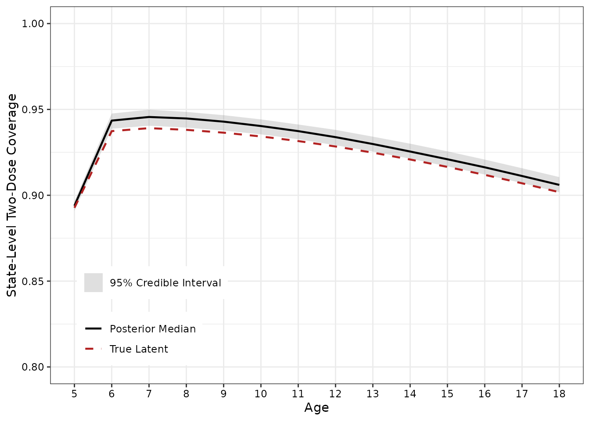
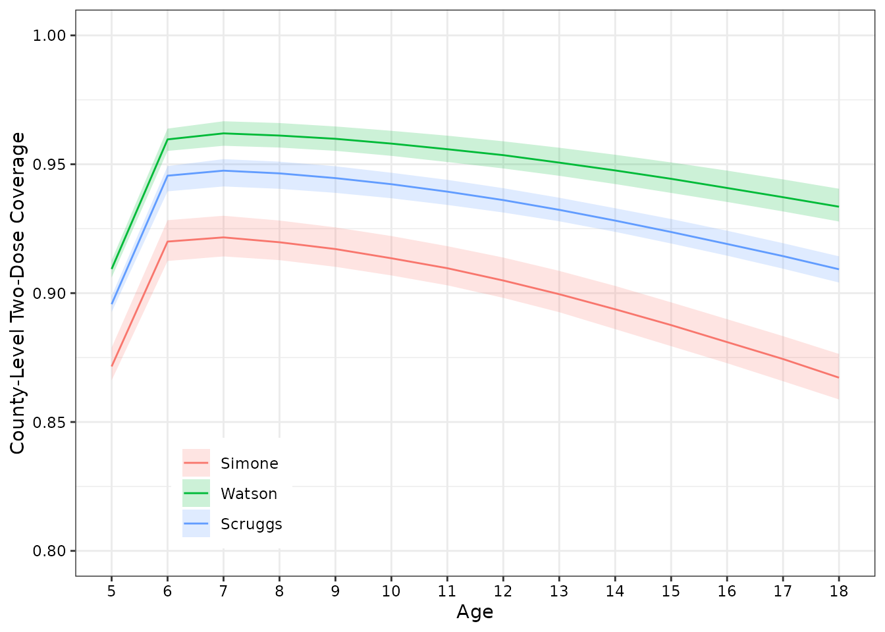

# Getting Started with imuGAP

## Introduction

`imuGAP` (Immunity: Geographic & Age-based Projection) estimates an
underlying process model for vaccination on an arbitrary hierarchical
population structure, which can then be used to predict vaccination
coverage. Internally, `imuGAP` performs Bayesian inference via the Stan
probabilistic programming language.

The package enables researchers and public health analysts to synthesize
across multiple heterogeneous surveillance streams (such as national
surveys, state school entry records, and local coverage censuses) to:

1.  **Estimate current vaccination coverage** across arbitrary
    sub-populations and geographic levels.
2.  **Project cohort trajectories** (e.g. coverage at each age from
    birth through adolescence for a given birth cohort).
3.  **Impute missing data gaps** across unobserved years, age groups, or
    sub-regions by leveraging inferred relationships via the process
    model.

#### Core Model Intuition

The core `imuGAP` model represents each target population slice
$`(i, a)`$ (location $`i`$, cohort born at time $`a`$) as having an
underlying non-uptake probability $`\phi_{i,a}`$, with complementary
uptake probability $`1 - \phi_{i,a}`$. Given a dose eligibility schedule
$`\nu(\tau)`$ (in terms of time-in-life) and a force-of-vaccination rate
$`\lambda(t)`$ (in terms of absolute time), cumulative coverage at age
$`t`$ for the first dose is modeled as:

``` math
\Pr_{i, a}(\ge\textrm{1 dose}\mid t) = \left(1 - \phi_{i, a}\right) \left(1 - \exp\left\{-\int_a^{t} \lambda(s)\nu(s-a) \mathrm{d}s\right\}\right)
```

This formulation extends sequentially to multiple vaccine doses,
conditional on receipt of prior doses. Sequential multi-dose regimens
(e.g. Dose 1 at $`\ge 12`$ months, Dose 2 at $`\ge 4`$ years) are
modeled as a continuous-time Markov transition process.

------------------------------------------------------------------------

## The Fit & Predict Loop

The following diagram shows the end-to-end fit and predict workflow:


------------------------------------------------------------------------

### 1. Preparing the Inputs

`imuGAP` requires three core input tables:

1.  `locations`: The nested population hierarchy (e.g. State
    $`\rightarrow`$ County $`\rightarrow`$ School). This may optionally
    include population sizes, which may be necessary to ensure accurate
    results when entities within the same layer differ substantially in
    size.
2.  `observations`: Empirical survey counts (`positive` and `sample_n`)
    and censoring indicators.
3.  `populations`: Metadata and fractional weights mapping observations
    to discrete location/age/cohort/dose slices.

``` r

library(imuGAP)
library(data.table)
library(ggplot2)

data("locations_sim", package = "imuGAP")
data("observations_sim", package = "imuGAP")
data("populations_sim", package = "imuGAP")

head(locations_sim)
#>                  loc_id population parent_id
#>                  <char>      <num>    <char>
#> 1:                State  2895.1333      <NA>
#> 2:              Scruggs  1527.7000     State
#> 3:               Simone   746.6333     State
#> 4:               Watson   620.8000     State
#> 5: Chickadee Elementary   147.8333   Scruggs
#> 6:     Nuthatch Academy   368.5333   Scruggs
head(observations_sim[, .(obs_id, loc_id, positive, sample_n, censored)])
#>    obs_id               loc_id positive sample_n censored
#>     <int>               <char>    <num>    <int>    <num>
#> 1:      1 Chickadee Elementary      135      155       NA
#> 2:      2 Chickadee Elementary      124      152       NA
#> 3:      3 Chickadee Elementary      133      156       NA
#> 4:      4 Chickadee Elementary      127      155       NA
#> 5:      5 Chickadee Elementary      141      155       NA
#> 6:      6 Chickadee Elementary      139      158       NA
head(populations_sim)
#>    obs_id               loc_id cohort   age  dose weight
#>     <int>               <char>  <int> <int> <int>  <num>
#> 1:      1 Chickadee Elementary      1     5     2      1
#> 2:      2 Chickadee Elementary      2     5     2      1
#> 3:      3 Chickadee Elementary      3     5     2      1
#> 4:      4 Chickadee Elementary      4     5     2      1
#> 5:      5 Chickadee Elementary      5     5     2      1
#> 6:      6 Chickadee Elementary      6     5     2      1
```

Input datasets are automatically validated and canonicalized during
sampling via
[`canonicalize_locations()`](https://accidda.github.io/imuGAP/reference/canonicalize.md),
[`canonicalize_observations()`](https://accidda.github.io/imuGAP/reference/canonicalize.md),
and
[`canonicalize_populations()`](https://accidda.github.io/imuGAP/reference/canonicalize.md).

For an in-depth walkthrough of flexible surveillance stream
structures—including right-censored observations (such as when
surveillance reports only complete coverage for a bundle of vaccines,
not specifically the target vaccine) and composite observations that mix
multiple age groups or populations—see **[Included Example Datasets and
Data
Validation](https://accidda.github.io/imuGAP/articles/example_data.md)**.

------------------------------------------------------------------------

### 2. Fitting the Model

You can fit the model to your data by calling
[`sampling()`](https://accidda.github.io/imuGAP/reference/sampling.md).
Configure model options (such as B-spline degrees of freedom and dose
eligibility ages) with
[`imugap_options()`](https://accidda.github.io/imuGAP/reference/imugap_options.md),
and specify MCMC sampler settings (chains, iterations, backend) with
[`stan_options()`](https://accidda.github.io/flexstanr/reference/stan_options.html):

``` r

# Configure model options
im_opts <- imugap_options(df = 5L, dose_schedule = c(1L, 4L))

# Configure Stan MCMC sampler
st_opts <- stan_options(chains = 4, iter = 2000, seed = 1L)

# Fit the model
fit <- sampling(
  observations = observations_sim,
  populations = populations_sim,
  locations = locations_sim,
  imugap_opts = im_opts,
  stan_opts = st_opts
)
```

For this vignette, you can load the pre-computed fit fixture `fit_sim`
bundled with the package:

``` r

data("fit_sim", package = "imuGAP")
fit_sim
#> An imuGAP model fit (`imugap_fit`):
#>   Hierarchy:    28 locations across 3 layers (root: 'State')
#>   Observations: 841 total (775 uncensored, 66 right-censored)
#> 
#> Inference for Stan model: impute_school_coverage_process_v6.
#> 4 chains, each with iter=1000; warmup=500; thin=1; 
#> post-warmup draws per chain=500, total post-warmup draws=2000.
#> 
#>                     mean se_mean   sd      2.5%       25%       50%       75%
#> beta_bs[1]         -1.68    0.00 0.04     -1.74     -1.70     -1.68     -1.65
#> beta_bs[2]         -1.88    0.00 0.05     -1.98     -1.91     -1.88     -1.84
#> beta_bs[3]         -2.48    0.00 0.09     -2.65     -2.54     -2.48     -2.42
#> beta_bs[4]         -3.12    0.00 0.09     -3.30     -3.19     -3.12     -3.06
#> beta_bs[5]         -2.59    0.00 0.09     -2.77     -2.65     -2.59     -2.53
#> sigma_layer[1]      0.56    0.01 0.33      0.19      0.31      0.46      0.70
#> sigma_layer[2]      0.75    0.01 0.13      0.55      0.66      0.73      0.82
#> lambda_raw[1]       1.02    0.00 0.03      0.97      1.00      1.02      1.04
#> lambda_raw[2]       1.06    0.00 0.01      1.03      1.05      1.06      1.07
#> lp__           -78864.98    0.26 5.05 -78875.67 -78868.15 -78864.64 -78861.32
#>                    97.5% n_eff Rhat
#> beta_bs[1]         -1.61  1404 1.00
#> beta_bs[2]         -1.78  1075 1.00
#> beta_bs[3]         -2.31   916 1.00
#> beta_bs[4]         -2.95  1036 1.00
#> beta_bs[5]         -2.42  1068 1.00
#> sigma_layer[1]      1.46   646 1.01
#> sigma_layer[2]      1.08   257 1.01
#> lambda_raw[1]       1.07  1348 1.00
#> lambda_raw[2]       1.09  1107 1.00
#> lp__           -78855.79   364 1.01
#> 
#> Samples were drawn using NUTS(diag_e) at Wed Sep 30 16:15:36 2026.
#> For each parameter, n_eff is a crude measure of effective sample size,
#> and Rhat is the potential scale reduction factor on split chains (at 
#> convergence, Rhat=1).
```

------------------------------------------------------------------------

### 3. Defining a Prediction Target Grid

To generate coverage predictions for specific populations, define a
target grid using
[`create_target()`](https://accidda.github.io/imuGAP/reference/create_target.md).

For example, to evaluate a cross-sectional “snapshot” across all
locations for ages 1 through 18 and doses 1 and 2:

``` r

target_grid <- create_target(
  location = unique(locations_sim$loc_id),
  age = 1:18,
  cohort = max(populations_sim$cohort) - 18,
  dose = c(1, 2),
  mode = "snapshot"
)
head(target_grid)
#>    obs_c_id               loc_id   age cohort  dose weight
#>       <int>               <char> <int>  <num> <num>  <num>
#> 1:        1                State     1     29     1      1
#> 2:        2              Scruggs     1     29     1      1
#> 3:        3               Simone     1     29     1      1
#> 4:        4               Watson     1     29     1      1
#> 5:        5 Chickadee Elementary     1     29     1      1
#> 6:        6     Nuthatch Academy     1     29     1      1
```

------------------------------------------------------------------------

### 4. Predicting Coverage

Pass the model fit and target grid to
[`predict()`](https://rdrr.io/r/stats/predict.html) to generate
posterior draws of coverage on the natural (probability) scale:

``` r

# Generate posterior draws for each target slice
predict_res <- predict(object = fit_sim, target = target_grid, posterior_size = 100)
```

You can load the pre-computed prediction fixture `predict_sim`:

``` r

data("predict_sim", package = "imuGAP")
predict_sim
#> An imuGAP predictions object (`imugap_predict`):
#>   Targets:   1008 target population slices across 28 locations
#>   Posterior: 100 draws (4 chains x 25 iterations)
#> 
#> Use summary() to compute quantiles or as.data.frame() to convert to a long table.
```

------------------------------------------------------------------------

### 5. Summarizing and Visualizing Predictions

You can compute vaccination coverage estimate summary statistics
(posterior mean, median, and credible intervals) on the natural
(probability) scale across your prediction targets using
[`summary()`](https://rdrr.io/r/base/summary.html):

``` r

summary_predict <- summary(predict_sim)

# Filter coverage estimate statistics to a specific target slice (e.g. age 4, dose 2)
summary_predict[age == 4 & dose == 2]
#>     obs_c_id                    loc_id   age cohort  dose weight loc_c_id
#>        <int>                    <char> <int>  <num> <num>  <num>    <int>
#>  1:      589                     State     4     26     2      1        1
#>  2:      590                   Scruggs     4     26     2      1        2
#>  3:      591                    Simone     4     26     2      1        3
#>  4:      592                    Watson     4     26     2      1        4
#>  5:      593      Chickadee Elementary     4     26     2      1        8
#>  6:      594          Nuthatch Academy     4     26     2      1       11
#>  7:      595         Blue Heron School     4     26     2      1        5
#>  8:      596     Flycatcher Elementary     4     26     2      1       10
#>  9:      597  Bluebird Learning Center     4     26     2      1        6
#> 10:      598           Catbird Academy     4     26     2      1        7
#> 11:      599          Finch Elementary     4     26     2      1        9
#> 12:      600            Sparrow School     4     26     2      1       12
#> 13:      601 Towhee Children's Academy     4     26     2      1       13
#> 14:      602        Warbler Elementary     4     26     2      1       14
#> 15:      603          Egret Elementary     4     26     2      1       17
#> 16:      604          Cardinal Academy     4     26     2      1       16
#> 17:      605            Bunting School     4     26     2      1       15
#> 18:      606           Tanager Academy     4     26     2      1       21
#> 19:      607      Oriole Youth Academy     4     26     2      1       20
#> 20:      608  Grosbeak Learning Center     4     26     2      1       18
#> 21:      609          Junco Elementary     4     26     2      1       19
#> 22:      610         Meadowlark School     4     26     2      1       26
#> 23:      611      Goldfinch Elementary     4     26     2      1       23
#> 24:      612       Mockingbird Academy     4     26     2      1       27
#> 25:      613   Kinglet Learning Center     4     26     2      1       25
#> 26:      614              Vireo School     4     26     2      1       28
#> 27:      615        Kingfisher Academy     4     26     2      1       24
#> 28:      616      Cormorant Elementary     4     26     2      1       22
#>     obs_c_id                    loc_id   age cohort  dose weight loc_c_id
#>        <int>                    <char> <int>  <num> <num>  <num>    <int>
#>             mean          q2_5   q50        q97_5
#>            <num>         <num> <num>        <num>
#>  1: 8.980366e-18 -2.223542e-16     0 1.124216e-16
#>  2: 8.998596e-18 -2.227849e-16     0 1.127125e-16
#>  3: 8.755307e-18 -2.164768e-16     0 1.099417e-16
#>  4: 9.133549e-18 -2.264645e-16     0 1.144085e-16
#>  5: 9.152214e-18 -2.268312e-16     0 1.146316e-16
#>  6: 9.038155e-18 -2.232537e-16     0 1.132078e-16
#>  7: 9.125733e-18 -2.272513e-16     0 1.147371e-16
#>  8: 9.313765e-18 -2.311535e-16     0 1.169833e-16
#>  9: 9.250830e-18 -2.287838e-16     0 1.162784e-16
#> 10: 8.924110e-18 -2.204480e-16     0 1.117756e-16
#> 11: 9.046746e-18 -2.218895e-16     0 1.129685e-16
#> 12: 9.211948e-18 -2.290635e-16     0 1.156028e-16
#> 13: 8.321473e-18 -2.065709e-16     0 1.047252e-16
#> 14: 8.515384e-18 -2.093713e-16     0 1.076748e-16
#> 15: 9.186441e-18 -2.281674e-16     0 1.151818e-16
#> 16: 6.559134e-18 -1.613229e-16     0 8.343698e-17
#> 17: 7.643237e-18 -1.867321e-16     0 9.577934e-17
#> 18: 9.372250e-18 -2.316178e-16     0 1.182128e-16
#> 19: 8.550762e-18 -2.110428e-16     0 1.071452e-16
#> 20: 6.264444e-18 -1.544820e-16     0 8.058108e-17
#> 21: 8.818298e-18 -2.182516e-16     0 1.107549e-16
#> 22: 8.900423e-18 -2.190151e-16     0 1.116933e-16
#> 23: 9.116402e-18 -2.244920e-16     0 1.139945e-16
#> 24: 8.914435e-18 -2.206616e-16     0 1.116032e-16
#> 25: 9.350532e-18 -2.324618e-16     0 1.174627e-16
#> 26: 9.349276e-18 -2.326446e-16     0 1.174813e-16
#> 27: 8.791269e-18 -2.178186e-16     0 1.106294e-16
#> 28: 9.086598e-18 -2.242859e-16     0 1.135468e-16
#>             mean          q2_5   q50        q97_5
#>            <num>         <num> <num>        <num>
```

#### State-Level Coverage Trajectory

The following plot shows predicted state-level two-dose coverage across
ages 5 to 18 against the true simulation baseline:

**Show plot code**

``` r

data("latent_params_sim", package = "imuGAP")

state_predict <- summary_predict[loc_id == "State" & dose == 2 & age > 4]
state_idx <- predict_sim$target[loc_id == "State" & dose == 2 & age > 4, which = TRUE]
state_predict[, latent := latent_params_sim$coverage[state_idx]]

ggplot(state_predict) +
  aes(x = age) +
  geom_ribbon(aes(ymin = q2_5, ymax = q97_5, fill = "95% Credible Interval"), alpha = 0.25) +
  geom_line(aes(y = q50, color = "Posterior Median"), linewidth = 0.8) +
  geom_line(aes(y = latent, color = "True Latent"), linetype = "dashed", linewidth = 0.8) +
  scale_x_continuous(breaks = 5:18, minor_breaks = NULL) +
  coord_cartesian(ylim = c(0.8, 1.0)) +
  scale_color_manual(
    name = NULL,
    values = c("Posterior Median" = "black", "True Latent" = "firebrick")
  ) +
  scale_fill_manual(name = NULL, values = c("95% Credible Interval" = "grey50")) +
  theme(
    legend.position = "inside",
    legend.position.inside = c(0.05, 0.05),
    legend.justification.inside = c(0, 0)
  ) +
  labs(x = "Age", y = "State-Level Two-Dose Coverage")
```



------------------------------------------------------------------------

#### County-Level Estimates

The following plot compares county-level coverage estimates across
counties:

**Show plot code**

``` r

summary_predict |>
  subset(loc_id %in% c("Scruggs", "Simone", "Watson") & dose == 2 & age > 4) |>
  transform(loc_id = factor(loc_id, levels = c("Simone", "Watson", "Scruggs"))) |>
  ggplot() +
  aes(x = age) +
  geom_line(aes(y = q50, color = loc_id)) +
  geom_ribbon(aes(ymin = q2_5, ymax = q97_5, fill = loc_id), alpha = 0.2) +
  theme(
    legend.position = "inside",
    legend.position.inside = c(0.12, 0.05),
    legend.justification.inside = c(0, 0)
  ) +
  scale_x_continuous(breaks = 5:18, minor_breaks = NULL) +
  coord_cartesian(ylim = c(0.8, 1.0)) +
  scale_color_discrete(NULL, aesthetics = c("color", "fill")) +
  labs(x = "Age", y = "County-Level Two-Dose Coverage")
```



------------------------------------------------------------------------

#### Extracting Long-Format Draws for Custom Analysis

Use [`as.data.frame()`](https://rdrr.io/r/base/as.data.frame.html) to
extract individual MCMC draws in a tidy, long format:

``` r

draws_df <- as.data.frame(predict_sim)
head(draws_df)
#>    iteration chain obs_c_id loc_id   age cohort  dose weight loc_c_id coverage
#>        <int> <int>    <int> <char> <int>  <num> <num>  <num>    <int>    <num>
#> 1:         1     1        1  State     1     29     1      1        1        0
#> 2:         2     1        1  State     1     29     1      1        1        0
#> 3:         3     1        1  State     1     29     1      1        1        0
#> 4:         4     1        1  State     1     29     1      1        1        0
#> 5:         5     1        1  State     1     29     1      1        1        0
#> 6:         6     1        1  State     1     29     1      1        1        0
```

------------------------------------------------------------------------

## Summary and Guide to Other Vignettes

To explore advanced features and deeper technical details, see the
following companion vignettes:

- **[Included Example Datasets and Data
  Validation](https://accidda.github.io/imuGAP/articles/example_data.md)**:
  Detailed documentation of the bundled simulation fixtures,
  surveillance stream types (ChildVaxView, SchoolVaxView, TeenVaxView),
  canonicalization rules, and validation error diagnostics.

- **[Flexible Location Layers in
  imuGAP](https://accidda.github.io/imuGAP/articles/user_specified_layers.md)**:
  Demonstrates how `imuGAP` estimates the process model across 1-layer,
  2-layer, and multi-layer hierarchical population structures, showing
  how inferred relationships enable sub-regional estimation and cohort
  projection.

- **[Fit Inspection and Stan
  Diagnostics](https://accidda.github.io/imuGAP/articles/examining_fits.md)**:
  Comprehensive guide to MCMC convergence assessment, parameter
  extraction with
  [`extract_imugap()`](https://accidda.github.io/imuGAP/reference/extract_imugap.md),
  and parameter recovery trace plots for $`\beta_{\text{bs}}`$,
  $`\sigma_{\text{layer}}`$, $`\delta_{\text{loc}}`$, and $`\lambda`$.
